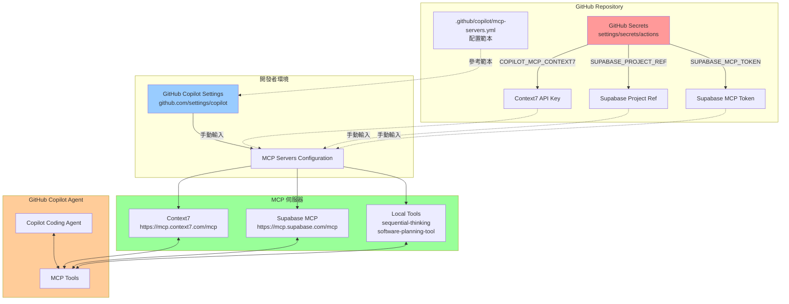
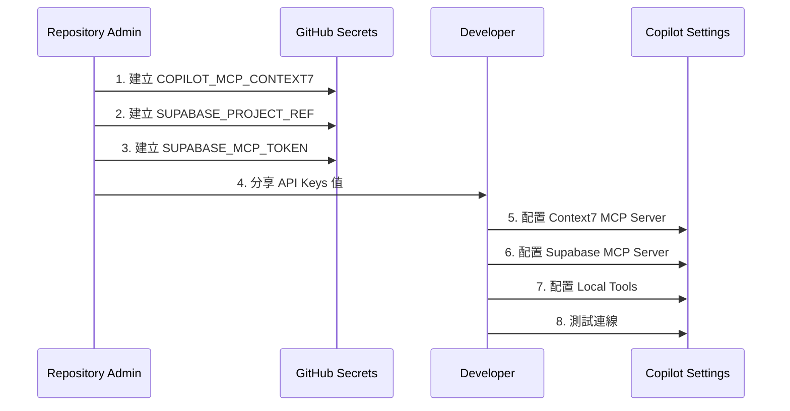
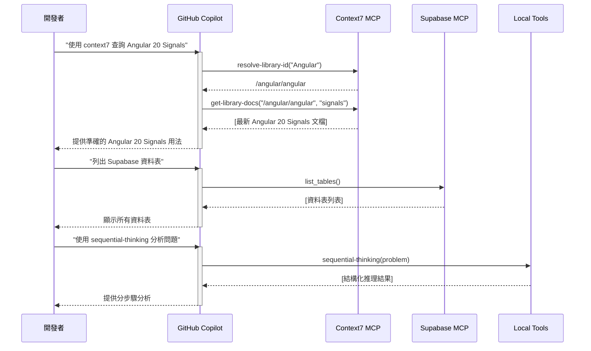
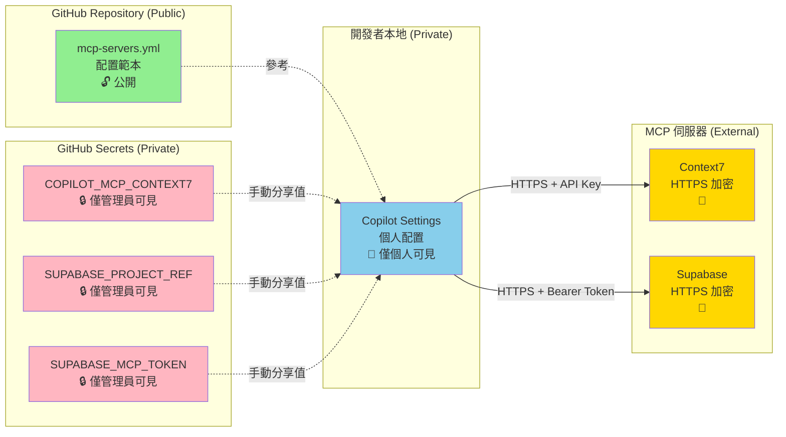
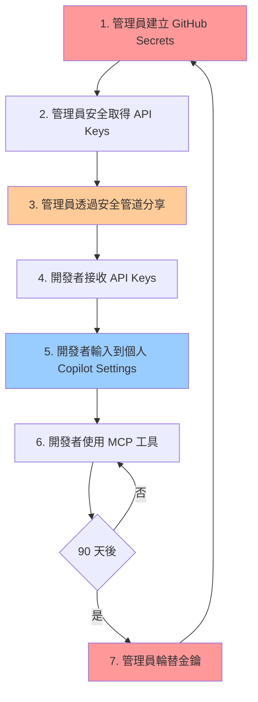
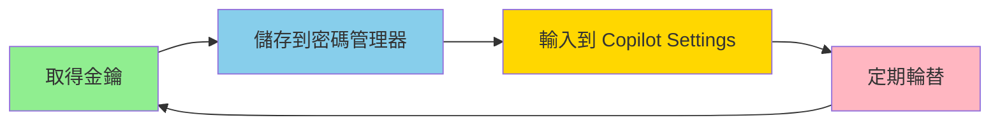
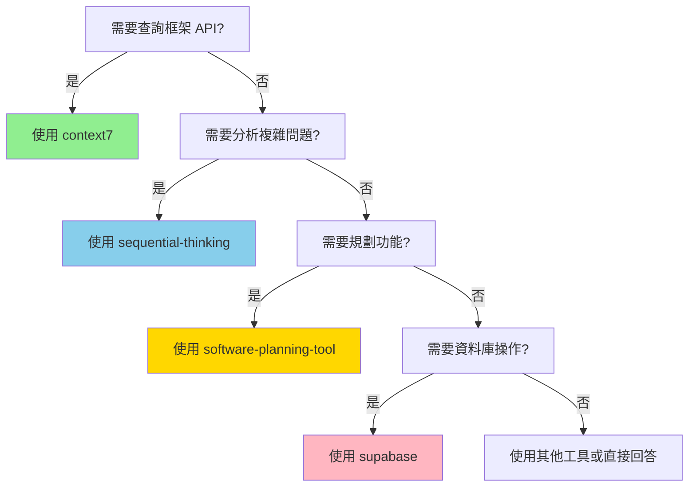
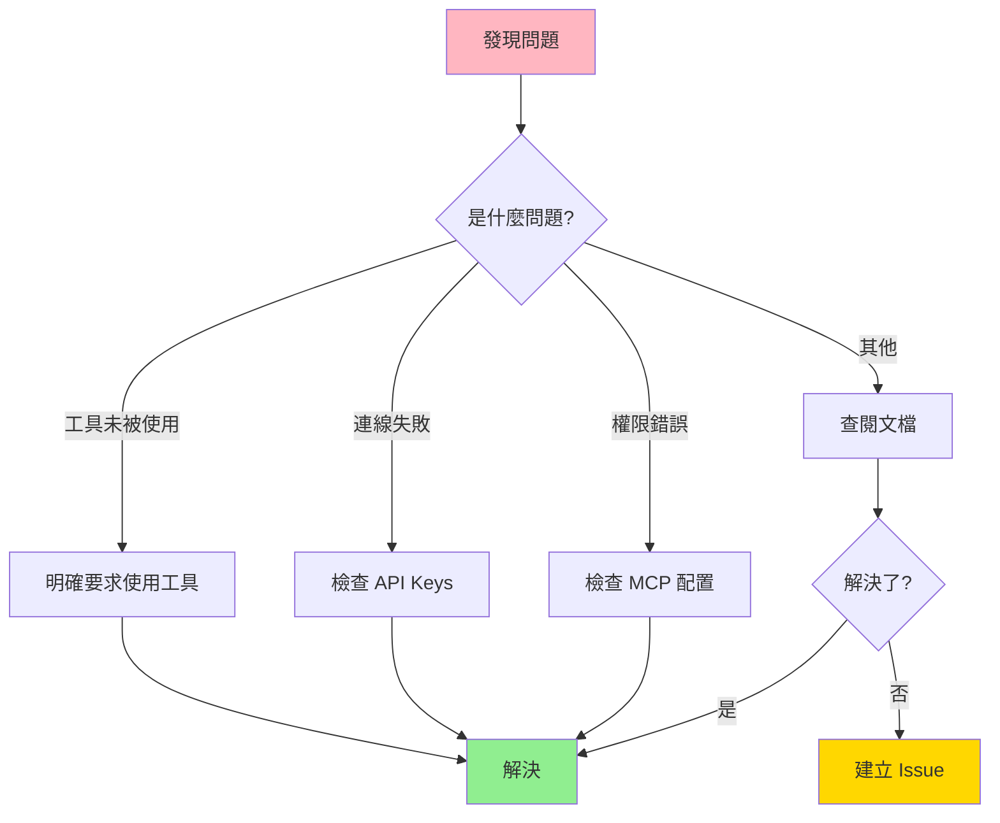
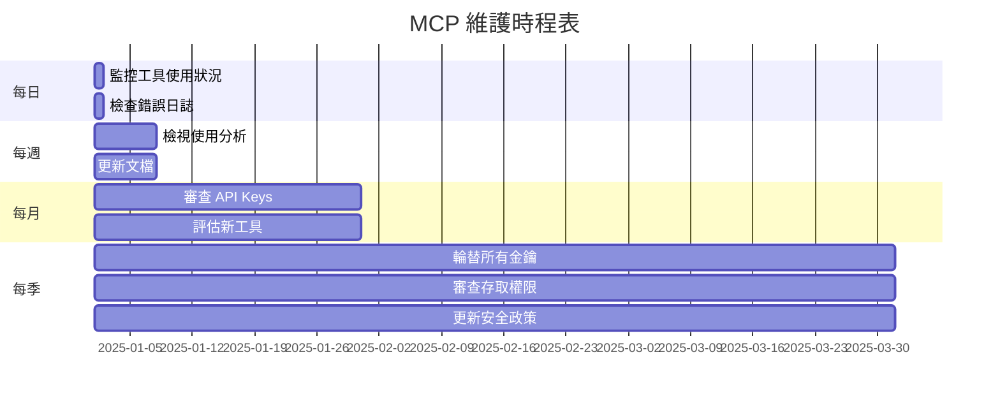

# GitHub Copilot MCP 架構圖

本文檔說明 GigHub 專案的 GitHub Copilot MCP (Model Context Protocol) 整合架構。

## 架構概覽



## 資料流程

### 1. 設定階段 (Setup Phase)



### 2. 使用階段 (Usage Phase)



## 元件說明

### GitHub Repository 層

#### 1. mcp-servers.yml
**位置**: `.github/copilot/mcp-servers.yml`

**功能**:
- MCP 伺服器配置範本
- 定義所需的環境變數
- 文檔化 MCP 工具

**關鍵內容**:
```yaml
mcp-servers:
  context7:
    type: http
    url: 'https://mcp.context7.com/mcp'
    headers: { 'CONTEXT7_API_KEY': '${{ secrets.COPILOT_MCP_CONTEXT7 }}' }
    tools: ['get-library-docs', 'resolve-library-id']
  
  supabase:
    type: http
    url: 'https://mcp.supabase.com/mcp?project_ref=${{ secrets.SUPABASE_PROJECT_REF }}'
    headers: { 'Authorization': 'Bearer ${{ secrets.SUPABASE_MCP_TOKEN }}' }
    tools: ['*']
```

**注意**: 
- `${{ secrets.XXX }}` 語法僅用於文檔
- 實際使用時需手動配置

#### 2. GitHub Secrets
**位置**: https://github.com/7Spade/GigHub/settings/secrets/actions

**功能**:
- 安全儲存敏感憑證
- 僅 Repository 管理員可存取
- 可在 GitHub Actions 中使用

**必要 Secrets**:
| Secret Name | 用途 |
|------------|------|
| COPILOT_MCP_CONTEXT7 | Context7 API Key |
| SUPABASE_PROJECT_REF | Supabase 專案參考 ID |
| SUPABASE_MCP_TOKEN | Supabase Service Role Key |

### 開發者環境層

#### GitHub Copilot Settings
**位置**: https://github.com/settings/copilot

**功能**:
- 個人 Copilot 配置
- MCP 伺服器設定
- 工具權限管理

**配置步驟**:
1. 啟用 Copilot Agent Mode
2. 新增 MCP 伺服器
3. 輸入 API Keys
4. 選擇允許的工具

### MCP 伺服器層

#### 1. Context7 MCP Server
**URL**: https://mcp.context7.com/mcp

**功能**:
- 查詢最新框架文檔
- 解析函式庫 ID
- 版本相容性檢查

**工具**:
- `resolve-library-id`: 解析函式庫名稱到 Context7 ID
- `get-library-docs`: 取得特定主題的文檔

**使用範例**:
```
"使用 context7 查詢 Angular 20 中 input() 函數的用法"
"使用 context7 確認 ng-zorro-antd 20.3 的 ST 表格 API"
```

#### 2. Supabase MCP Server
**URL**: https://mcp.supabase.com/mcp

**功能**:
- 資料庫 schema 查詢
- 執行 SQL 查詢
- RLS 政策檢查
- 資料表操作

**工具**:
- `list_tables`: 列出所有資料表
- `execute_sql`: 執行 SQL 查詢
- `get_advisors`: 取得安全建議
- 更多... (允許所有工具)

**使用範例**:
```
"列出 GigHub 專案的所有資料表"
"執行 SQL: SELECT * FROM tasks LIMIT 10"
"檢查 RLS 政策是否正確設定"
```

#### 3. Local Tools
**執行環境**: 開發者本機

**功能**:
- 本地執行，無需外部 API
- 不需要額外憑證
- 需要 Node.js 環境

**工具**:
| 工具 | 用途 |
|------|------|
| sequential-thinking | 結構化推理分析 |
| software-planning-tool | 功能規劃與任務管理 |
| filesystem | 檔案系統操作 |
| everything | 通用工具集 |

**使用範例**:
```
"使用 sequential-thinking 分析這個架構問題"
"使用 software-planning-tool 規劃通知系統的開發"
```

## 安全性架構



### 安全層級

| 層級 | 元件 | 可見性 | 保護機制 |
|------|------|--------|---------|
| 🔓 公開 | mcp-servers.yml | 所有人 | 無敏感資訊 |
| 🔒 私有 | GitHub Secrets | 僅管理員 | GitHub 加密儲存 |
| 🔐 個人 | Copilot Settings | 僅個人 | 個人帳號保護 |
| 🔐 加密 | MCP 通訊 | - | HTTPS + 認證 |

### 金鑰流轉



## 最佳實踐

### 1. 金鑰管理


**規則**:
- ✅ 使用密碼管理器 (1Password, LastPass)
- ✅ 定期輪替 (每 90 天)
- ✅ 環境隔離 (開發/測試/生產)
- ❌ 不在程式碼中硬編碼
- ❌ 不在文檔中明文記錄

### 2. 工具使用優先順序


### 3. 故障排除流程


## 監控與維護

### 定期檢查項目



## 相關文檔

- **[copilot-setup-steps.yml](copilot-setup-steps.yml)** - 完整設定指南
- **[COPILOT_MCP_QUICKSTART.md](COPILOT_MCP_QUICKSTART.md)** - 快速入門
- **[MCP_TOOLS_USAGE_GUIDE.md](MCP_TOOLS_USAGE_GUIDE.md)** - 工具使用指南
- **[.github/README.md](README.md)** - 目錄導航

---

**版本**: 1.0.0  
**最後更新**: 2025-12-12  
**維護者**: GitHub Copilot
