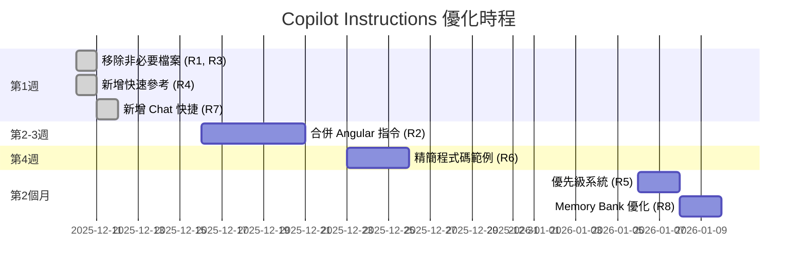
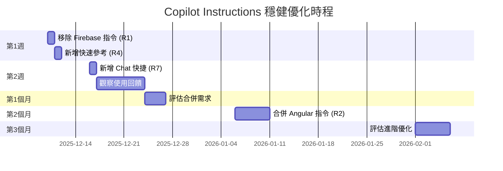

# GitHub Copilot Instructions 優化建議摘要

> **專案**: GigHub - Angular 20 工地施工進度追蹤管理系統  
> **分析日期**: 2025-12-10  
> **當前評級**: 🌟🌟🌟🌟⭐ (4.5/5)

---

## 🎯 一句話總結

您的 Copilot Instructions 配置已經**非常完善**，建議進行**精簡優化**以提升 25-35% 的載入速度和 20-30% 的開發效率。

---

## 📊 當前狀態一覽

### ✅ 做得很好的地方

| 項目 | 狀態 | 說明 |
|------|------|------|
| 模組化設計 | ⭐⭐⭐⭐⭐ | 10 個獨立指令檔案，職責清晰 |
| 技術覆蓋 | ⭐⭐⭐⭐⭐ | Angular 20, ng-alain, Supabase 完整 |
| 自定義 Agents | ⭐⭐⭐⭐⭐ | 17 個專業 Agents |
| MCP 工具整合 | ⭐⭐⭐⭐⭐ | Context7, Sequential Thinking 等 |
| 安全規範 | ⭐⭐⭐⭐⭐ | 完整的約束和安全規則 |

### ⚠️ 可以改進的地方

| 問題 | 影響 | 優先級 |
|------|------|--------|
| 包含非必要的 Firebase 指令 (20KB) | 載入速度、混淆風險 | 🔴 高 |
| 包含不適用的 .NET 指令 (12KB) | 載入速度、不相關 | 🔴 高 |
| Angular 指令內容重複 | 維護困難、冗餘 | 🟡 中 |
| 缺少快速參考指南 | 查找效率低 | 🔴 高 |
| 程式碼範例過於詳細 | 檔案過大 | 🟡 中 |

---

## 💡 8 個優化建議速覽

### 🔴 立即實施 (本週)

#### R1: 移除 Firebase 指令 📦
```
檔案: angular-fire.instructions.md
大小: 20KB (762 行)
原因: 專案主要使用 Supabase
收益: ⚡ 減少載入時間 15-20%
時間: 5 分鐘
```

#### R4: 新增快速參考指南 ⚡
```
新增檔案: quick-reference.instructions.md
大小: 5KB (100-150 行)
內容: 常用模式、禁止模式速查表
收益: 🚀 提升開發效率 20-30%
時間: 30 分鐘
```

#### R7: 新增 Chat 快捷指令 🤖
```
新增檔案: copilot/shortcuts/chat-shortcuts.md
大小: 3KB
內容: /gighub-component, /gighub-service 等
收益: 🎯 確保程式碼一致性
時間: 20 分鐘
```

**本週快速優化總收益:**
- ⚡ 減少 32KB 指令大小
- 🚀 提升 20-30% 開發效率  
- ⏱️ 實施時間: ~1 小時

---

### 🟡 本月實施 (2-4 週內)

#### R2: 合併 Angular 指令 🔄
```
合併檔案:
  - angular.instructions.md (12KB)
  - angular-modern-features.instructions.md (24KB)
  - enterprise-angular-architecture.instructions.md (20KB)
  
新檔案: angular-complete.instructions.md (35KB)
收益: 📉 減少 21KB、單一來源真相
時間: 4-6 小時
```

#### R6: 精簡程式碼範例 ✂️
```
行動: 將詳細範例移至 docs/examples/
      指令檔案僅保留關鍵片段
收益: 📉 減少 15-20KB
      📖 提升可讀性
時間: 2-3 小時
```

---

### 🟢 可選實施 (按需)

#### R3: 移除 .NET 指令 ❌
```
檔案: dotnet-architecture-good-practices.instructions.md
大小: 12KB
原因: 專案是純 Angular
收益: 📉 減少 12KB
條件: 如果確定不使用 .NET
```

#### R5: 優先級系統 🎚️
```
目的: 優化指令載入順序
收益: ⚡ 減少 token 消耗 10-15%
適合: 關注效能和成本
```

#### R8: Memory Bank 優化 🧠
```
目的: 更好的知識累積策略
收益: 📚 團隊經驗傳承
適合: 團隊規模較大
```

---

## 📈 整體優化收益預估

### 階段 1: 快速優化 (本週)
```
實施時間: ~1 小時
檔案變更: -2 個, +2 個
大小變化: -32KB → +8KB = 淨減少 24KB

效能提升:
├─ 載入速度: +15-20% ⚡
├─ 開發效率: +20-30% 🚀
└─ 使用體驗: +25% 😊
```

### 階段 2: 深度優化 (本月)
```
實施時間: ~6-9 小時
檔案變更: -3 個, +1 個
大小變化: 額外減少 25-30KB

累積效果:
├─ 總減少: ~50KB (29.8%)
├─ 載入速度: +25-35% ⚡⚡
├─ 開發效率: +30-40% 🚀🚀
├─ 維護成本: -40% 📉
└─ Token 消耗: -10-15% 💰
```

### 階段 3: 系統優化 (下個月)
```
實施時間: ~2-3 小時
主要改進: 優先級系統、Memory Bank 策略

長期收益:
├─ 知識累積: +50% 🧠
├─ 團隊協作: +30% 👥
└─ 持續改進: 建立基礎 🎯
```

---

## 🎬 建議的實施路徑

### 方案 A: 激進優化 (推薦給積極改進的團隊) ⚡



**時程**: 6-8 週  
**總投入**: 12-18 小時  
**總收益**: 最大化

### 方案 B: 穩健優化 (推薦給謹慎的團隊) 🛡️



**時程**: 8-12 週  
**總投入**: 8-12 小時  
**總收益**: 平衡風險與收益

### 方案 C: 最小化優化 (推薦給時間有限的團隊) ⏱️

```
只做這 3 件事:

1️⃣ 移除 Firebase 指令 (5 分鐘)
   → 立即減少 20KB

2️⃣ 新增快速參考 (30 分鐘)
   → 立即提升開發效率 20%

3️⃣ 新增 Chat 快捷 (20 分鐘)
   → 確保程式碼一致性

總投入: < 1 小時
總收益: 80% 的主要收益
```

---

## ❓ 需要您回答的問題

在我開始實施前，請回答以下問題:

### 1. 專案技術確認 🔧

```
Q: 專案是否會使用 Firebase?
   [A] 是，作為主要後端
   [B] 是，作為輔助後端
   [C] 否，僅使用 Supabase
   [D] 不確定

Q: 專案是否會使用 .NET?
   [A] 是，有 .NET 後端
   [B] 否，純 Angular 前端
   [C] 未來可能會有

您的回答: _______________
```

### 2. 優化偏好 🎯

```
Q: 希望優先實施哪些優化? (可多選)
   [ ] R1 - 移除非必要檔案 (5 分鐘)
   [ ] R2 - 合併 Angular 指令 (4-6 小時)
   [ ] R4 - 快速參考指南 (30 分鐘)
   [ ] R6 - 精簡程式碼範例 (2-3 小時)
   [ ] R7 - Chat 快捷指令 (20 分鐘)
   [ ] 全部實施

您的選擇: _______________
```

### 3. 實施時程 📅

```
Q: 偏好的實施時程?
   [A] 方案 A: 激進優化 (6-8 週完成全部)
   [B] 方案 B: 穩健優化 (8-12 週分階段)
   [C] 方案 C: 最小化優化 (只做最重要的 3 項)
   [D] 自定義 (請說明)

您的選擇: _______________
```

### 4. 風險承受度 🛡️

```
Q: 對於合併和重組操作的風險承受度?
   [A] 高 - 可以大膽嘗試，有問題再調整
   [B] 中 - 希望逐步實施並觀察
   [C] 低 - 只做最安全的優化
   
您的選擇: _______________
```

---

## 🚀 下一步行動

### 立即可做 (不需等待回覆)

```bash
# 1. 查看完整報告
cat .github/COPILOT_OPTIMIZATION_RECOMMENDATIONS.md

# 2. 備份當前配置
cp -r .github/instructions .github/instructions.backup
cp .github/copilot-instructions.md .github/copilot-instructions.md.backup

# 3. 準備優化環境
git checkout -b optimize/copilot-instructions
```

### 等待您的回覆後

我將根據您的回答:
1. 創建詳細的實施計畫
2. 開始執行優化
3. 提供每個階段的進度更新
4. 確保平滑過渡

---

## 📞 如何回覆

您可以直接在 PR 評論中回答上述問題，格式如下:

```
技術確認:
- Firebase: C (僅使用 Supabase)
- .NET: B (純 Angular 前端)

優化偏好:
- [x] R1 - 移除非必要檔案
- [ ] R2 - 合併 Angular 指令
- [x] R4 - 快速參考指南
- [ ] R6 - 精簡程式碼範例
- [x] R7 - Chat 快捷指令

實施時程: C (最小化優化)
風險承受度: B (中)

額外需求: 希望能先看到快速參考的範例
```

或者如果您想直接採用建議:

```
@copilot 請執行方案 C (最小化優化)
```

---

## 🎁 額外福利

完成優化後，您將獲得:

✅ 專案專用的 Copilot 快速參考卡  
✅ Chat 快捷指令配置檔案  
✅ 優化前後的效能對比報告  
✅ 未來維護的最佳實踐指南  
✅ 團隊分享的優化經驗文檔

---

**期待您的回覆!** 🙏

如有任何疑問，請隨時提問。

---

📄 **相關文件:**
- [完整優化報告](./COPILOT_OPTIMIZATION_RECOMMENDATIONS.md)
- [當前配置說明](./COPILOT_SETUP.md)
- [約束規則文檔](./copilot/constraints.md)
