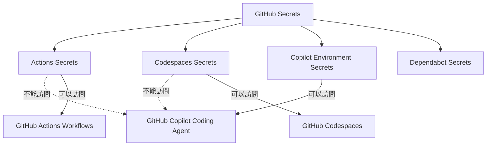

# GitHub Copilot Secrets 配置說明

## 問題描述

您提到 secrets 都保存在 `https://github.com/7Spade/GigHub/settings/secrets/actions`，並詢問使用 "github" MCP 是否可以看見這些 secrets。

## 重要發現 ⚠️

**答案是：NO（不能）**

GitHub 有多個不同的 secrets 範圍，它們**彼此不共享**：



## 各種 Secrets 範圍說明

### 1. Actions Secrets ✅ 您已配置
- **位置**: `https://github.com/7Spade/GigHub/settings/secrets/actions`
- **用途**: 僅供 GitHub Actions workflows 使用
- **訪問者**: `.github/workflows/*.yml` 中的 workflows
- **Copilot Coding Agent 能訪問嗎？**: ❌ **不能**

### 2. Codespaces Secrets
- **位置**: `https://github.com/7Spade/GigHub/settings/secrets/codespaces`
- **用途**: GitHub Codespaces 開發環境
- **訪問者**: Codespaces 容器內的應用
- **Copilot Coding Agent 能訪問嗎？**: ❌ **不能**

### 3. Copilot Environment Secrets ⚠️ 需要配置
- **位置**: `https://github.com/7Spade/GigHub/settings/environments` → `copilot` environment
- **用途**: GitHub Copilot Coding Agent (Web)
- **訪問者**: Copilot Coding Agent sessions
- **Copilot Coding Agent 能訪問嗎？**: ✅ **能！這是唯一方式**

## 為什麼這樣設計？

這是出於**安全考慮**：

1. **隔離原則**: 不同的執行環境有不同的信任級別
2. **最小權限**: 每個服務只能訪問其需要的 secrets
3. **審計追蹤**: 清楚知道哪個服務使用了哪些 secrets

## 解決方案

### 方法 1: 配置 Copilot Environment Secrets（推薦）

#### Step 1: 創建 Copilot Environment

1. 前往：https://github.com/7Spade/GigHub/settings/environments
2. 點擊 "New environment"
3. 環境名稱：`copilot`（必須是這個名字）
4. 點擊 "Configure environment"

#### Step 2: 添加 Secrets

在 `copilot` environment 設置頁面：

1. 找到 "Environment secrets" 區域
2. 點擊 "Add secret"
3. 添加以下 secrets：

| Secret Name | Value Source | Description |
|-------------|--------------|-------------|
| `COPILOT_MCP_CONTEXT7` | Context7 API Key | 用於 Context7 MCP 文檔查詢 |
| `SUPABASE_PROJECT_REF` | Supabase Project Ref | 您的 Supabase 項目 ID |
| `SUPABASE_MCP_TOKEN` | Supabase Token | Supabase MCP 認證令牌 |

#### Step 3: 驗證配置

```bash
# 在 .github/copilot.yml 中的引用：
context7:
  headers:
    CONTEXT7_API_KEY: '${{ secrets.COPILOT_MCP_CONTEXT7 }}'  # ✅ 從 copilot environment 讀取

supabase:
  url: '...?project_ref=${{ secrets.SUPABASE_PROJECT_REF }}'  # ✅ 從 copilot environment 讀取
  headers:
    Authorization: 'Bearer ${{ secrets.SUPABASE_MCP_TOKEN }}'  # ✅ 從 copilot environment 讀取
```

### 方法 2: 複製現有 Secrets（如果您已在 Actions 中配置）

如果您已經在 Actions secrets 中配置了這些值，您需要：

1. 前往 Actions secrets 頁面，**複製**每個 secret 的值
2. 在 Copilot environment 中**重新創建**這些 secrets
3. 兩邊的 secrets 是**獨立的**，需要分別維護

## 為什麼 `.github/copilot.yml` 是正確的？

根據 GitHub Copilot 的設計：

1. **VS Code MCP Servers**（本地開發）:
   - 配置在 `.vscode/mcp.json` 或 VS Code settings
   - 使用本地環境變量

2. **GitHub Copilot Coding Agent**（Web）:
   - `.github/copilot.yml` 是參考配置
   - 實際 secrets 從 **Copilot environment** 注入
   - 不使用 Actions/Codespaces secrets

## 常見問題 FAQ

### Q1: 我已經在 Actions secrets 中配置了，為什麼還要重新配置？

**A**: 因為 Actions secrets 和 Copilot environment secrets 是**完全隔離**的。這是 GitHub 的安全設計，防止不同服務之間的權限洩漏。

### Q2: 我可以在多個地方使用同一個 secret 值嗎？

**A**: 可以！secret 的**值**可以相同，但需要在不同的位置**分別配置**：
- Actions secrets: 供 GitHub Actions 使用
- Copilot environment secrets: 供 Copilot Coding Agent 使用

### Q3: 如果我只配置了 Actions secrets，Copilot 會報錯嗎？

**A**: 是的。Copilot 會嘗試訪問 secrets，如果在 copilot environment 中找不到，MCP servers 將無法啟動。

### Q4: 我需要刪除 Actions secrets 嗎？

**A**: **不需要**！保留 Actions secrets，因為：
- GitHub Actions workflows 需要它們
- Copilot environment secrets 是額外的配置
- 兩者互不衝突

### Q5: 能否使用 GitHub MCP 工具查看 secrets？

**A**: **不能**。出於安全考慮，所有 secrets 都是加密的，任何工具（包括 GitHub MCP）都無法直接讀取 secrets 的值。

## 驗證配置是否成功

配置完成後，測試方法：

1. **在 GitHub Copilot Chat 中測試 Context7**:
   ```
   @copilot 請使用 context7 查詢 Angular Signals 的最新用法
   ```
   預期：Copilot 會調用 context7 MCP tool

2. **測試 Supabase MCP**:
   ```
   @copilot 請列出 Supabase 資料庫中的所有表格
   ```
   預期：Copilot 會調用 supabase MCP tool

3. **檢查錯誤訊息**:
   - 如果看到 "Authentication failed" → secrets 配置錯誤
   - 如果看到 "Secret not found" → secrets 未在 copilot environment 中配置
   - 如果 MCP tool 成功執行 → ✅ 配置正確

## 總結

| 配置項 | 位置 | 狀態 |
|--------|------|------|
| Actions Secrets | /settings/secrets/actions | ✅ 已配置（供 GitHub Actions 使用）|
| Copilot Environment | /settings/environments/copilot | ⚠️ **需要配置**（供 Copilot Agent 使用）|
| `.github/copilot.yml` | 已創建 | ✅ 已完成 |

**下一步行動**:
1. ✅ 創建 `copilot` environment
2. ✅ 添加三個 secrets 到 copilot environment
3. ✅ 測試 MCP tools 是否正常工作

## 參考資料

- [GitHub Docs: Copilot Environment Setup](https://docs.github.com/en/copilot/how-tos/use-copilot-agents/coding-agent/customize-the-agent-environment)
- [GitHub Community: Using secrets in copilot agent environment](https://github.com/orgs/community/discussions/180346)
- [VS Code: MCP Servers Configuration](https://code.visualstudio.com/docs/copilot/customization/mcp-servers)

---

**文檔版本**: 1.0  
**最後更新**: 2025-12-12  
**作者**: GitHub Copilot Coding Agent
