# GigHub - Architecture Plan

## Executive Summary

This document provides a comprehensive architectural design for the GigHub platform, focusing on the authentication flow, database design, and Row Level Security (RLS) policies to prevent 42501 permission denied errors. The system uses a multi-layered authentication approach:

**Supabase Auth → Delon Auth → DA_SERVICE_TOKEN → Angular Application**

The core challenge addressed in this architecture is designing a robust RLS system that:
1. Avoids circular dependencies in policy checks
2. Properly handles the hierarchical structure: Users → Organizations → Teams → Blueprints
3. Uses SECURITY DEFINER helper functions to bypass RLS when needed
4. Maintains proper data isolation while allowing legitimate access

---

## System Context

### System Context Diagram

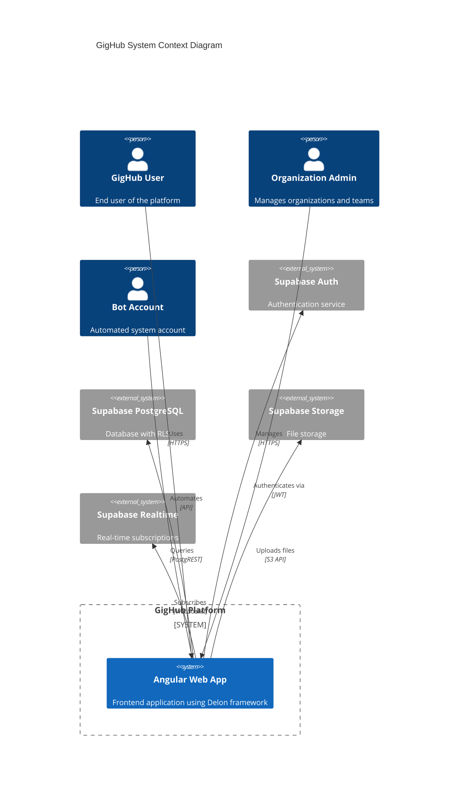

### Explanation

**Overview**: The GigHub platform is a construction/project management system that allows users, organizations, and bots to manage blueprints (logical containers) containing tasks, diaries, and other modules.

**Key Components**:
- **Angular Web App**: Frontend using ng-alain/Delon framework with DA_SERVICE_TOKEN for auth state
- **Supabase Auth**: Handles user authentication, issues JWT tokens
- **Supabase PostgreSQL**: Database with Row Level Security policies
- **Supabase Storage**: File attachments for blueprints, tasks, diaries
- **Supabase Realtime**: Live updates for collaborative features

**Design Decisions**:
- Supabase chosen for its integrated auth + database + storage + realtime stack
- RLS used for row-level data isolation instead of application-level filtering
- SECURITY DEFINER functions prevent RLS circular dependency issues (42501 errors)

---

## Architecture Overview

### Authentication Flow

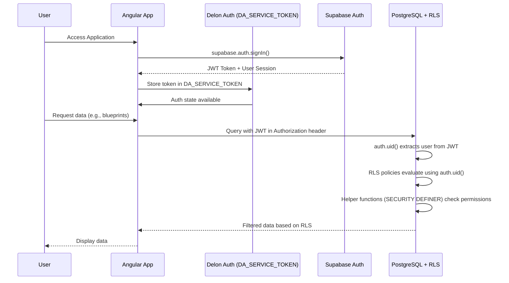

### High-Level Architecture Patterns

1. **Account Type Pattern**: Single `accounts` table with `type` column (User/Organization/Bot)
2. **Membership Pattern**: Separate tables for organization members, team members, blueprint members
3. **Helper Function Pattern**: SECURITY DEFINER functions bypass RLS for permission checks
4. **Direct Auth Check Pattern**: Store `auth_user_id` in membership tables for direct checks

---

## Component Architecture

### Component Diagram

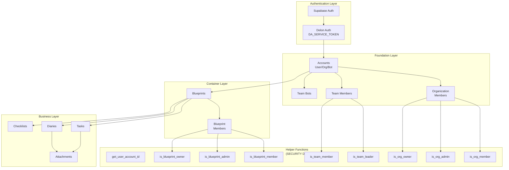

### Component Responsibilities

| Component | Responsibility | Key Fields |
|-----------|---------------|------------|
| **accounts** | Store all account types | id, auth_user_id, type, status |
| **organization_members** | Org → User membership | org_id, account_id, auth_user_id, role |
| **teams** | Sub-units of organizations | id, organization_id, name |
| **team_members** | Team → User membership | team_id, account_id, auth_user_id, role |
| **blueprints** | Logical containers | id, owner_id, status, visibility |
| **blueprint_members** | Blueprint → User membership | blueprint_id, account_id, auth_user_id, role |
| **Helper Functions** | Permission checks with RLS bypass | Uses SECURITY DEFINER |

### Design Decisions

**Why store `auth_user_id` in membership tables?**
- Enables direct RLS checks without joining through accounts table
- Avoids the circular dependency: `SELECT policy → helper function → SELECT accounts → RLS check → helper function...`
- Critical for preventing 42501 errors

**Why use SECURITY DEFINER?**
- Functions run with the privileges of the function owner (postgres)
- Combined with `SET row_security = off`, allows bypassing RLS within the function
- Essential for permission check functions that need to query protected tables

---

## Data Flow

### Data Flow Diagram

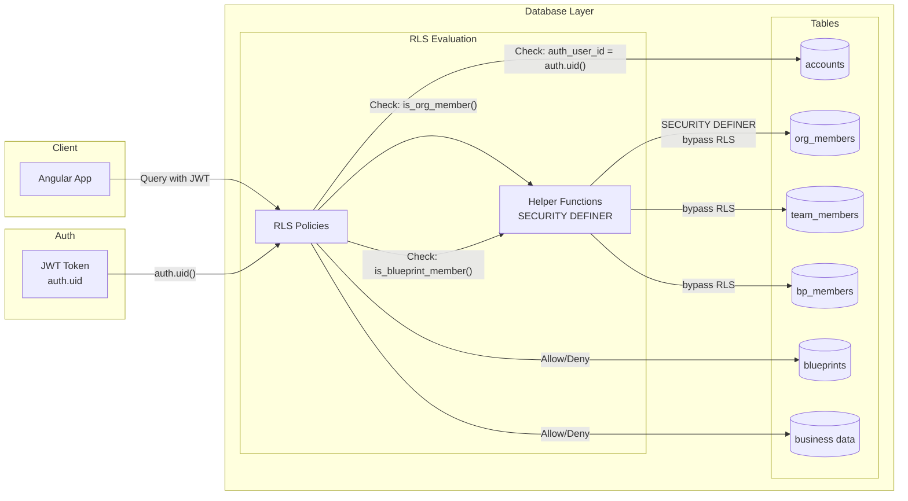

### Data Flow Explanation

**Query Flow (avoiding 42501)**:

1. **Client sends query** with JWT token containing `auth.uid()`
2. **RLS policy evaluates** using one of two patterns:
   - **Direct check**: `auth_user_id = auth.uid()` (no function call, no recursion)
   - **Function check**: `is_blueprint_member(id)` (uses SECURITY DEFINER)
3. **Helper function executes** with RLS disabled (SECURITY DEFINER + `SET row_security = off`)
4. **Function returns boolean** without triggering additional RLS checks
5. **Policy allows/denies** based on result

**Critical Pattern for Self-Discovery**:
```sql
-- CORRECT: Allow users to discover their own memberships
USING (
  auth_user_id = auth.uid()  -- Direct check, no recursion
  OR
  is_org_member(organization_id)  -- Function for checking others
)
```

---

## Entity Relationship Diagram

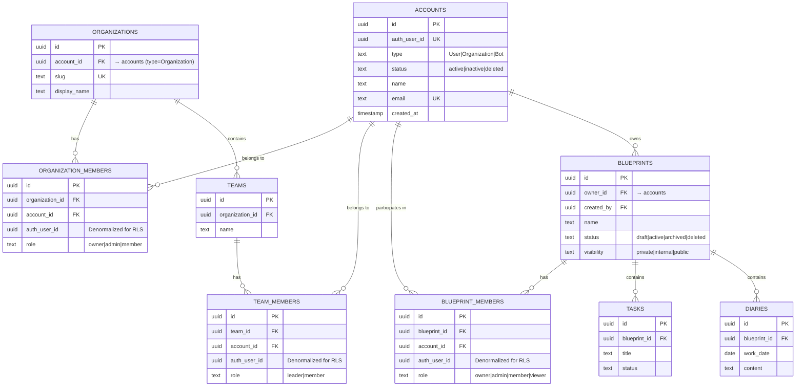

### ERD Explanation

**Key Design Points**:

1. **Denormalized `auth_user_id`**: Stored in membership tables to enable direct RLS checks
2. **Account Type Discrimination**: Single accounts table with type column
3. **Blueprint as Container**: All business data references blueprint_id
4. **Soft Delete Pattern**: status/deleted_at instead of hard delete

---

## Deployment Architecture

### Deployment Diagram

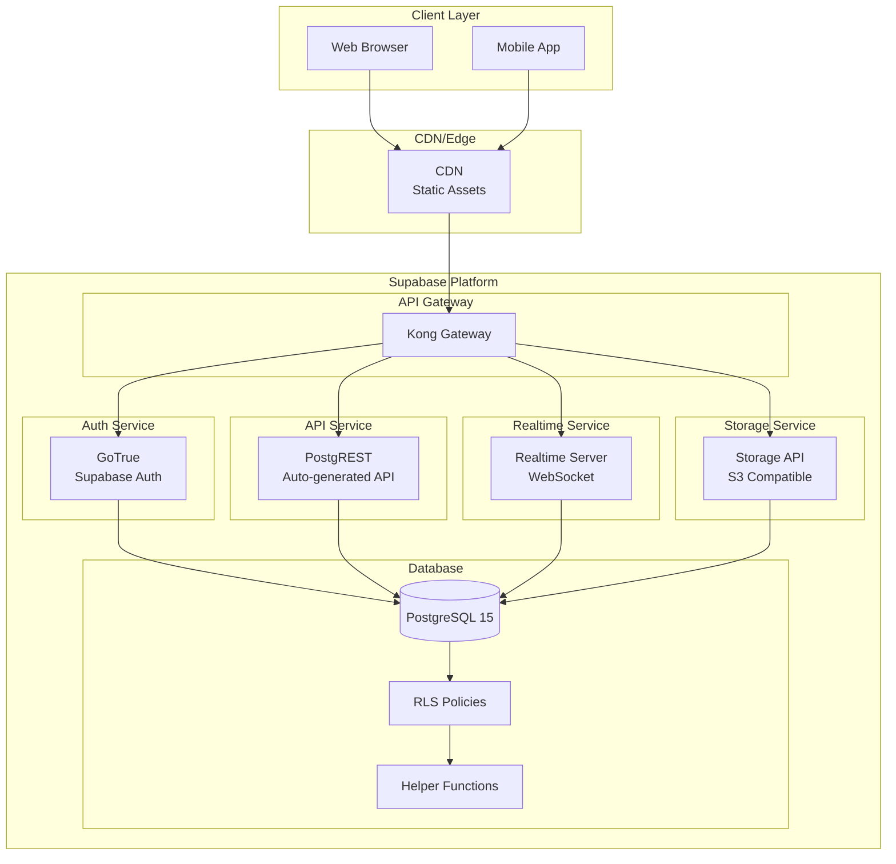

### Deployment Explanation

**Infrastructure Components**:
- **Supabase Platform**: Managed PostgreSQL with integrated services
- **Kong Gateway**: API routing, rate limiting, auth header injection
- **PostgREST**: Auto-generates REST API from PostgreSQL schema
- **GoTrue**: JWT-based authentication service

**NFR Considerations**:
- **Scalability**: Supabase handles horizontal scaling
- **Security**: RLS at database level, JWT authentication
- **Reliability**: Managed service with built-in HA
- **Performance**: Connection pooling via Supavisor

---

## Key Workflows

### Blueprint Creation Sequence

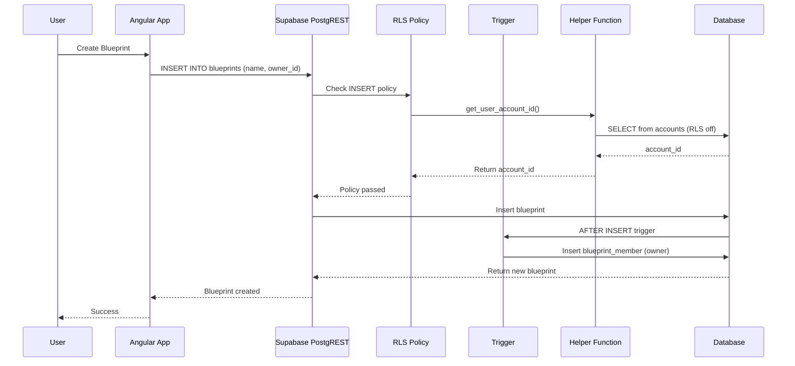

### Permission Check Sequence (Avoiding 42501)

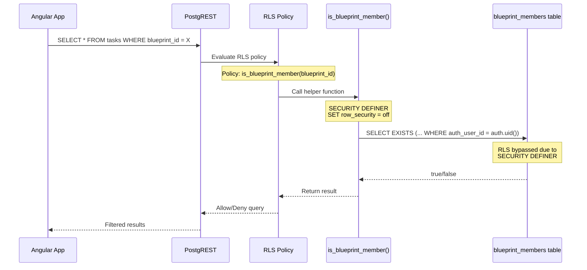

### Self-Discovery Pattern (Critical for 42501 Fix)

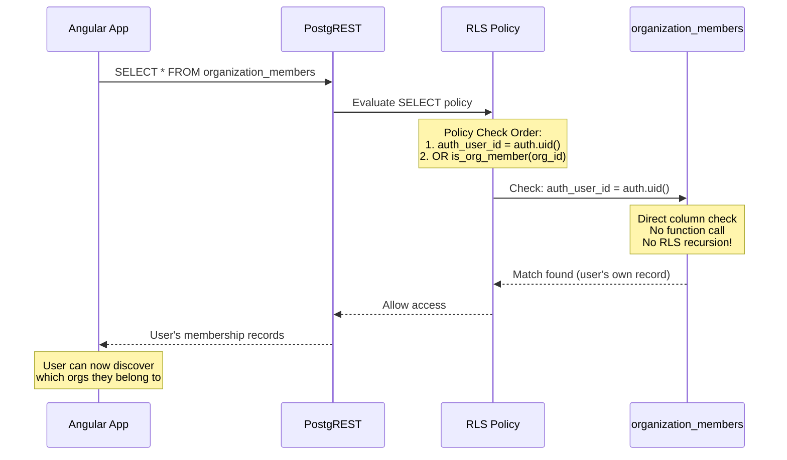

---

## RLS Design Patterns

### Pattern 1: Direct Auth Check (No Recursion)

```sql
-- For membership tables: allow self-discovery
CREATE POLICY "self_discovery" ON organization_members
FOR SELECT TO authenticated
USING (
  auth_user_id = auth.uid()  -- Direct check, no recursion
);
```

**When to use**: Membership tables where users need to discover their own memberships.

### Pattern 2: SECURITY DEFINER Helper Function

```sql
CREATE FUNCTION is_org_member(target_org_id UUID)
RETURNS BOOLEAN
LANGUAGE plpgsql
STABLE
SECURITY DEFINER
SET search_path = public
SET row_security = off  -- Critical!
AS $$
BEGIN
  RETURN EXISTS (
    SELECT 1 FROM organization_members
    WHERE organization_id = target_org_id
      AND auth_user_id = auth.uid()
  );
END;
$$;
```

**When to use**: Permission checks that need to query protected tables.

### Pattern 3: Combined Policy (Self + Others)

```sql
CREATE POLICY "view_members" ON organization_members
FOR SELECT TO authenticated
USING (
  -- Self-discovery (no function call)
  auth_user_id = auth.uid()
  OR
  -- View other members (uses helper)
  is_org_member(organization_id)
);
```

**When to use**: Tables where users need both self-discovery and access to related records.

### Pattern 4: Cascading Permission Check

```sql
-- For business data tables
CREATE POLICY "blueprint_tasks_access" ON tasks
FOR SELECT TO authenticated
USING (
  is_blueprint_member(blueprint_id)  -- Single function call
);
```

**When to use**: Business data tables that inherit permissions from parent containers.

---

## Phased Development

### Phase 1: Foundation Layer (Initial Implementation)

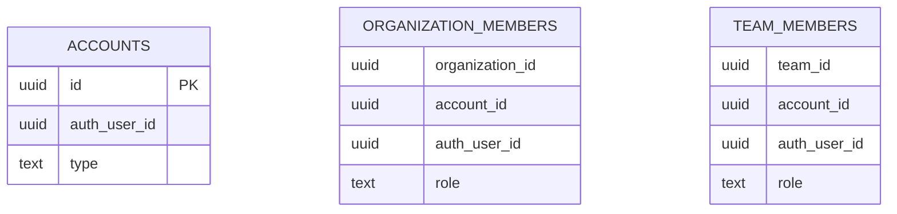

**Focus**:
- accounts table with proper RLS
- organization_members with self-discovery pattern
- team_members with self-discovery pattern
- Helper functions: get_user_account_id, is_org_member, is_team_member

### Phase 2: Container Layer

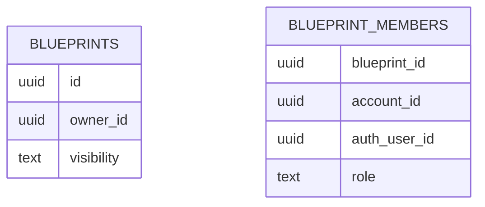

**Focus**:
- blueprints table with visibility-based access
- blueprint_members with self-discovery pattern
- Helper functions: is_blueprint_member, is_blueprint_admin
- Auto-add creator as owner trigger

### Phase 3: Business Layer

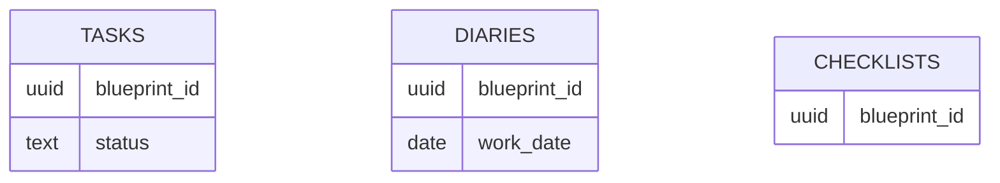

**Focus**:
- All business tables reference blueprint_id
- Simple RLS: `is_blueprint_member(blueprint_id)`
- No additional helper functions needed

### Migration Path

1. **Deploy foundation layer** with proper RLS patterns
2. **Test self-discovery** for all membership tables
3. **Deploy container layer** (blueprints)
4. **Test blueprint creation flow** including auto-owner trigger
5. **Deploy business layer** incrementally
6. **Monitor for 42501 errors** and adjust policies

---

## Non-Functional Requirements Analysis

### Scalability

| Aspect | Approach |
|--------|----------|
| **Database** | PostgreSQL with connection pooling (Supavisor) |
| **Queries** | Indexed columns for RLS checks (auth_user_id, blueprint_id) |
| **Functions** | STABLE marking for query optimizer caching |
| **Data Growth** | Soft delete + archiving strategy |

### Performance

| Aspect | Approach |
|--------|----------|
| **RLS Overhead** | SECURITY DEFINER reduces query nesting |
| **Index Strategy** | Composite indexes on membership tables |
| **Function Cost** | Minimal - single EXISTS check |
| **Query Planning** | STABLE functions allow optimizer to cache results |

**Recommended Indexes**:
```sql
CREATE INDEX idx_org_members_auth_user ON organization_members(auth_user_id);
CREATE INDEX idx_bp_members_auth_user ON blueprint_members(auth_user_id);
CREATE INDEX idx_bp_members_blueprint ON blueprint_members(blueprint_id);
CREATE INDEX idx_tasks_blueprint ON tasks(blueprint_id);
```

### Security

| Aspect | Approach |
|--------|----------|
| **Authentication** | Supabase Auth with JWT |
| **Authorization** | RLS policies + helper functions |
| **Data Isolation** | Blueprint-level isolation |
| **Audit Trail** | created_at, updated_at, created_by columns |

**Security Considerations**:
- SECURITY DEFINER functions have elevated privileges - minimize attack surface
- Revoke EXECUTE from anon and public roles
- Use SET search_path to prevent search path attacks

### Reliability

| Aspect | Approach |
|--------|----------|
| **Data Integrity** | Foreign key constraints with ON DELETE CASCADE |
| **Consistency** | ACID transactions for membership changes |
| **Recovery** | Soft delete pattern for accidental deletions |
| **Failover** | Supabase managed HA |

### Maintainability

| Aspect | Approach |
|--------|----------|
| **Code Organization** | Separate migrations per feature |
| **Documentation** | Comments on policies and functions |
| **Testing** | Migration scripts with ROLLBACK capability |
| **Debugging** | Policy names explain their purpose |

---

## Risks and Mitigations

| Risk | Impact | Mitigation |
|------|--------|------------|
| **Circular RLS dependency** | 42501 errors | Use SECURITY DEFINER + direct auth checks |
| **Performance degradation** | Slow queries | Index auth_user_id columns, use STABLE functions |
| **Security bypass** | Data leak | Revoke function access from anon, test RLS thoroughly |
| **Migration failures** | System downtime | Use transactions, test in staging |
| **Complex policy debugging** | Development slowdown | Document policies, use meaningful names |

---

## Technology Stack Recommendations

| Layer | Technology | Justification |
|-------|------------|---------------|
| **Database** | PostgreSQL 15+ | Row Level Security, JSONB, extensive indexing |
| **Backend** | Supabase | Integrated auth, realtime, storage |
| **Frontend** | Angular + ng-alain | Enterprise framework with Delon auth |
| **Auth** | Supabase Auth + JWT | Seamless integration, DA_SERVICE_TOKEN |
| **API** | PostgREST (auto-generated) | Zero backend code, RLS-enforced |

---

## 42501 Error Prevention Checklist

Before deploying any RLS policy, verify:

- [ ] **Membership tables have self-discovery pattern**: `auth_user_id = auth.uid()` first
- [ ] **Helper functions use SECURITY DEFINER**: With `SET row_security = off`
- [ ] **auth_user_id is indexed**: For fast direct lookups
- [ ] **Functions are STABLE**: For query optimizer benefits
- [ ] **EXECUTE is revoked from anon/public**: Security hardening
- [ ] **Policy comments explain purpose**: For maintainability
- [ ] **Circular dependencies tested**: Query each table as different users

---

## Next Steps

1. **Review existing migrations** for compliance with patterns
2. **Add missing indexes** on auth_user_id columns
3. **Test self-discovery queries** for all membership tables
4. **Deploy blueprint layer** following Phase 2 guidelines
5. **Implement monitoring** for 42501 errors in production
6. **Create integration tests** for RLS policies

---

## Appendix: Helper Function Reference

### get_user_account_id()
Returns the account_id for the current authenticated user.

### is_org_member(org_id)
Returns true if current user is a member of the organization.

### is_org_admin(org_id)
Returns true if current user is an admin or owner of the organization.

### is_org_owner(org_id)
Returns true if current user is the owner of the organization.

### is_team_member(team_id)
Returns true if current user is a member of the team.

### is_team_leader(team_id)
Returns true if current user is a leader of the team.

### is_blueprint_member(blueprint_id)
Returns true if current user is a member of the blueprint.

### is_blueprint_admin(blueprint_id)
Returns true if current user is an admin or owner of the blueprint.

### is_blueprint_owner(blueprint_id)
Returns true if current user is the owner of the blueprint.

All functions follow the pattern:
```sql
SECURITY DEFINER
SET search_path = public
SET row_security = off
```
