# GigHub - 專案架構分析與核心缺口評估

> **文件版本 (Document Version)**: 2.0  
> **建立日期 (Created)**: 2025-12-09  
> **撰寫者 (Author)**: Senior Cloud Architect  
> **狀態 (Status)**: 分析完成 (Analysis Complete)

---

## 執行摘要 (Executive Summary)

本文件提供 GigHub（工地施工進度追蹤管理系統）的全面架構分析，包括當前系統狀態評估、核心架構缺口識別與改進建議。

### 關鍵發現 (Key Findings)

#### ✅ 優勢 (Strengths)
1. **現代化技術棧**: Angular 20 + Standalone Components + Signals
2. **清晰的架構分層**: 三層架構（Foundation → Container → Business）
3. **完整的 Blueprint 模組**: 已實作 CRUD、權限、審計功能
4. **多層安全機制**: Firestore Rules + Service Layer + Client Validation
5. **型別安全**: TypeScript 嚴格模式，完整的介面定義

#### ⚠️ 核心缺口 (Core Gaps)
1. **後端架構不統一**: 同時使用 Supabase 和 Firebase（技術棧衝突）
2. **業務模組未實作**: Task, Log, Quality 等核心功能模組缺失
3. **缺乏統一 API 層**: 服務直接存取資料庫，缺乏中間層抽象
4. **測試覆蓋率不足**: 缺少單元測試和整合測試
5. **狀態管理策略不一致**: Signals 與 RxJS 混用，缺乏統一模式
6. **缺少 CI/CD 流程**: 無自動化部署與品質檢查
7. **監控與日誌不完整**: 缺乏 APM、錯誤追蹤與效能監控

---

## 目錄 (Table of Contents)

1. [系統情境](#系統情境-system-context)
2. [架構概覽](#架構概覽-architecture-overview)
3. [元件架構](#元件架構-component-architecture)
4. [部署架構](#部署架構-deployment-architecture)
5. [資料流程](#資料流程-data-flow)
6. [關鍵工作流程](#關鍵工作流程-key-workflows)
7. [核心缺口分析](#核心缺口分析-gap-analysis)
8. [非功能需求評估](#非功能需求評估-nfr-assessment)
9. [改進建議](#改進建議-recommendations)
10. [實施路徑](#實施路徑-implementation-roadmap)

---

## 系統情境 (System Context)

### 系統情境圖 (System Context Diagram)

```mermaid
flowchart TB
    subgraph External["外部參與者 (External Actors)"]
        USER["👤 一般使用者<br/>General User"]
        ADMIN["👔 系統管理員<br/>System Admin"]
        PM["📋 專案經理<br/>Project Manager"]
        SUPERVISOR["👷 工地主任<br/>Site Supervisor"]
        INSPECTOR["✅ 品管人員<br/>Quality Inspector"]
        CLIENT["🏢 業主<br/>Client"]
    end
    
    subgraph GigHub["GigHub 系統邊界 (System Boundary)"]
        WEBAPP["🌐 Web Application<br/>(Angular 20)"]
        
        subgraph Services["核心服務 (Core Services)"]
            AUTH["🔐 身份驗證<br/>Authentication"]
            AUTHZ["🛡️ 授權管理<br/>Authorization"]
            BLUEPRINT["📦 藍圖容器<br/>Blueprint Container"]
            WORKSPACE["🔄 工作區管理<br/>Workspace Context"]
        end
        
        subgraph Business["業務模組 (Business Modules)"]
            TASK["📋 任務管理<br/>Task Management"]
            LOG["📝 施工日誌<br/>Construction Log"]
            QUALITY["✅ 品質管制<br/>Quality Control"]
            FILE["📁 檔案管理<br/>File Storage"]
        end
    end
    
    subgraph Backend["後端基礎設施 (Backend Infrastructure)"]
        FIREBASE["🔥 Firebase Auth"]
        SUPABASE["🗄️ Supabase<br/>(PostgreSQL)"]
        FIRESTORE["📊 Firestore"]
        STORAGE["💾 Cloud Storage"]
    end
    
    subgraph External_Systems["外部系統 (External Systems)"]
        EMAIL["📧 Email Service"]
        SMS["📱 SMS Gateway"]
        PAYMENT["💳 Payment Gateway"]
        MAP["🗺️ Map Service"]
    end
    
    USER --> WEBAPP
    ADMIN --> WEBAPP
    PM --> WEBAPP
    SUPERVISOR --> WEBAPP
    INSPECTOR --> WEBAPP
    CLIENT --> WEBAPP
    
    WEBAPP --> AUTH
    WEBAPP --> AUTHZ
    WEBAPP --> BLUEPRINT
    WEBAPP --> WORKSPACE
    
    AUTH --> FIREBASE
    AUTHZ --> FIRESTORE
    BLUEPRINT --> FIRESTORE
    WORKSPACE --> FIRESTORE
    
    TASK --> SUPABASE
    LOG --> SUPABASE
    QUALITY --> SUPABASE
    FILE --> STORAGE
    
    WEBAPP -.->|通知 (Notifications)| EMAIL
    WEBAPP -.->|簡訊 (SMS)| SMS
    WEBAPP -.->|付款 (Payment)| PAYMENT
    WEBAPP -.->|地圖 (Maps)| MAP
    
    style GigHub fill:#e1f5fe
    style Backend fill:#fff3e0
    style External_Systems fill:#f3e5f5
```

### 說明 (Explanation)

#### 外部參與者 (External Actors)
- **一般使用者**: 工地施工人員，負責記錄日誌與任務執行
- **系統管理員**: 平台管理者，管理組織與權限
- **專案經理**: 負責專案規劃與進度追蹤
- **工地主任**: 現場管理者，監督施工進度
- **品管人員**: 負責品質檢查與驗收
- **業主**: 專案業主，查看進度報表

#### 系統邊界 (System Boundaries)
**內部 (Inside GigHub)**:
- Web 應用程式（Angular 20 前端）
- 核心服務（認證、授權、藍圖管理、工作區）
- 業務模組（任務、日誌、品質、檔案）

**外部 (Outside GigHub)**:
- 身份驗證（Firebase Auth）
- 資料庫（Firestore + Supabase）
- 雲端儲存（Cloud Storage）
- 第三方服務（Email、SMS、Payment、Maps）

---

## 架構概覽 (Architecture Overview)

### 三層架構模式 (Three-Layer Architecture)

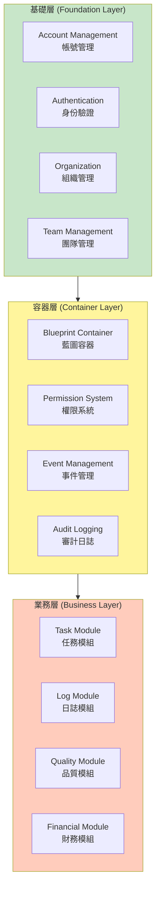

### 架構原則 (Architectural Principles)

1. **分層解耦 (Layered Decoupling)**
   - 各層職責明確，依賴方向單一（向下依賴）
   - 容器層提供統一的業務邏輯容器
   - 業務層專注於領域特定功能

2. **奧卡姆剃刀 (Occam's Razor)**
   - 避免過度工程
   - 優先使用 Angular 內建功能
   - 不引入不必要的狀態管理庫

3. **安全優先 (Security First)**
   - 多層安全驗證（Database → Service → Client）
   - 細粒度權限控制（RBAC + ABAC）
   - 完整審計追蹤

4. **可擴展性 (Extensibility)**
   - 模組化設計，易於新增業務模組
   - Plugin 架構支援第三方擴展
   - API-first 設計

---

## 元件架構 (Component Architecture)

### 元件架構圖 (Component Diagram)

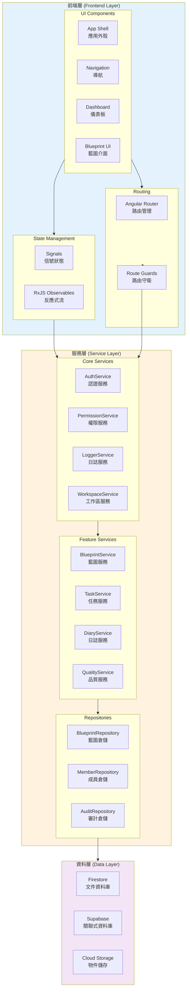

### 元件說明 (Component Descriptions)

#### 前端層 (Frontend Layer)

**UI Components**:
- **App Shell**: 應用程式外殼，包含頂部導航、側邊欄、內容區
- **Navigation**: 動態導航選單，根據權限顯示可用功能
- **Dashboard**: 儀表板元件，顯示專案概況與統計
- **Blueprint UI**: 藍圖管理介面（列表、詳情、編輯）

**State Management**:
- **Signals**: Angular 20 內建的細粒度反應式狀態管理
- **RxJS Observables**: 處理異步操作與事件流

**Routing**:
- **Angular Router**: 路由管理與延遲載入
- **Route Guards**: 認證與授權守衛

#### 服務層 (Service Layer)

**Core Services**:
- **AuthService**: 處理 Firebase Authentication 整合
- **PermissionService**: 權限檢查與快取
- **LoggerService**: 應用程式日誌記錄
- **WorkspaceService**: 工作區情境管理

**Feature Services**:
- **BlueprintService**: 藍圖業務邏輯
- **TaskService**: 任務管理業務邏輯（待實作）
- **DiaryService**: 施工日誌業務邏輯（待實作）
- **QualityService**: 品質管理業務邏輯（待實作）

**Repositories**:
- **BlueprintRepository**: 藍圖資料存取
- **MemberRepository**: 成員資料存取
- **AuditRepository**: 審計日誌資料存取

#### 資料層 (Data Layer)

- **Firestore**: 文件型資料庫，儲存 Blueprint、Member、Audit 資料
- **Supabase**: PostgreSQL 資料庫，儲存業務模組資料（待實作）
- **Cloud Storage**: 檔案物件儲存

---

## 部署架構 (Deployment Architecture)

### 部署架構圖 (Deployment Diagram)

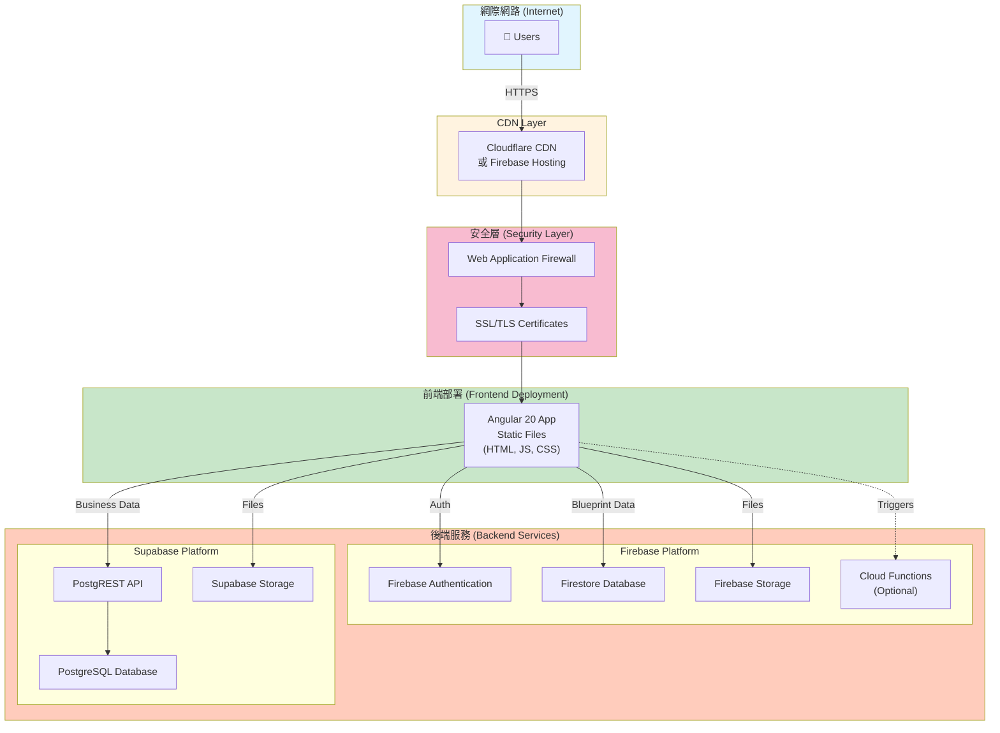

### 部署環境 (Deployment Environments)

#### 開發環境 (Development)
- **前端**: `yarn start` (localhost:4200)
- **Firebase**: 模擬器模式 (localhost:8080)
- **Supabase**: 本地 Docker 容器（待配置）

#### 測試環境 (Staging)
- **前端**: Firebase Hosting (staging.gighub.app)
- **Firebase**: 測試專案
- **Supabase**: 測試資料庫實例

#### 生產環境 (Production)
- **前端**: Firebase Hosting + CDN (app.gighub.com)
- **Firebase**: 生產專案（已配置）
- **Supabase**: 生產資料庫（待配置）

### 部署策略 (Deployment Strategy)

**CI/CD Pipeline** (待實作):
```
Code Push → GitHub Actions → Build → Test → Deploy to Staging → Manual Approval → Deploy to Production
```

**備份策略**:
- Firestore: 每日自動備份
- Supabase: 持續備份，保留 7 天
- 關鍵資料異地備份

---

## 資料流程 (Data Flow)

### 整體資料流程圖 (Overall Data Flow Diagram)

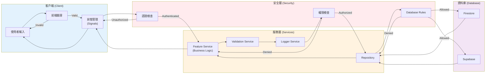

### 關鍵資料流 (Key Data Flows)

#### 1. 藍圖建立流程 (Blueprint Creation Flow)

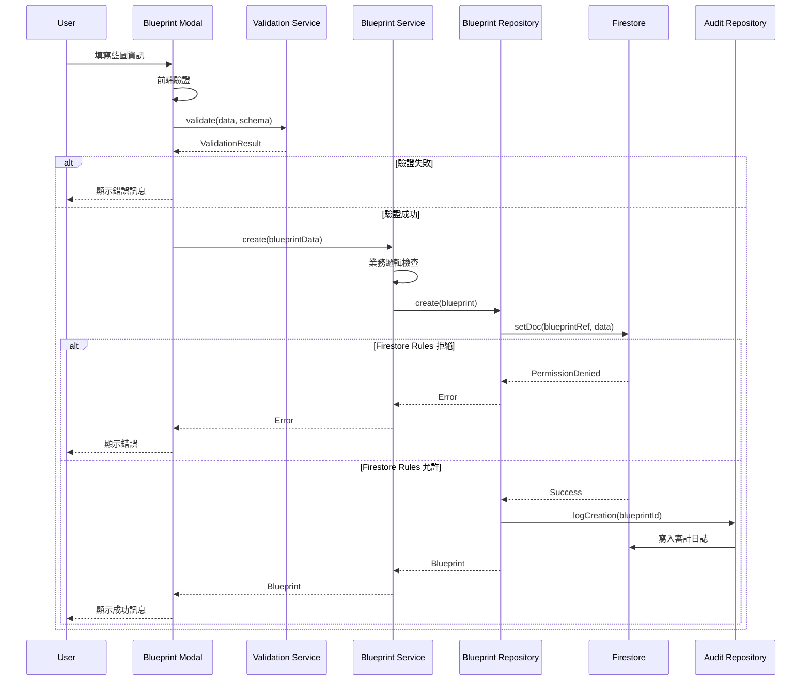

#### 2. 權限檢查流程 (Permission Check Flow)

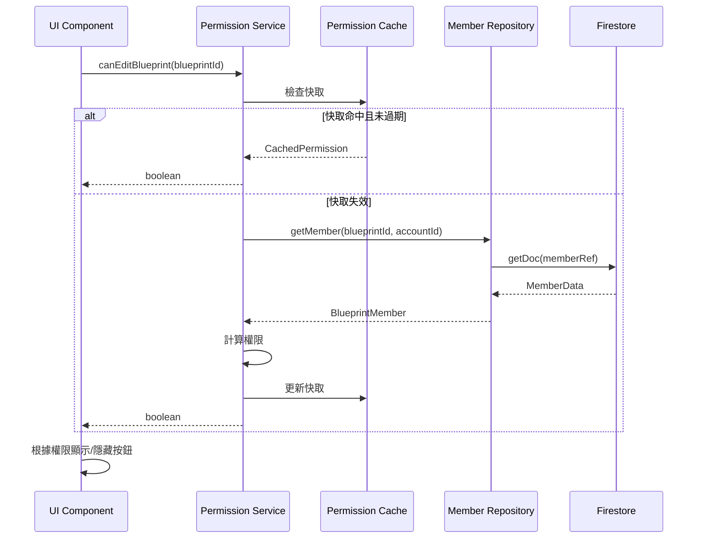

---

## 關鍵工作流程 (Key Workflows)

### 1. 使用者登入流程 (User Login Workflow)

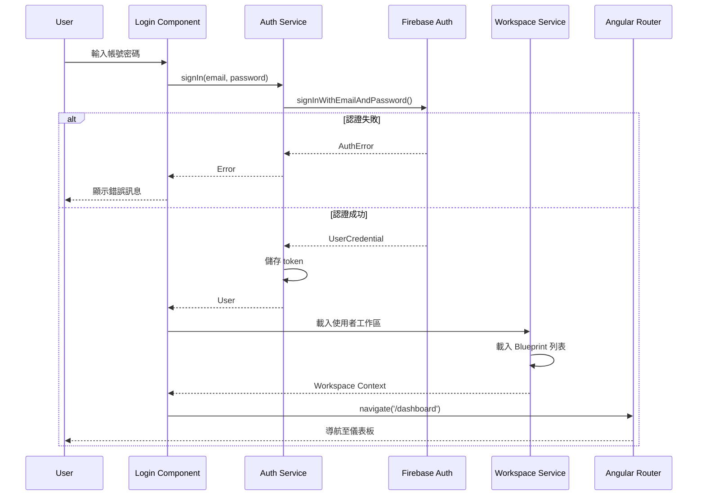

### 2. 藍圖成員管理流程 (Blueprint Member Management Workflow)

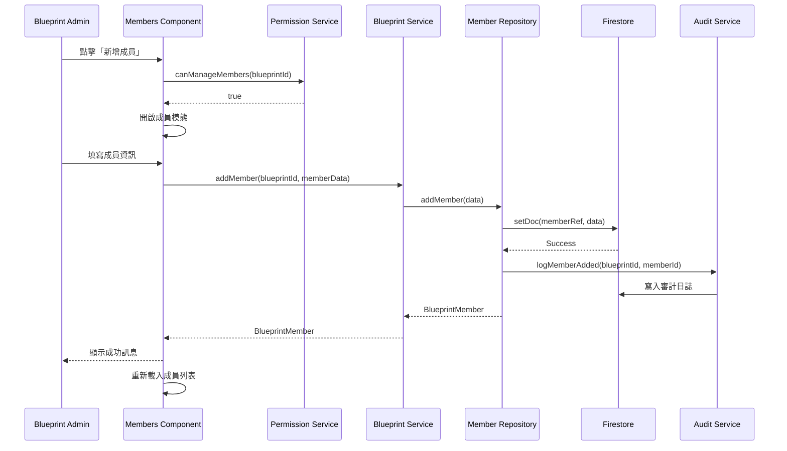

### 3. 施工日誌建立流程 (Construction Log Creation Workflow)

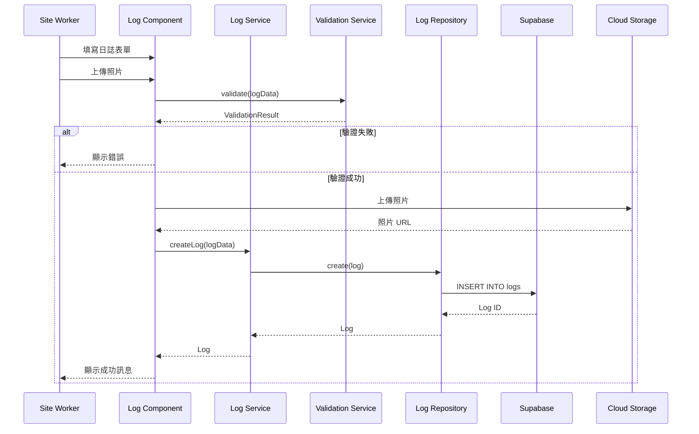

---

## 核心缺口分析 (Gap Analysis)

### 架構缺口 (Architecture Gaps)

#### 1. 後端技術棧不統一 ⚠️ HIGH PRIORITY

**問題描述**:
- 同時使用 Firebase (Firestore) 和 Supabase (PostgreSQL)
- 造成資料分散、查詢複雜度增加
- 開發者需要學習兩套不同的 API
- 增加維護成本與複雜度

**影響**:
- 資料一致性難以保證
- 跨平台查詢困難
- 增加學習曲線
- 雙倍的基礎設施成本

**建議解決方案**:
```
選項 1: 全面遷移至 Supabase
- 優點: 統一資料模型、RLS 支援、更強大的查詢能力
- 缺點: 需要重寫 Blueprint 模組

選項 2: 全面使用 Firebase
- 優點: 已有實作經驗、即時同步、無伺服器
- 缺點: 複雜查詢受限、成本較高

選項 3: 混合架構（當前狀態改進）
- Firebase: 認證 + Blueprint 容器資料
- Supabase: 業務模組資料（Task, Log, Quality）
- 優點: 發揮各平台優勢
- 缺點: 仍需維護兩套系統
```

**推薦方案**: 選項 3（短期）→ 選項 1（長期）

#### 2. 缺乏統一 API 層 ⚠️ HIGH PRIORITY

**問題描述**:
- 服務層直接存取 Firestore/Supabase
- 缺乏統一的 API 抽象層
- 難以切換資料來源
- 測試困難

**建議解決方案**:
```typescript
// 引入 Repository Pattern 抽象層
interface IRepository<T> {
  findById(id: string): Observable<T>;
  findAll(query?: QueryOptions): Observable<T[]>;
  create(data: Partial<T>): Observable<T>;
  update(id: string, data: Partial<T>): Observable<T>;
  delete(id: string): Observable<void>;
}

// Firestore 實作
class FirestoreRepository<T> implements IRepository<T> {
  // Firestore 特定實作
}

// Supabase 實作
class SupabaseRepository<T> implements IRepository<T> {
  // Supabase 特定實作
}
```

#### 3. 業務模組未實作 ⚠️ HIGH PRIORITY

**缺失模組**:
- ✅ Blueprint Module (已完成)
- ❌ Task Module (任務管理) - 核心功能
- ❌ Log Module (施工日誌) - 核心功能
- ❌ Quality Module (品質管制) - 核心功能
- ❌ Financial Module (財務管理) - 進階功能
- ❌ File Module (檔案管理) - 支援功能

**影響**:
- 系統無法投入實際使用
- 無法驗證架構設計是否合理
- 使用者體驗不完整

**實施優先順序**:
1. Task Module (P0)
2. Log Module (P0)
3. Quality Module (P1)
4. File Module (P1)
5. Financial Module (P2)

### 功能缺口 (Feature Gaps)

#### 1. 缺少即時協作功能

**問題**:
- 無即時更新機制
- 多人編輯可能衝突
- 無線上狀態顯示

**建議**:
- 使用 Firestore 即時監聽器
- WebSocket 推送通知
- 實作樂觀鎖定機制

#### 2. 缺少離線支援

**問題**:
- 工地網路不穩定
- 無離線資料快取
- 無衝突解決機制

**建議**:
- Service Worker + IndexedDB
- Firestore Offline Persistence
- 衝突解決策略

#### 3. 缺少報表與分析功能

**問題**:
- 無資料視覺化
- 無匯出功能
- 無統計分析

**建議**:
- 整合 Chart 函式庫（已有 @delon/chart）
- PDF/Excel 匯出功能
- 儀表板統計面板

### 技術債務 (Technical Debt)

#### 1. 測試覆蓋率不足 ⚠️ MEDIUM PRIORITY

**現狀**:
- 單元測試: ~0%
- 整合測試: 0%
- E2E 測試: 0%

**建議**:
- 核心服務單元測試: 目標 80%
- Repository 測試: 使用 Mock 資料
- E2E 測試: 關鍵使用者流程

#### 2. 狀態管理不一致

**問題**:
- Signals 與 RxJS 混用
- 無統一狀態管理模式
- 資料流向不清晰

**建議**:
```typescript
// 統一使用 Signals + toObservable
import { signal, computed } from '@angular/core';
import { toObservable } from '@angular/core/rxjs-interop';

// 元件狀態
data = signal<Data[]>([]);
loading = signal(false);

// 衍生狀態
filteredData = computed(() => 
  this.data().filter(...)
);

// 轉換為 Observable 用於服務層
data$ = toObservable(this.data);
```

#### 3. 錯誤處理不完整

**問題**:
- 錯誤處理分散
- 無統一錯誤訊息格式
- 缺少錯誤恢復機制

**建議**:
```typescript
// 全域錯誤攔截器
@Injectable()
export class GlobalErrorHandler implements ErrorHandler {
  handleError(error: Error): void {
    // 記錄錯誤
    this.logger.error(error);
    
    // 顯示使用者友善訊息
    this.notification.error(
      this.getErrorMessage(error)
    );
    
    // 上報錯誤追蹤服務
    this.sentry.captureException(error);
  }
}
```

---

## 非功能需求評估 (NFR Assessment)

### 可擴展性 (Scalability)

#### 當前狀態: ⭐⭐⭐☆☆ (3/5)

**優勢**:
- ✅ Firestore 自動擴展
- ✅ Supabase 可垂直擴展
- ✅ CDN 分散靜態資源

**限制**:
- ❌ 無水平擴展策略
- ❌ 無負載均衡配置
- ❌ 無資料分片機制

**改進建議**:
1. 實施資料分片（按組織分片）
2. 讀寫分離（Supabase Read Replicas）
3. 快取策略（Redis for hot data）
4. 非同步處理（Cloud Functions/Background Jobs）

### 效能 (Performance)

#### 當前狀態: ⭐⭐⭐☆☆ (3/5)

**優勢**:
- ✅ OnPush 變更偵測
- ✅ Lazy Loading 路由
- ✅ Signals 細粒度更新

**問題**:
- ❌ 無 Bundle 大小優化
- ❌ 無圖片優化策略
- ❌ 無查詢效能監控

**效能目標**:
| 指標 | 當前 | 目標 |
|------|------|------|
| First Contentful Paint (FCP) | ? | < 1.8s |
| Time to Interactive (TTI) | ? | < 3.8s |
| Bundle Size (Initial) | ? | < 500KB |
| API Response Time (P95) | ? | < 500ms |

**改進建議**:
1. 實施 Bundle Analyzer 分析
2. 圖片 WebP 格式 + Lazy Loading
3. Virtual Scrolling 大列表
4. Firestore Index 優化
5. 實施 APM 監控（如 New Relic）

### 安全性 (Security)

#### 當前狀態: ⭐⭐⭐⭐☆ (4/5)

**優勢**:
- ✅ Firebase Authentication
- ✅ Firestore Security Rules
- ✅ 多層權限檢查
- ✅ TypeScript 型別安全

**待加強**:
- ⚠️ 無 CSRF 保護
- ⚠️ 無 Rate Limiting
- ⚠️ 無輸入消毒策略
- ⚠️ 無敏感資料加密

**安全檢查清單**:
- [ ] OWASP Top 10 檢查
- [ ] 依賴漏洞掃描（npm audit）
- [ ] SQL Injection 防護
- [ ] XSS 防護
- [ ] CORS 配置
- [ ] API Rate Limiting
- [ ] 敏感資料加密（at rest & in transit）
- [ ] 定期安全審計

### 可靠性 (Reliability)

#### 當前狀態: ⭐⭐⭐☆☆ (3/5)

**優勢**:
- ✅ 雲平台 SLA (99.95%)
- ✅ 自動備份機制
- ✅ 錯誤邊界元件

**待加強**:
- ❌ 無災難恢復計畫
- ❌ 無健康檢查端點
- ❌ 無降級策略

**可靠性目標**:
- 可用性: 99.9% (三個九)
- MTTR (Mean Time To Recovery): < 15 min
- RPO (Recovery Point Objective): < 1 hour
- RTO (Recovery Time Objective): < 30 min

**改進建議**:
1. 實施健康檢查 API
2. 多區域備援部署
3. 自動故障轉移
4. 備份還原測試
5. Chaos Engineering 演練

### 可維護性 (Maintainability)

#### 當前狀態: ⭐⭐⭐⭐☆ (4/5)

**優勢**:
- ✅ TypeScript 嚴格模式
- ✅ 清晰的架構分層
- ✅ 完整的文件
- ✅ 統一的程式碼風格

**待加強**:
- ⚠️ 測試覆蓋率不足
- ⚠️ 缺少 Code Review 流程
- ⚠️ 無自動化重構工具

**改進建議**:
1. 強制 Code Review (GitHub PR)
2. 測試覆蓋率門檻 (80%)
3. 自動化程式碼品質檢查（SonarQube）
4. 技術文件持續更新
5. 開發者入職文件

---

## 改進建議 (Recommendations)

### 短期改進 (Short-term Improvements) - 1-3 個月

#### P0 - 關鍵優先

1. **實作核心業務模組**
   - Task Module (任務管理)
   - Log Module (施工日誌)
   - 預估工時: 6 週

2. **統一 Repository Pattern**
   - 抽象 Repository 介面
   - 實作 Firestore/Supabase Repository
   - 預估工時: 2 週

3. **建立 CI/CD Pipeline**
   - GitHub Actions 配置
   - 自動化測試
   - 自動部署至 Staging
   - 預估工時: 1 週

#### P1 - 高優先

4. **增加測試覆蓋率**
   - 核心服務單元測試
   - Repository 測試
   - 預估工時: 4 週（持續進行）

5. **實施錯誤監控**
   - Sentry 整合
   - 錯誤追蹤與告警
   - 預估工時: 1 週

### 中期改進 (Mid-term Improvements) - 3-6 個月

#### P1 - 高優先

6. **實作 Quality Module**
   - 品質檢查清單
   - 照片上傳與標註
   - 缺失追蹤
   - 預估工時: 4 週

7. **實施效能優化**
   - Bundle 分析與優化
   - 圖片優化
   - 快取策略
   - 預估工時: 3 週

8. **即時協作功能**
   - Firestore 即時監聽
   - 線上狀態顯示
   - 樂觀鎖定
   - 預估工時: 3 週

#### P2 - 中優先

9. **報表與分析**
   - 儀表板統計
   - 圖表視覺化
   - PDF/Excel 匯出
   - 預估工時: 4 週

10. **行動端優化**
    - PWA 配置
    - 離線支援
    - 推送通知
    - 預估工時: 3 週

### 長期改進 (Long-term Improvements) - 6-12 個月

#### P2 - 中優先

11. **資料庫統一遷移**
    - 評估遷移至 Supabase
    - 資料遷移腳本
    - 漸進式遷移
    - 預估工時: 8 週

12. **進階功能**
    - Financial Module
    - 多語系支援（i18n）
    - AI 輔助分析
    - 預估工時: 12 週

13. **企業級功能**
    - SSO 整合
    - 進階權限管理
    - 客製化工作流程
    - 預估工時: 8 週

---

## 實施路徑 (Implementation Roadmap)

### Phase 1: 核心功能完善 (Q1 2025)

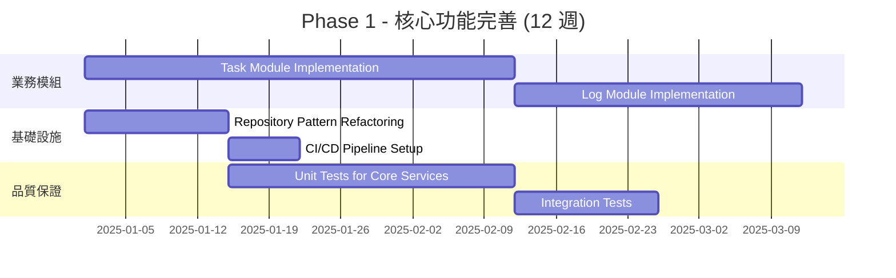

**交付成果**:
- ✅ Task Module (完整 CRUD + 狀態管理)
- ✅ Log Module (日誌建立 + 照片上傳)
- ✅ Repository Pattern (抽象層 + 實作)
- ✅ CI/CD Pipeline (自動部署至 Staging)
- ✅ 測試覆蓋率 > 60%

### Phase 2: 效能與品質提升 (Q2 2025)

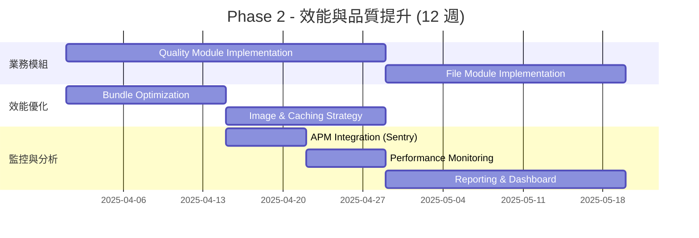

**交付成果**:
- ✅ Quality Module
- ✅ File Module
- ✅ Bundle Size < 500KB
- ✅ APM 監控系統
- ✅ 基礎報表功能

### Phase 3: 企業級功能 (Q3-Q4 2025)

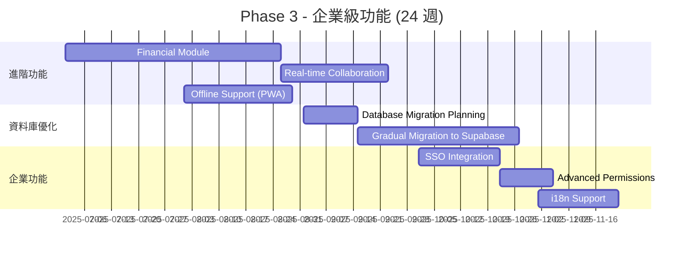

**交付成果**:
- ✅ Financial Module
- ✅ 即時協作功能
- ✅ PWA 離線支援
- ✅ 資料庫遷移至 Supabase
- ✅ SSO 整合
- ✅ 多語系支援

---

## 風險與緩解措施 (Risks and Mitigations)

### 技術風險

| 風險 | 機率 | 影響 | 緩解措施 |
|------|------|------|----------|
| 資料庫遷移失敗 | 中 | 高 | 完整測試環境、漸進式遷移、回滾計畫 |
| 效能瓶頸 | 中 | 中 | 早期效能測試、APM 監控、快取策略 |
| 安全漏洞 | 低 | 高 | 定期安全審計、依賴更新、OWASP 檢查 |
| 第三方服務中斷 | 低 | 中 | 多雲備援、降級策略、SLA 監控 |

### 專案風險

| 風險 | 機率 | 影響 | 緩解措施 |
|------|------|------|----------|
| 需求變更頻繁 | 高 | 中 | 敏捷開發、Sprint Planning、產品待辦清單 |
| 團隊人力不足 | 中 | 高 | 優先順序排序、外包關鍵任務、技術培訓 |
| 技術選型錯誤 | 低 | 高 | POC 驗證、技術評審、社群支援度評估 |
| 上線延期 | 中 | 中 | 合理排程、緩衝時間、MVP 優先 |

---

## 技術棧建議 (Technology Stack Recommendations)

### 當前技術棧

```
Frontend:
- Angular 20 ✅
- ng-alain 20 ✅
- ng-zorro-antd 20 ✅
- RxJS 7.8 ✅
- TypeScript 5.9 ✅

Backend:
- Firebase Auth ✅
- Firestore ⚠️ (建議逐步遷移)
- Supabase ⚠️ (目標主要資料庫)
- Cloud Storage ✅

Tools:
- Angular CLI ✅
- Yarn ✅
```

### 建議新增工具

```
Testing:
- Jasmine + Karma (已內建) ✅
- Cypress (E2E Testing) 📦 新增
- Jest (更快的單元測試) 📦 可選

Monitoring:
- Sentry (錯誤追蹤) 📦 新增
- Google Analytics (使用者行為) 📦 新增
- Lighthouse CI (效能監控) 📦 新增

CI/CD:
- GitHub Actions ✅
- Vercel (可選替代 Firebase Hosting) 📦 可選

Development:
- Storybook (元件開發) 📦 可選
- Compodoc (文件生成) 📦 建議
```

---

## 下一步行動 (Next Steps)

### 立即行動 (Immediate Actions)

1. **建立 GitHub Project Board**
   - 建立 Issue 追蹤所有缺口項目
   - 設定 Milestone
   - 指派負責人

2. **設定 CI/CD Pipeline**
   - 配置 GitHub Actions
   - 自動化 Lint + Build + Test
   - 自動部署至 Staging

3. **開始實作 Task Module**
   - 設計資料模型
   - 實作 Repository
   - 建立 UI 元件
   - 撰寫測試

### 本週行動 (This Week)

4. **技術決策會議**
   - 確認資料庫策略（Firestore vs Supabase）
   - 討論實施優先順序
   - 資源分配

5. **文件更新**
   - 更新專案 README
   - 建立開發者指南
   - API 文件規範

---

## 總結 (Summary)

### 優勢總結 (Strengths Summary)

GigHub 專案具備良好的基礎架構：
- ✅ 現代化的前端技術棧（Angular 20）
- ✅ 清晰的三層架構設計
- ✅ 完整的 Blueprint 模組實作
- ✅ 多層安全機制
- ✅ 型別安全的開發體驗

### 關鍵挑戰 (Key Challenges)

需要優先解決的核心問題：
1. 後端技術棧統一化
2. 核心業務模組實作
3. 測試覆蓋率提升
4. CI/CD 流程建立
5. 效能優化與監控

### 推薦方向 (Recommended Direction)

**短期（1-3 個月）**:
- 聚焦核心業務模組實作（Task, Log）
- 建立 CI/CD 與測試基礎設施
- Repository Pattern 重構

**中期（3-6 個月）**:
- 完成所有核心業務模組（Quality, File）
- 效能優化與監控
- 報表與分析功能

**長期（6-12 個月）**:
- 資料庫統一化（遷移至 Supabase）
- 企業級功能（SSO, 進階權限）
- AI 輔助分析

### 成功指標 (Success Metrics)

| 指標 | 當前 | 3 個月目標 | 6 個月目標 |
|------|------|-----------|-----------|
| 核心模組完成度 | 25% (1/4) | 75% (3/4) | 100% (4/4) |
| 測試覆蓋率 | ~0% | 60% | 80% |
| 部署自動化 | 手動 | 半自動 | 全自動 |
| 效能得分 | ? | > 70 | > 85 |
| 錯誤率 | ? | < 1% | < 0.5% |

---

**文件結束 (End of Document)**

此文件將隨專案發展持續更新。如有任何問題或建議，請聯繫架構團隊。
