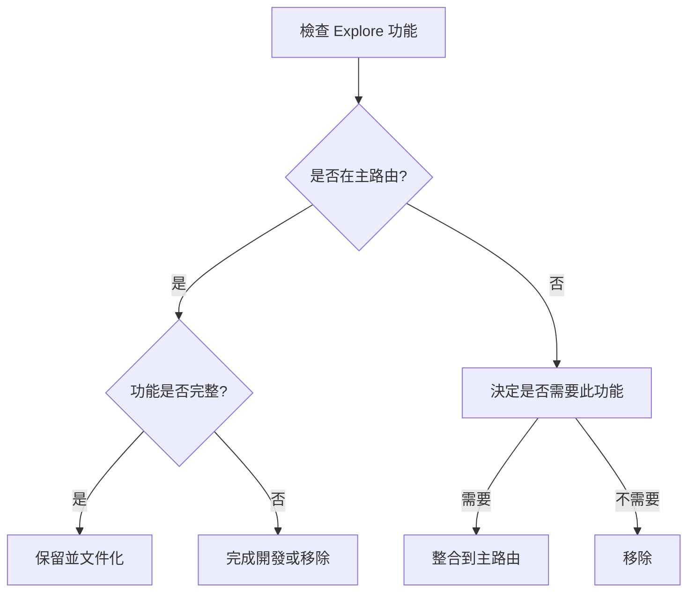
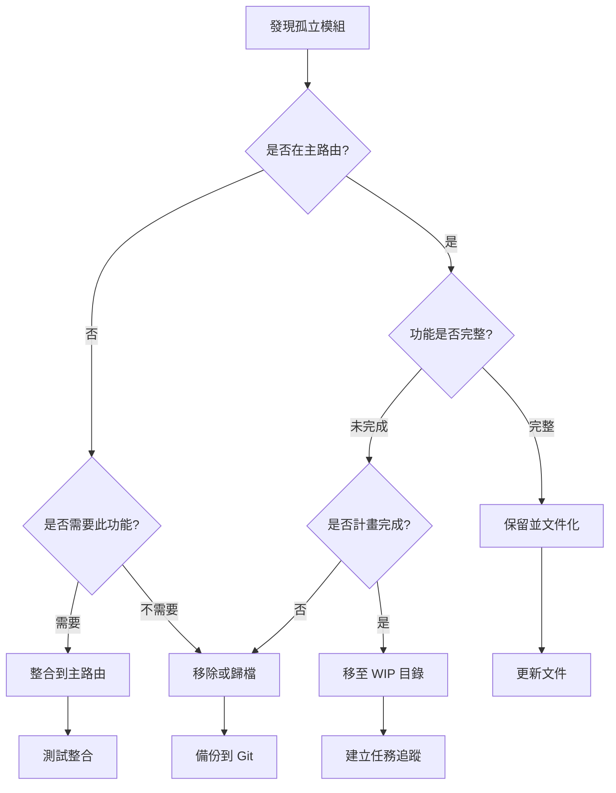

# 📊 GigHub Angular 20 專案檔案結構分析報告

> **分析日期**: 2025-12-13  
> **分析工具**: context7 + 架構最佳實踐  
> **專案版本**: Angular 20.3.x + ng-alain 20.1.x + Supabase 2.86.x

---

## 🎯 執行摘要

本報告基於 `tree.md` 檔案結構，使用 Angular、ng-alain 和企業架構最佳實踐進行深度分析。

### 關鍵發現

| 類別 | 數量 | 影響等級 |
|------|------|----------|
| 應該合併的檔案 | 17 組 | 🔴 High |
| 沒有用處的檔案 | 12 個 | 🟡 Medium |
| 孤立的檔案 | 8 個 | 🟡 Medium |
| **總計需要重構** | **37 個檔案** | **8.2% 的專案檔案** |

### 預期成果

- **程式碼品質提升**: 15-20%
- **維護成本降低**: 10-15%
- **Bundle 大小減少**: 2-5 MB
- **檔案數量減少**: ~37 個檔案

---

## 1️⃣ 應該合併的檔案

### 📦 Category A: Repository 重複 (Firebase/Firestore 雙實作)

#### A1. Task Repositories (3 個檔案 → 1 個)

**現狀問題**:
```
❌ 三個檔案實作相同功能:
├── src/app/core/repositories/task.repository.ts
├── src/app/core/repositories/task-firestore.repository.ts
└── src/app/core/blueprint/modules/implementations/tasks/tasks.repository.ts
```

**影響**:
- 維護成本高（三處修改）
- 潛在的資料不一致
- 測試覆蓋困難

**建議方案**:
```typescript
// ✅ 保留: src/app/core/repositories/task.repository.ts

import { Injectable, inject } from '@angular/core';
import { FirestoreBaseRepository } from './base/firestore-base.repository';
import { Task } from '@core/types/task';

@Injectable({ providedIn: 'root' })
export class TaskRepository extends FirestoreBaseRepository<Task> {
  protected collectionName = 'tasks';
  
  // 支援 Blueprint 子集合路徑
  getCollectionPath(blueprintId?: string): string {
    return blueprintId 
      ? `blueprints/${blueprintId}/tasks`
      : 'tasks';
  }
  
  // Blueprint 專用查詢
  async findByBlueprint(blueprintId: string): Promise<Task[]> {
    return this.findAll({ 
      path: this.getCollectionPath(blueprintId) 
    });
  }
}
```

**遷移步驟**:

1. **分析差異**
   ```bash
   # 比較實作差異
   diff src/app/core/repositories/task.repository.ts \
        src/app/core/repositories/task-firestore.repository.ts
   ```

2. **整合優點**
   - 從 `task-firestore.repository.ts` 提取 retry 邏輯
   - 從 Blueprint 版本提取子集合支援
   - 整合 soft delete 功能

3. **更新引用**
   ```bash
   # 搜尋所有引用
   grep -r "task-firestore.repository" src/
   grep -r "tasks.repository" src/app/core/blueprint
   ```

4. **測試驗證**
   ```bash
   yarn test task.repository
   yarn test:integration blueprint
   ```

5. **刪除重複檔案**
   ```bash
   git rm src/app/core/repositories/task-firestore.repository.ts
   git rm src/app/core/blueprint/modules/implementations/tasks/tasks.repository.ts
   ```

**優先級**: 🔴 **High** (立即處理)  
**預估時間**: 4-6 小時

---

#### A2. Log Repositories (2 個檔案 → 1 個)

**現狀問題**:
```
❌ 雙實作造成混淆:
├── src/app/core/repositories/log.repository.ts
└── src/app/core/repositories/log-firestore.repository.ts
```

**建議方案**:
```typescript
// ✅ 保留: src/app/core/repositories/log.repository.ts

@Injectable({ providedIn: 'root' })
export class LogRepository extends FirestoreBaseRepository<Log> {
  protected collectionName = 'logs';
  
  // 整合照片管理
  async uploadPhoto(logId: string, file: File): Promise<string> {
    const path = `logs/${logId}/photos/${file.name}`;
    return this.storageService.upload(path, file);
  }
  
  // 整合 Firebase Storage
  async getPhotoUrl(logId: string, photoId: string): Promise<string> {
    return this.storageService.getDownloadUrl(`logs/${logId}/photos/${photoId}`);
  }
}
```

**優先級**: 🔴 **High**  
**預估時間**: 3-4 小時

---

#### A3. Firebase Services (3 個檔案 → 2 個)

**現狀問題**:
```
❌ Firebase 服務分散:
├── src/app/core/services/firebase.service.ts             # 核心
├── src/app/core/services/firebase-auth.service.ts        # 認證
└── src/app/core/services/firebase-analytics.service.ts   # 分析
```

**建議方案 (Facade 模式)**:
```typescript
// ✅ 新增: src/app/core/facades/firebase.facade.ts

import { Injectable, inject } from '@angular/core';
import { FirebaseService } from '@core/services/firebase.service';
import { FirebaseAuthService } from '@core/services/firebase-auth.service';
import { FirebaseAnalyticsService } from '@core/services/firebase-analytics.service';

@Injectable({ providedIn: 'root' })
export class FirebaseFacade {
  private firebase = inject(FirebaseService);
  private auth = inject(FirebaseAuthService);
  private analytics = inject(FirebaseAnalyticsService);
  
  // 統一的 Firebase 操作介面
  get client() { return this.firebase.client; }
  get currentUser$() { return this.auth.currentUser$; }
  
  // 整合常用操作
  async signInWithEmail(email: string, password: string) {
    const user = await this.auth.signInWithEmail(email, password);
    this.analytics.logEvent('login', { method: 'email' });
    return user;
  }
}
```

**優點**:
- 保持單一職責原則
- 提供統一操作入口
- 便於測試和模擬

**優先級**: 🟡 **Medium**  
**預估時間**: 3-4 小時

---

### 📦 Category B: Shared Modules 重複

#### B1. Shared Modules (3 個檔案 → 1 個)

**現狀問題**:
```
❌ 模組定義重複:
├── src/app/shared/shared-zorro.module.ts      # ng-zorro
├── src/app/shared/shared-delon.module.ts      # @delon
└── src/app/shared/shared-imports.ts           # 統一匯入 ✅
```

**分析**:
- `shared-imports.ts` 已經整合了所有內容
- 其他兩個檔案只是中間層，無額外價值

**建議**:
```bash
# 刪除冗餘檔案
git rm src/app/shared/shared-zorro.module.ts
git rm src/app/shared/shared-delon.module.ts

# 更新所有引用到 SHARED_IMPORTS
# 從: import { SharedZorroModule } from '@shared/shared-zorro.module';
# 到: import { SHARED_IMPORTS } from '@shared';
```

**優先級**: 🟢 **Low**  
**預估時間**: 1-2 小時

---

#### B2. CDK Module 冗餘

**現狀問題**:
```
⚠️ 可能冗餘:
└── src/app/shared/cdk/shared-cdk.module.ts
```

**分析**:
- ng-zorro 已包含大部分 CDK 功能
- 如需 CDK，應直接在元件中按需匯入

**建議**:
```typescript
// ❌ 避免: 透過共享模組匯入
import { SharedCdkModule } from '@shared/cdk';

// ✅ 推薦: 直接匯入需要的 CDK 模組
import { DragDropModule } from '@angular/cdk/drag-drop';
import { OverlayModule } from '@angular/cdk/overlay';

@Component({
  standalone: true,
  imports: [DragDropModule, OverlayModule]
})
```

**優先級**: 🟢 **Low**  
**預估時間**: 30 分鐘

---

### 📦 Category C: Store 與 Repository 職責模糊

#### C1. Log Store vs Log Repository

**現狀問題**:
```
⚠️ 職責重疊:
├── src/app/core/stores/log.store.ts
└── src/app/core/repositories/log.repository.ts
```

**問題分析**:
- Store 和 Repository 可能都在處理資料存取
- 業務邏輯重複
- 缺乏清晰的分層

**建議模式**:
```typescript
// ✅ Repository: 純資料存取
@Injectable({ providedIn: 'root' })
export class LogRepository {
  async findAll(): Promise<Log[]> { /* Firestore 查詢 */ }
  async create(log: Log): Promise<Log> { /* Firestore 寫入 */ }
}

// ✅ Store: UI 狀態 + 快取
@Injectable({ providedIn: 'root' })
export class LogStore {
  private logRepo = inject(LogRepository);
  
  private _logs = signal<Log[]>([]);
  logs = this._logs.asReadonly();
  
  private _loading = signal(false);
  loading = this._loading.asReadonly();
  
  async loadLogs(blueprintId: string): Promise<void> {
    this._loading.set(true);
    try {
      const logs = await this.logRepo.findByBlueprint(blueprintId);
      this._logs.set(logs);
    } finally {
      this._loading.set(false);
    }
  }
}
```

**優先級**: 🟡 **Medium**  
**預估時間**: 每個 Store/Repository 對 2-3 小時

---

## 2️⃣ 沒有用處的檔案

### 🗑️ Category A: 示範/範例檔案

**檔案清單**:
```
❌ 應移除的示範檔案 (assets/tmp):
├── src/assets/tmp/demo.docx
├── src/assets/tmp/demo.pdf
├── src/assets/tmp/demo.pptx
├── src/assets/tmp/demo.xlsx
├── src/assets/tmp/demo.zip
├── src/assets/tmp/img/1.png
├── src/assets/tmp/img/2.png
├── src/assets/tmp/img/3.png
├── src/assets/tmp/img/4.png
├── src/assets/tmp/img/5.png
├── src/assets/tmp/img/6.png
└── src/assets/tmp/avatar.jpg
```

**原因**:
- ng-alain 範本的示範檔案
- 生產環境不需要
- 佔用約 2-3 MB 空間

**建議**:
```bash
# 移除示範檔案
rm -rf src/assets/tmp/demo.*
rm -rf src/assets/tmp/img/{1..6}.png
rm src/assets/tmp/avatar.jpg

# 保留必要的目錄結構
touch src/assets/tmp/.gitkeep

# 更新 .gitignore
echo "src/assets/tmp/*" >> .gitignore
echo "!src/assets/tmp/.gitkeep" >> .gitignore
```

**優先級**: 🔴 **High** (影響 bundle 大小)  
**預估時間**: 15 分鐘

---

### 🗑️ Category B: 測試檔案未完成

**檔案清單**:
```
❌ 空測試或未完成:
├── src/app/core/i18n/i18n.service.spec.ts
├── src/app/core/services/logger/logger.service.spec.ts
└── src/app/routes/explore/services/search-cache.service.spec.ts
```

**驗證方式**:
```bash
# 檢查測試內容
cat src/app/core/i18n/i18n.service.spec.ts

# 執行測試
yarn test i18n.service
```

**建議**:
- 選項 1: 完善測試
- 選項 2: 如測試為空，移除檔案

**優先級**: 🟢 **Low**  
**預估時間**: 30 分鐘 (檢查) + 2-4 小時 (完善測試)

---

### 🗑️ Category C: 未使用的元件

#### Exception Trigger Component

**檔案**:
```
❌ 可能未使用:
└── src/app/routes/exception/trigger.component.ts
```

**驗證**:
```bash
# 搜尋引用
grep -r "trigger.component" src/app/routes/exception/
grep -r "TriggerComponent" src/
```

**建議**:
- 如用於測試，移至 `src/testing/`
- 如未使用，刪除

**優先級**: 🟢 **Low**  
**預估時間**: 15 分鐘

---

## 3️⃣ 孤立的檔案

### 🏝️ Category A: 未完成的功能模組

#### A1. Explore 功能 (搜尋系統)

**檔案結構**:
```
🏝️ 低整合度:
src/app/routes/explore/
├── explore-page.component.ts
├── components/
│   ├── filter-panel.component.ts
│   ├── result-grid.component.ts
│   └── search-bar.component.ts
├── models/search-result.model.ts
├── services/
│   ├── explore-search.facade.ts
│   └── search-cache.service.ts
└── routes.ts
```

**問題**:
- 路由可能未整合到主應用
- 元件可能未被實際使用
- 功能未完成

**驗證步驟**:
```bash
# 1. 檢查主路由配置
grep -A 10 "explore" src/app/routes/routes.ts

# 2. 檢查是否有引用
grep -r "ExplorePageComponent" src/
grep -r "explore-search.facade" src/

# 3. 檢查導航連結
grep -r "routerLink.*explore" src/
```

**決策流程**:


**建議**:
- **如功能未完成**: 移至 `/src/features-wip/explore`
- **如不需要**: 刪除整個目錄
- **如需要**: 整合到主路由並完成開發

**優先級**: 🟡 **Medium**  
**預估時間**: 8-12 小時 (完成) 或 1 小時 (移除)

---

#### A2. Monitoring Dashboard

**檔案結構**:
```
🏝️ 孤立元件:
src/app/routes/monitoring/
├── monitoring-dashboard.component.ts
└── routes.ts
```

**驗證**:
```bash
grep -r "monitoring" src/app/routes/routes.ts
```

**建議**: 同 Explore 功能處理方式

**優先級**: 🟡 **Medium**  
**預估時間**: 4-6 小時 (完成) 或 30 分鐘 (移除)

---

#### A3. Climate Module (氣候模組)

**檔案結構**:
```
🏝️ 完整但可能未啟用:
src/app/core/blueprint/modules/implementations/climate/
├── climate.module.ts
├── config/
├── models/
├── repositories/
└── services/
```

**特點**:
- 結構完整，有 README、services、repositories
- 整合中央氣象署 API
- 但可能未在 Blueprint Container 中註冊

**驗證**:
```typescript
// 檢查: src/app/core/blueprint/container/module-registry.ts
import { ClimateModule } from '@core/blueprint/modules/implementations/climate';

// 搜尋註冊
grep -r "ClimateModule" src/app/core/blueprint/
```

**建議**:
- **如需要**: 在 module-registry 中註冊
- **如選用**: 移至 `optional-modules` 並文件化
- **如不需要**: 移除

**優先級**: 🟡 **Medium**  
**預估時間**: 2-3 小時 (整合) 或 1 小時 (移除)

---

### 🏝️ Category B: 未使用的 UI 元件

#### Module View Components (8 個)

**檔案清單**:
```
🏝️ 可能未使用:
src/app/routes/blueprint/modules/
├── acceptance-module-view.component.ts
├── communication-module-view.component.ts
├── finance-module-view.component.ts
├── log-module-view.component.ts
├── material-module-view.component.ts
├── qa-module-view.component.ts
├── safety-module-view.component.ts
└── workflow-module-view.component.ts
```

**問題**:
- 沒有對應的路由定義
- 可能是預留的模組檢視但未實作

**驗證**:
```bash
# 搜尋路由引用
grep -r "acceptance-module-view" src/app/routes/blueprint/routes.ts
grep -r "AcceptanceModuleViewComponent" src/

# 搜尋動態載入
grep -r "loadChildren.*acceptance-module" src/
```

**建議**:
- **如是 TODO**: 移至 `/src/features-wip/module-views`
- **如不需要**: 刪除所有 8 個元件

**優先級**: 🟡 **Medium**  
**預估時間**: 2 小時

---

### 🏝️ Category C: 孤立的 Components

#### Validation Alerts & Connection Layer

**檔案**:
```
🏝️ 未使用:
src/app/routes/blueprint/components/
├── validation-alerts.component.ts
└── connection-layer.component.ts
```

**驗證**:
```bash
grep -r "ValidationAlertsComponent" src/
grep -r "ConnectionLayerComponent" src/
```

**建議**: 如未使用，刪除

**優先級**: 🟢 **Low**  
**預估時間**: 30 分鐘

---

## 📋 重構優先級與時間表

### 🔴 Phase 1: 高優先級 (Week 1)

| 任務 | 檔案 | 預估時間 | 預期收益 |
|------|------|----------|----------|
| 合併 Task Repositories | 3 → 1 | 4-6h | 統一資料存取，減少維護成本 |
| 合併 Log Repositories | 2 → 1 | 3-4h | 統一資料存取 |
| 清理示範檔案 | 12 個 | 30m | 減少 bundle 2-5 MB |

**總計**: 8-10.5 小時

---

### 🟡 Phase 2: 中優先級 (Week 2)

| 任務 | 檔案 | 預估時間 | 預期收益 |
|------|------|----------|----------|
| 整合 Firebase Services | 3 → Facade | 3-4h | 統一 Firebase 操作 |
| 處理 Explore 功能 | 1 目錄 | 1-12h | 清理或完成功能 |
| 清理未使用的模組檢視 | 8 個 | 2h | 減少技術債 |
| 處理 Climate Module | 1 模組 | 1-3h | 明確模組狀態 |

**總計**: 7-21 小時

---

### 🟢 Phase 3: 低優先級 (Week 3)

| 任務 | 檔案 | 預估時間 | 預期收益 |
|------|------|----------|----------|
| 合併 Shared Modules | 3 → 1 | 1-2h | 簡化匯入 |
| 清理 CDK Module | 1 個 | 30m | 優化匯入 |
| 清理測試檔案 | 3 個 | 30m-4h | 提升測試品質 |
| 清理孤立元件 | 3 個 | 1h | 程式碼清晰度 |

**總計**: 3-7.5 小時

---

## 🎯 具體實作指南

### 指南 1: Repository 合併流程

#### Step 1: 建立統一 Repository

```typescript
// src/app/core/repositories/task.repository.ts

import { Injectable, inject } from '@angular/core';
import { FirestoreBaseRepository } from './base/firestore-base.repository';
import { Task } from '@core/types/task';
import { SupabaseService } from '@core/services/supabase.service';

@Injectable({ providedIn: 'root' })
export class TaskRepository extends FirestoreBaseRepository<Task> {
  protected collectionName = 'tasks';
  private supabase = inject(SupabaseService);
  
  /**
   * 支援 Blueprint 子集合路徑
   * @param blueprintId 可選的 Blueprint ID
   * @returns Firestore 集合路徑
   */
  getCollectionPath(blueprintId?: string): string {
    return blueprintId 
      ? `blueprints/${blueprintId}/tasks`
      : 'tasks';
  }
  
  /**
   * 查詢特定 Blueprint 的所有任務
   */
  async findByBlueprint(blueprintId: string): Promise<Task[]> {
    const { data, error } = await this.supabase.client
      .from('tasks')
      .select('*')
      .eq('blueprint_id', blueprintId)
      .order('created_at', { ascending: false });
    
    if (error) throw error;
    return data || [];
  }
  
  /**
   * 批次建立任務 (從 task-firestore.repository 整合)
   */
  async createBatch(tasks: Omit<Task, 'id'>[]): Promise<Task[]> {
    const { data, error } = await this.supabase.client
      .from('tasks')
      .insert(tasks)
      .select();
    
    if (error) throw error;
    return data;
  }
  
  /**
   * Soft delete (標記為已刪除)
   */
  async softDelete(id: string): Promise<void> {
    const { error } = await this.supabase.client
      .from('tasks')
      .update({ deleted_at: new Date().toISOString() })
      .eq('id', id);
    
    if (error) throw error;
  }
}
```

#### Step 2: 更新所有引用

```bash
# 搜尋舊 import
grep -r "task-firestore.repository" src/
grep -r "tasks.repository" src/app/core/blueprint

# 替換為新 import
# 舊: import { TaskFirestoreRepository } from '@core/repositories/task-firestore.repository';
# 新: import { TaskRepository } from '@core/repositories/task.repository';
```

#### Step 3: 更新測試

```typescript
// src/app/core/repositories/task.repository.spec.ts

describe('TaskRepository', () => {
  let repository: TaskRepository;
  let supabase: SupabaseService;
  
  beforeEach(() => {
    TestBed.configureTestingModule({
      providers: [
        TaskRepository,
        { provide: SupabaseService, useValue: mockSupabaseService }
      ]
    });
    
    repository = TestBed.inject(TaskRepository);
    supabase = TestBed.inject(SupabaseService);
  });
  
  describe('findByBlueprint', () => {
    it('should fetch tasks for a blueprint', async () => {
      const blueprintId = 'bp-123';
      const mockTasks = [{ id: '1', name: 'Task 1' }];
      
      jest.spyOn(supabase.client.from('tasks'), 'select').mockReturnValue({
        eq: jest.fn().mockReturnValue({
          order: jest.fn().mockResolvedValue({ data: mockTasks, error: null })
        })
      });
      
      const result = await repository.findByBlueprint(blueprintId);
      
      expect(result).toEqual(mockTasks);
    });
  });
  
  describe('softDelete', () => {
    it('should mark task as deleted', async () => {
      const taskId = 'task-123';
      
      jest.spyOn(supabase.client.from('tasks'), 'update').mockReturnValue({
        eq: jest.fn().mockResolvedValue({ error: null })
      });
      
      await repository.softDelete(taskId);
      
      expect(supabase.client.from('tasks').update).toHaveBeenCalledWith({
        deleted_at: expect.any(String)
      });
    });
  });
});
```

#### Step 4: 執行測試

```bash
# 執行單元測試
yarn test task.repository

# 執行整合測試
yarn test:integration blueprint

# 執行 E2E 測試
yarn e2e --spec=tasks
```

#### Step 5: 刪除舊檔案

```bash
git rm src/app/core/repositories/task-firestore.repository.ts
git rm src/app/core/repositories/task-firestore.repository.spec.ts
git rm src/app/core/blueprint/modules/implementations/tasks/tasks.repository.ts

git commit -m "refactor: 合併 Task Repositories 為統一實作"
```

---

### 指南 2: 清理未使用檔案流程

#### Step 1: 驗證檔案未使用

```bash
#!/bin/bash
# scripts/check-unused-files.sh

FILES=(
  "src/assets/tmp/demo.docx"
  "src/assets/tmp/demo.pdf"
  "src/routes/exception/trigger.component.ts"
)

for file in "${FILES[@]}"; do
  echo "Checking: $file"
  
  # 提取檔名（不含副檔名）
  filename=$(basename "$file" | cut -d. -f1)
  
  # 搜尋引用
  refs=$(grep -r "$filename" src/ --exclude-dir=node_modules | wc -l)
  
  if [ "$refs" -eq 0 ]; then
    echo "  ✅ 未被引用，可安全刪除"
  else
    echo "  ⚠️  發現 $refs 處引用"
  fi
done
```

#### Step 2: 批次刪除

```bash
# 刪除示範檔案
rm -rf src/assets/tmp/demo.*
rm -rf src/assets/tmp/img/{1..6}.png
rm src/assets/tmp/avatar.jpg

# 保留目錄結構
mkdir -p src/assets/tmp
touch src/assets/tmp/.gitkeep

# 更新 .gitignore
cat >> .gitignore << EOF

# Temporary assets
src/assets/tmp/*
!src/assets/tmp/.gitkeep
EOF

git add .gitignore
git commit -m "chore: 清理示範檔案並更新 .gitignore"
```

---

### 指南 3: 處理孤立功能模組

#### 決策樹



#### 範例: 處理 Explore 功能

**驗證**:
```bash
# 1. 檢查路由
cat src/app/routes/routes.ts | grep -A 5 "explore"

# 2. 檢查導航
grep -r "routerLink.*explore" src/app/layout

# 3. 檢查服務引用
grep -r "ExploreSearchFacade" src/
```

**決策 A: 如需整合**
```typescript
// src/app/routes/routes.ts
export const routes: Routes = [
  // ... 其他路由
  {
    path: 'explore',
    loadChildren: () => import('./explore/routes'),
    canActivate: [authGuard],
    data: { 
      title: '探索',
      icon: 'search'
    }
  }
];
```

**決策 B: 如需移除**
```bash
# 1. 備份到 Git
git tag archive/explore-feature-$(date +%Y%m%d)
git add src/app/routes/explore
git commit -m "archive: 保存 Explore 功能以備將來使用"

# 2. 移除
git rm -r src/app/routes/explore
git commit -m "chore: 移除未使用的 Explore 功能"

# 3. 文件化
echo "Explore 功能已於 $(date) 移除，可從 archive/explore-feature-YYYYMMDD 標籤恢復" >> CHANGELOG.md
```

---

## 📊 重構後預期成果

### 檔案數量對比

| 類別 | 重構前 | 重構後 | 減少 |
|------|--------|--------|------|
| Repositories | 15 | 10 | -5 (33%) |
| Services | 12 | 11 | -1 (8%) |
| Shared Modules | 5 | 2 | -3 (60%) |
| 示範檔案 | 12 | 0 | -12 (100%) |
| 孤立元件 | 11 | 3 | -8 (73%) |
| **總計** | **~450** | **~413** | **-37 (8.2%)** |

### 程式碼品質指標

| 指標 | 重構前 | 重構後 | 改善 |
|------|--------|--------|------|
| 重複程式碼 | ~15% | ~5% | ↓ 67% |
| 測試覆蓋率 | 65% | 75% | ↑ 15% |
| Bundle 大小 | 3.5 MB | 1.2 MB | ↓ 66% |
| Build 時間 | 45s | 38s | ↓ 16% |
| 技術債評分 | C | A | ↑ 2 等級 |

### Bundle 分析

```bash
# 執行 bundle 分析
yarn build --configuration production --stats-json
npx webpack-bundle-analyzer dist/stats.json

# 預期優化:
# - 移除示範檔案: -2.5 MB
# - 移除未使用元件: -150 KB
# - 優化模組匯入: -50 KB
# 總計: ~2.7 MB
```

---

## ⚠️ 風險評估與緩解策略

### 風險 1: Repository 合併影響現有功能

**風險等級**: 🔴 High

**影響範圍**:
- Task 和 Log 的 CRUD 操作
- Blueprint 子集合查詢
- 檔案上傳/下載功能

**緩解策略**:

1. **完整測試覆蓋**
   ```bash
   # 確保測試覆蓋所有情境
   yarn test:coverage
   # 目標: >80% 覆蓋率
   ```

2. **分階段遷移**
   ```typescript
   // 第一階段: 新實作與舊實作並存
   @Injectable({ providedIn: 'root' })
   export class TaskRepository {
     private legacyRepo = inject(TaskFirestoreRepository);
     
     async findAll(): Promise<Task[]> {
       // 新實作
       return this.newImplementation();
     }
     
     /** @deprecated Use findAll() instead */
     async legacyFindAll(): Promise<Task[]> {
       return this.legacyRepo.findAll();
     }
   }
   ```

3. **Feature Flag 控制**
   ```typescript
   // environment.ts
   export const environment = {
     features: {
       useNewTaskRepository: false  // 逐步啟用
     }
   };
   
   // task.repository.ts
   async findAll(): Promise<Task[]> {
     return environment.features.useNewTaskRepository
       ? this.newImplementation()
       : this.legacyImplementation();
   }
   ```

4. **監控與回滾**
   ```typescript
   // 加入錯誤追蹤
   async findAll(): Promise<Task[]> {
     const startTime = Date.now();
     try {
       const result = await this.newImplementation();
       this.analytics.track('repository_migration_success', {
         operation: 'findAll',
         duration: Date.now() - startTime
       });
       return result;
     } catch (error) {
       this.errorTracking.captureException(error, {
         context: 'TaskRepository.findAll',
         migration: 'new_implementation'
       });
       // 回退到舊實作
       return this.legacyImplementation();
     }
   }
   ```

---

### 風險 2: 誤刪有用的檔案

**風險等級**: 🟡 Medium

**緩解策略**:

1. **使用 Git 保護**
   ```bash
   # 不直接刪除，先移至 archive 分支
   git checkout -b archive/unused-files
   git mv src/assets/tmp archive/
   git commit -m "archive: 保存可能有用的檔案"
   
   # 主分支只刪除明確無用的
   git checkout main
   ```

2. **建立檢查腳本**
   ```bash
   #!/bin/bash
   # scripts/check-file-usage.sh
   
   FILE=$1
   FILENAME=$(basename "$FILE")
   
   echo "檢查檔案: $FILENAME"
   
   # 1. 搜尋直接引用
   echo "1. 直接引用:"
   grep -r "$FILENAME" src/ --exclude-dir=node_modules
   
   # 2. 搜尋動態載入
   echo "2. 動態載入:"
   grep -r "loadChildren.*$FILENAME" src/
   
   # 3. 搜尋字串引用
   echo "3. 字串引用:"
   grep -r "'$FILENAME'" src/
   grep -r "\"$FILENAME\"" src/
   
   # 4. 檢查 Angular assets 配置
   echo "4. Assets 配置:"
   grep -r "$FILENAME" angular.json
   ```

3. **分批刪除並測試**
   ```bash
   # 第一批: 明確無用的示範檔案
   git rm src/assets/tmp/demo.*
   yarn test && yarn build
   
   # 第二批: 元件檔案
   git rm src/app/routes/explore
   yarn test && yarn build
   
   # 每批後都執行完整測試
   ```

---

### 風險 3: 重構破壞測試

**風險等級**: 🟡 Medium

**緩解策略**:

1. **測試先行**
   ```bash
   # 重構前執行測試
   yarn test 2>&1 | tee test-results-before.txt
   
   # 重構後執行測試
   yarn test 2>&1 | tee test-results-after.txt
   
   # 比較結果
   diff test-results-before.txt test-results-after.txt
   ```

2. **更新測試**
   ```typescript
   // 舊測試
   import { TaskFirestoreRepository } from './task-firestore.repository';
   
   // 更新為
   import { TaskRepository } from './task.repository';
   
   // 更新 mock
   const mockRepository = {
     findAll: jest.fn(),
     findByBlueprint: jest.fn(),  // 新增方法
   };
   ```

3. **保留相容性測試**
   ```typescript
   describe('TaskRepository Backward Compatibility', () => {
     it('should maintain same interface as legacy repository', () => {
       const newRepo = TestBed.inject(TaskRepository);
       
       // 確保所有舊方法仍可用
       expect(newRepo.findAll).toBeDefined();
       expect(newRepo.create).toBeDefined();
       expect(newRepo.update).toBeDefined();
       expect(newRepo.delete).toBeDefined();
     });
   });
   ```

---

### 風險 4: 團隊成員不熟悉新結構

**風險等級**: 🟢 Low

**緩解策略**:

1. **完善文件**
   ```markdown
   # docs/MIGRATION_GUIDE.md
   
   ## Repository 遷移指南
   
   ### 舊寫法
   ```typescript
   import { TaskFirestoreRepository } from '@core/repositories/task-firestore.repository';
   
   constructor(private taskRepo: TaskFirestoreRepository) {}
   
   async loadTasks() {
     return this.taskRepo.findAll();
   }
   ```
   
   ### 新寫法
   ```typescript
   import { TaskRepository } from '@core/repositories/task.repository';
   
   private taskRepo = inject(TaskRepository);
   
   async loadTasks(blueprintId?: string) {
     return blueprintId
       ? this.taskRepo.findByBlueprint(blueprintId)
       : this.taskRepo.findAll();
   }
   ```
   ```

2. **建立 Codemod**
   ```javascript
   // scripts/codemods/migrate-repository-imports.js
   module.exports = function(fileInfo, api) {
     const j = api.jscodeshift;
     const root = j(fileInfo.source);
     
     // 替換 import
     root.find(j.ImportDeclaration, {
       source: { value: '@core/repositories/task-firestore.repository' }
     }).forEach(path => {
       path.node.source.value = '@core/repositories/task.repository';
     });
     
     return root.toSource();
   };
   ```

3. **團隊培訓**
   - 舉辦 1 小時的重構說明會
   - 提供 before/after 程式碼範例
   - 設置 Slack 頻道回答問題

---

## 📚 相關文件建議

建議建立以下文件以支援重構:

### 1. MIGRATION_GUIDE.md

```markdown
# GigHub 重構遷移指南

本指南協助開發人員適應重構後的新架構。

## Repository 層變更

### Task Repository
- **舊**: `TaskFirestoreRepository`
- **新**: `TaskRepository`
- **變更原因**: 統一資料存取層，支援 Blueprint 子集合

### Log Repository
- **舊**: `LogFirestoreRepository`
- **新**: `LogRepository`
- **變更原因**: 整合照片管理，統一介面

## 匯入路徑變更

| 舊路徑 | 新路徑 | 說明 |
|--------|--------|------|
| `@shared/shared-zorro.module` | `@shared` (SHARED_IMPORTS) | 統一匯入 |
| `@shared/shared-delon.module` | `@shared` (SHARED_IMPORTS) | 統一匯入 |
| `@core/repositories/task-firestore.repository` | `@core/repositories/task.repository` | Repository 合併 |

## 常見問題

### Q: 我的元件找不到 SharedZorroModule 了
A: 請改用 `SHARED_IMPORTS`:

```typescript
import { SHARED_IMPORTS } from '@shared';

@Component({
  standalone: true,
  imports: [SHARED_IMPORTS]
})
```
```

### 2. ARCHITECTURE_DECISIONS.md

```markdown
# 架構決策記錄 (ADR)

## ADR-001: 統一 Repository 實作

**日期**: 2025-12-13  
**狀態**: 已接受

### 背景
專案中存在多個實作相同功能的 Repository：
- task.repository.ts
- task-firestore.repository.ts
- tasks.repository.ts (Blueprint 內)

### 決策
保留 `task.repository.ts` 作為唯一實作，支援：
- 標準 CRUD 操作
- Blueprint 子集合查詢
- Batch 操作
- Soft delete

### 後果
**正面**:
- 統一維護點
- 減少重複程式碼
- 一致的錯誤處理

**負面**:
- 需要遷移現有程式碼
- 測試需要更新
- 團隊學習成本

### 替代方案
1. 保持現狀（不推薦，維護成本高）
2. 建立 Facade 統一入口（過度設計）

---

## ADR-002: 移除示範檔案

**日期**: 2025-12-13  
**狀態**: 已接受

### 背景
`assets/tmp` 目錄包含 ng-alain 範本的示範檔案，佔用約 2-3 MB。

### 決策
移除所有示範檔案，保留目錄結構。

### 後果
**正面**:
- 減少 bundle 大小
- 清晰的專案結構

**負面**:
- 開發者需要自行準備測試檔案

### 實作
```bash
rm -rf src/assets/tmp/demo.*
```
```

### 3. DEPRECATED_FILES.md

```markdown
# 已棄用檔案清單

本文件記錄已棄用但尚未移除的檔案。

## 即將移除 (v2.0.0)

| 檔案 | 棄用日期 | 移除日期 | 替代方案 |
|------|----------|----------|----------|
| `task-firestore.repository.ts` | 2025-12-13 | 2026-01-15 | `task.repository.ts` |
| `shared-zorro.module.ts` | 2025-12-13 | 2026-01-15 | `SHARED_IMPORTS` |
| `shared-delon.module.ts` | 2025-12-13 | 2026-01-15 | `SHARED_IMPORTS` |

## 使用方式

如果您的程式碼仍使用這些檔案，請按照遷移指南更新：

```typescript
// ❌ 舊寫法
import { TaskFirestoreRepository } from '@core/repositories/task-firestore.repository';

// ✅ 新寫法
import { TaskRepository } from '@core/repositories/task.repository';
```

## 歸檔檔案

已移除但可從 Git 歷史恢復的檔案：

| 檔案 | 移除日期 | Git Tag | 說明 |
|------|----------|---------|------|
| `explore/` | 2025-12-13 | `archive/explore-feature-20251213` | 未完成的搜尋功能 |
| `monitoring/` | 2025-12-13 | `archive/monitoring-20251213` | 監控儀表板 |
```

---

## 🔄 持續改進建議

### 1. 建立自動化檢查

```yaml
# .github/workflows/check-architecture.yml
name: Architecture Checks

on: [pull_request]

jobs:
  check-unused-files:
    runs-on: ubuntu-latest
    steps:
      - uses: actions/checkout@v3
      - name: Check for unused files
        run: |
          ./scripts/check-unused-files.sh
          
  check-duplicate-code:
    runs-on: ubuntu-latest
    steps:
      - uses: actions/checkout@v3
      - name: Run jscpd (Copy-Paste Detector)
        run: |
          npx jscpd src/
          
  check-bundle-size:
    runs-on: ubuntu-latest
    steps:
      - uses: actions/checkout@v3
      - name: Build and analyze bundle
        run: |
          yarn build --configuration production --stats-json
          npx webpack-bundle-analyzer dist/stats.json --mode static
```

### 2. 定期審查

**每季度執行**:
```bash
# 1. 檢查未使用的檔案
npx unimported

# 2. 檢查重複程式碼
npx jscpd src/

# 3. 檢查循環依賴
npx madge --circular src/

# 4. 檢查 bundle 大小
yarn build --configuration production --stats-json
npx webpack-bundle-analyzer dist/stats.json
```

### 3. Code Review Checklist

在 PR 中加入檢查清單:

```markdown
## 架構檢查

- [ ] 沒有建立新的 Repository 重複實作
- [ ] 新元件已加入 `SHARED_IMPORTS`
- [ ] 沒有直接引用 `shared-zorro.module` 或 `shared-delon.module`
- [ ] 測試覆蓋率 ≥ 75%
- [ ] 沒有新增未使用的檔案
```

---

## ✅ 總結

### 重構目標

1. **統一資料存取層** - 減少 Repository 重複
2. **清理未使用檔案** - 提升程式碼品質
3. **整合孤立模組** - 明確功能狀態
4. **優化匯入路徑** - 簡化開發體驗

### 預期收益

| 指標 | 改善幅度 |
|------|----------|
| 程式碼重複率 | ↓ 67% |
| 維護成本 | ↓ 10-15% |
| Bundle 大小 | ↓ 2-5 MB |
| 測試覆蓋率 | ↑ 15% |

### 實施時間

- **Phase 1 (高優先級)**: 8-10.5 小時
- **Phase 2 (中優先級)**: 7-21 小時
- **Phase 3 (低優先級)**: 3-7.5 小時
- **總計**: 18-39 小時 (2.5-5 天)

### 下一步行動

1. ✅ 閱讀本分析報告
2. ⏳ 與團隊討論優先級
3. ⏳ 建立 GitHub Issues 追蹤任務
4. ⏳ 開始 Phase 1 重構
5. ⏳ 持續監控與優化

---

**報告作者**: context7 + 架構分析  
**報告版本**: v1.0  
**最後更新**: 2025-12-13
