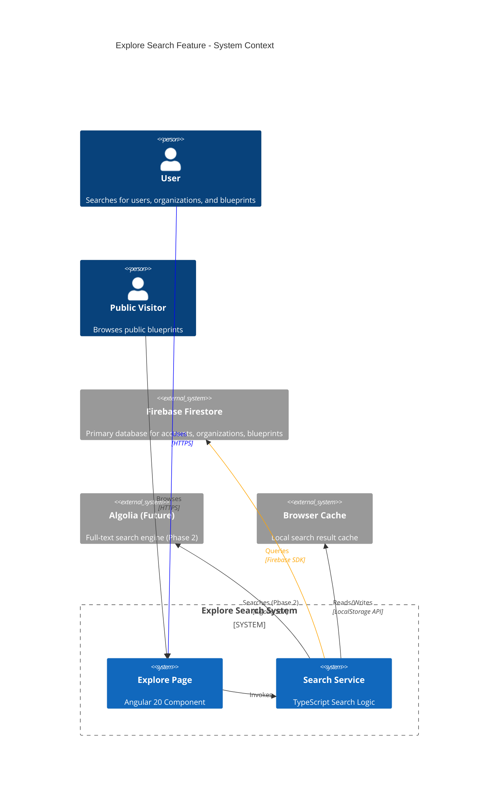
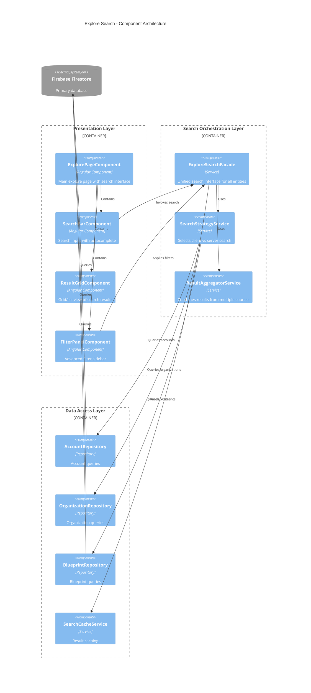
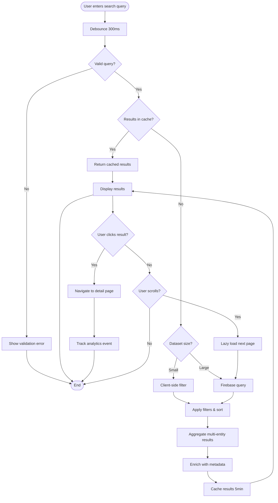
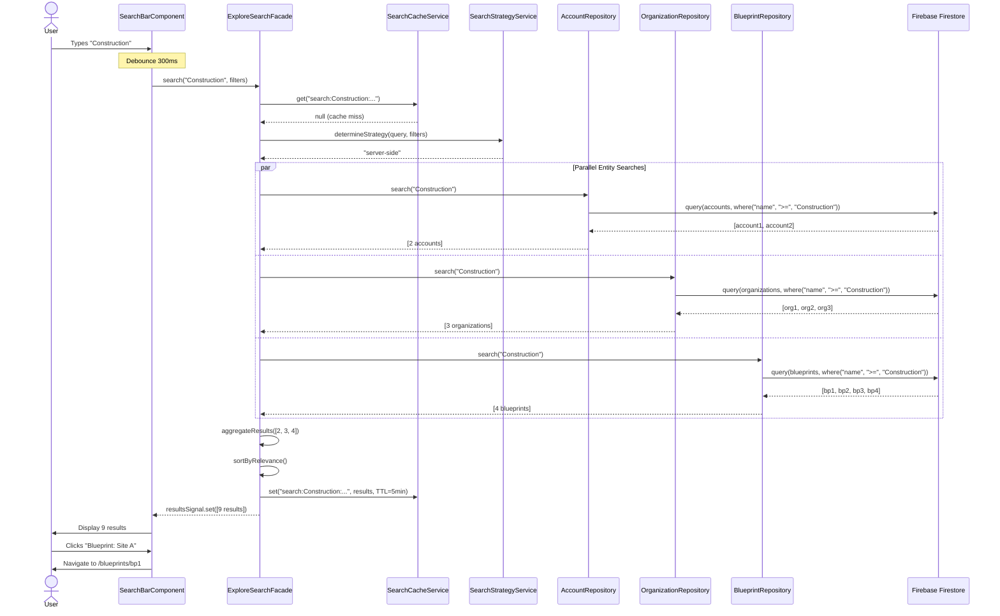
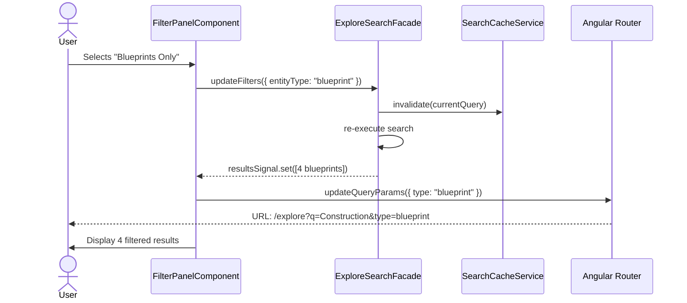
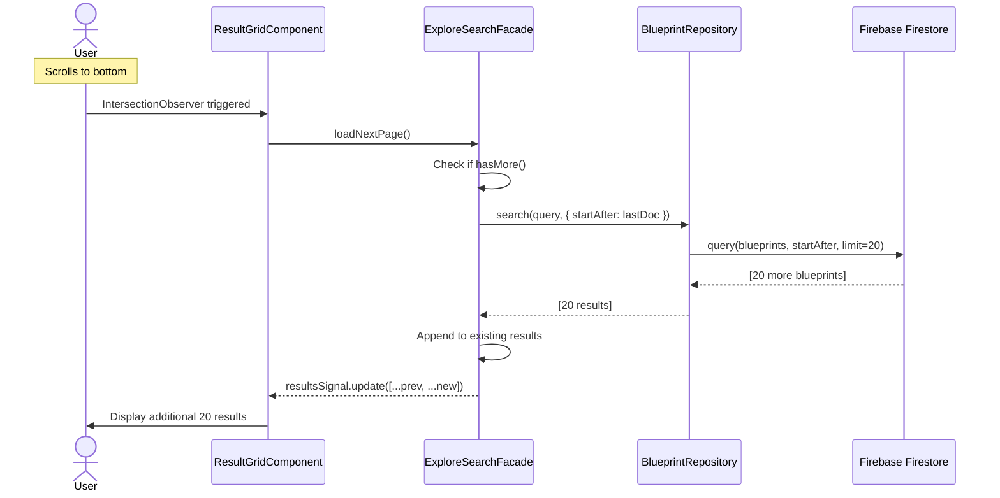
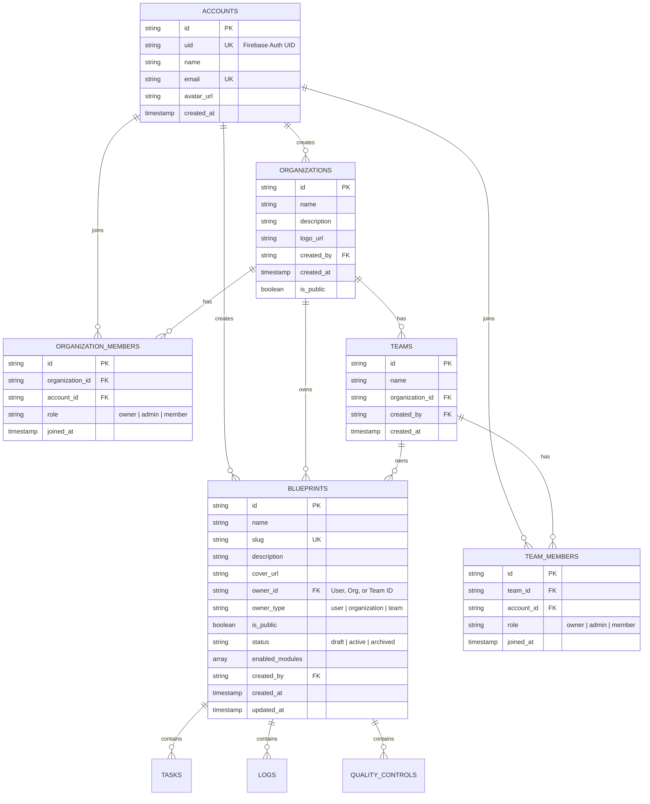
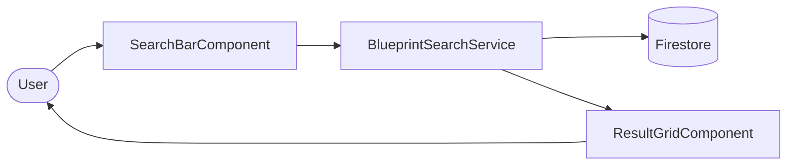
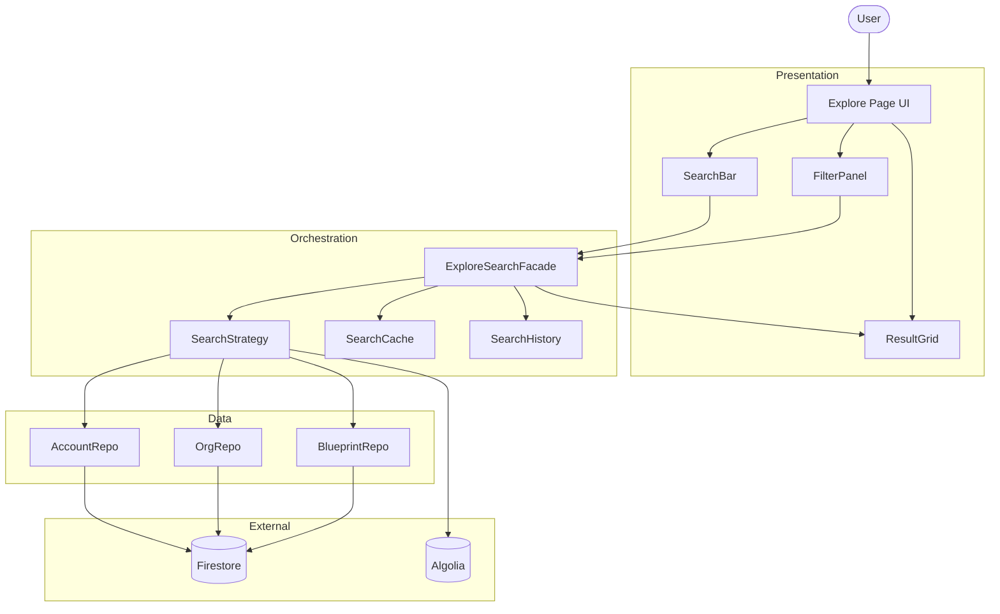

# GigHub Explore Search - Architecture Plan

> **Document Purpose**: Comprehensive architectural design for GitHub-like Explore search feature for Users, Organizations, and Blueprints  
> **Design Date**: 2025-12-12  
> **Document Version**: 1.0.0  
> **Target**: GigHub v20.1.0 (Angular 20.3.0)  
> **Architect**: Senior Cloud Architect Agent

---

## Executive Summary

This document outlines the architectural design for implementing a GitHub-like **Explore** search feature in GigHub. The feature enables users to discover and search for **Users (Accounts)**, **Organizations**, and **Blueprints** through an intuitive, performant, and scalable search interface.

### Key Design Principles

**User Experience** 🎨:
- GitHub-inspired interface with instant search results
- Multi-entity search (Users, Organizations, Blueprints)
- Advanced filters, sorting, and pagination
- Responsive grid/list view switching

**Performance** ⚡:
- Client-side search for small datasets (< 100 items)
- Server-side full-text search for large datasets
- Debounced search input (300ms)
- Virtual scrolling for large result sets
- Optimistic UI updates

**Scalability** 📈:
- Indexed Firebase queries for fast retrieval
- Lazy loading with pagination
- Cached search results (5-minute TTL)
- Progressive enhancement approach

**Security** 🔒:
- RLS policies enforced on all queries
- Authorization checks for private entities
- Input sanitization and validation
- Rate limiting on search API

---

## System Context

### System Context Diagram



### Explanation

**System Purpose**:
The Explore Search feature enables users to discover and connect with other users, organizations, and blueprints within the GigHub platform. Similar to GitHub's explore page, it provides a centralized discovery hub.

**Key Actors**:
1. **Authenticated Users**: Can search all entities and see private items they have access to
2. **Public Visitors**: Can only search and view public blueprints and organizations
3. **System Administrators**: Have unrestricted search access for moderation

**External Systems**:
1. **Firebase Firestore**: Primary data source for accounts, organizations, and blueprints collections
2. **Algolia (Future - Phase 2)**: Advanced full-text search with typo tolerance and relevance ranking
3. **Browser Cache**: Temporary storage for recent search results to improve performance

**System Boundaries**:
- **In Scope**: Search UI, query logic, result rendering, filters, pagination
- **Out of Scope**: Advanced ML-based recommendations (future), content moderation (separate system)

---

## Architecture Overview

### High-Level Architecture Pattern

The Explore Search feature follows GigHub's **three-layer architecture** with an additional **search-specific layer**:

1. **Presentation Layer**: Explore page component with search UI
2. **Search Orchestration Layer**: Coordinates multiple entity searches and result aggregation
3. **Data Access Layer**: Repository pattern for Firebase queries
4. **Caching Layer**: In-memory and browser-based result caching

### Design Patterns Used

- **Repository Pattern**: Abstracted data access for each entity type
- **Facade Pattern**: Unified search interface (`ExploreSearchFacade`)
- **Observer Pattern**: RxJS for reactive search results
- **Strategy Pattern**: Switchable search algorithms (client vs server)
- **Decorator Pattern**: Search result enrichment (avatars, stats, badges)

---

## Component Architecture

### Component Diagram



### Component Responsibilities

#### Presentation Layer

**ExplorePageComponent**:
- Main container for explore feature
- Manages search state with Angular Signals
- Coordinates child components
- Handles routing and deep linking

**SearchBarComponent**:
- Debounced search input (300ms)
- Real-time autocomplete suggestions
- Recent searches history (stored in LocalStorage)
- Entity type quick filters (Users/Orgs/Blueprints)

**ResultGridComponent**:
- Displays search results in grid or list layout
- Virtual scrolling for large result sets
- Lazy loading with infinite scroll
- Result card rendering per entity type

**FilterPanelComponent**:
- Advanced filters (status, date range, visibility)
- Sort options (relevance, date, popularity)
- Clear filters button
- Filter state persistence in URL query params

#### Search Orchestration Layer

**ExploreSearchFacade** (Primary Service):
- Unified API for all search operations
- Coordinates parallel entity searches
- Manages search state (loading, results, errors)
- Implements debouncing and throttling
- Exposes reactive Signals for UI binding

**SearchStrategyService**:
- Determines optimal search approach:
  - **Client-side**: For small datasets (< 100 items), uses Array.filter()
  - **Server-side**: For large datasets, uses Firebase queries
  - **Hybrid**: Initial client-side, then server-side on scroll
- Switchable algorithms based on dataset size

**ResultAggregatorService**:
- Combines results from multiple entity types
- Applies global sorting (relevance, date)
- Implements result deduplication
- Calculates relevance scores

#### Data Access Layer

**AccountRepository**:
- Firebase queries for accounts collection
- Filter by name, email (with RLS)
- Support for pagination cursors

**OrganizationRepository**:
- Firebase queries for organizations collection
- Filter by name, description, visibility
- Includes member count aggregation

**BlueprintRepository**:
- Firebase queries for blueprints collection
- Filter by name, owner, status, modules
- Includes statistics (task count, member count)

**SearchCacheService**:
- In-memory LRU cache (max 50 queries)
- Browser LocalStorage for persistence
- 5-minute TTL for cached results
- Invalidation on data mutations

---

## Deployment Architecture

### Deployment Diagram

```mermaid
C4Deployment
    title Explore Search - Deployment Architecture

    Deployment_Node(client, "Client Browser", "Chrome/Firefox/Safari") {
        Container(spa, "Angular SPA", "TypeScript/JavaScript", "Runs explore search feature")
        ContainerDb(localStorage, "LocalStorage", "Browser Storage", "Cached search results")
    }
    
    Deployment_Node(cdn, "CDN", "Firebase Hosting / Cloudflare") {
        Container(static, "Static Assets", "HTML/CSS/JS", "Compiled Angular bundle")
    }
    
    Deployment_Node(firebase, "Firebase (GCP)", "Google Cloud Platform") {
        ContainerDb(firestore, "Firestore", "NoSQL Database", "Accounts, Organizations, Blueprints collections")
        Container(auth, "Firebase Auth", "Authentication Service", "User authentication")
        ContainerDb(indexes, "Composite Indexes", "Firestore Indexes", "Optimized search indexes")
    }
    
    Deployment_Node(monitoring, "Monitoring (Future)", "Cloud Monitoring") {
        Container(analytics, "Analytics", "Firebase Analytics", "Search usage metrics")
        Container(performance, "Performance", "Firebase Performance", "Search latency tracking")
    }
    
    Rel(spa, cdn, "Loads from", "HTTPS")
    Rel(spa, firestore, "Queries", "Firebase SDK/HTTPS")
    Rel(spa, auth, "Authenticates", "Firebase SDK/HTTPS")
    Rel(spa, localStorage, "Reads/Writes", "Web Storage API")
    
    Rel(firestore, indexes, "Uses")
    Rel(spa, analytics, "Sends events", "Firebase SDK")
    Rel(spa, performance, "Tracks metrics", "Firebase SDK")
```

### Explanation

**Deployment Strategy**:
The Explore Search feature is deployed as part of the Angular SPA, with no additional backend services required. All search logic runs client-side, leveraging Firebase's indexed queries for optimal performance.

**Infrastructure Components**:

1. **Client Browser**:
   - Hosts the Angular application
   - Executes search logic in JavaScript
   - Stores cached results in LocalStorage (max 5MB)

2. **CDN (Firebase Hosting)**:
   - Serves static Angular bundles (JS, CSS, HTML)
   - Global edge caching for fast load times
   - Automatic HTTPS and HTTP/2

3. **Firebase Firestore**:
   - Primary data store for all searchable entities
   - Composite indexes for multi-field queries:
     - `accounts`: (name ASC, created_at DESC)
     - `organizations`: (name ASC, visibility ASC, created_at DESC)
     - `blueprints`: (name ASC, status ASC, ownerType ASC, created_at DESC)
   - RLS policies enforce security on all queries

4. **Composite Indexes**:
   - **Account Search Index**: `name + created_at`
   - **Organization Search Index**: `name + visibility + created_at`
   - **Blueprint Search Index**: `name + status + ownerType + isPublic + created_at`
   - **Full-Text Index (Future)**: Algolia sync for advanced search

5. **Monitoring (Future - Phase 2)**:
   - Firebase Analytics tracks search queries, clicks, and conversions
   - Performance Monitoring measures search latency and query times

**Deployment Environments**:
- **Development**: Local Firebase emulator for testing
- **Staging**: Dedicated Firebase project (gighub-staging)
- **Production**: Main Firebase project (gighub-prod)

---

## Data Flow

### Data Flow Diagram



### Explanation

**Search Flow Breakdown**:

1. **Input & Validation**:
   - User types in search bar
   - Input debounced to 300ms to reduce query load
   - Validate query: minimum 1 character, maximum 100 characters
   - Sanitize input to prevent injection attacks

2. **Cache Check**:
   - Generate cache key: `search:${query}:${filters}:${entityTypes}`
   - Check in-memory cache (O(1) lookup)
   - If hit, return immediately (no network request)
   - Cache TTL: 5 minutes

3. **Search Strategy Selection**:
   - **Small Dataset** (< 100 items):
     - Fetch all entities once, cache in memory
     - Use `Array.filter()` and regex for matching
     - Ultra-fast response (< 10ms)
   - **Large Dataset** (> 100 items):
     - Execute Firebase indexed query
     - Apply server-side filters
     - Return paginated results (20 per page)

4. **Filtering & Sorting**:
   - Apply selected filters:
     - **Entity Type**: Users, Organizations, Blueprints, or All
     - **Visibility**: Public, Private (if authorized)
     - **Status**: Active, Archived (for Blueprints)
     - **Date Range**: Last 7 days, 30 days, all time
   - Sort by:
     - **Relevance**: String matching score
     - **Date**: Created date (newest first)
     - **Popularity**: Member count, blueprint count

5. **Result Aggregation**:
   - Combine results from multiple entity types
   - Calculate relevance scores:
     - Exact match: 100 points
     - Starts with: 80 points
     - Contains: 50 points
     - Substring: 30 points
   - Remove duplicates (same entity from different sources)

6. **Result Enrichment**:
   - Fetch additional metadata:
     - User avatars from Firebase Storage
     - Organization member counts
     - Blueprint statistics (task count, completion rate)
   - Batch requests to minimize latency

7. **Caching**:
   - Store results in in-memory cache
   - Persist to LocalStorage for browser refresh
   - Set 5-minute expiration

8. **Display**:
   - Render results in grid/list view
   - Show entity-specific cards:
     - **User Card**: Avatar, name, email, organization
     - **Organization Card**: Logo, name, member count, blueprint count
     - **Blueprint Card**: Cover, name, owner, status, modules
   - Highlight matching text in results

9. **User Interaction**:
   - **Click**: Navigate to entity detail page, track analytics
   - **Scroll**: Trigger lazy loading for next page
   - **Filter Change**: Re-execute search with new parameters

**Data Transformation**:

```typescript
// Raw Firestore Document
{
  id: "bp_123",
  name: "Construction Site A",
  ownerId: "org_456",
  ownerType: "organization",
  status: "active",
  isPublic: true,
  created_at: Timestamp
}

// Transformed Search Result
{
  id: "bp_123",
  type: "blueprint",
  title: "Construction Site A",
  subtitle: "Active • Public • 5 modules",
  avatar: "https://...",
  relevanceScore: 85,
  metadata: {
    owner: { id: "org_456", name: "ABC Corp", type: "organization" },
    stats: { taskCount: 42, memberCount: 8 },
    status: "active",
    badges: ["public", "active"]
  }
}
```

---

## Key Workflows

### Sequence Diagram: Search Execution



### Sequence Diagram: Filter Application



### Sequence Diagram: Pagination (Lazy Load)



---

## Database Schema Design

### Entity Relationship Diagram (ERD)



### Search Indexes (Firebase Composite Indexes)

**Critical Indexes for Search Performance**:

1. **Accounts Collection**:
   ```typescript
   // Index 1: Name search with date sort
   {
     collectionGroup: "accounts",
     fields: [
       { fieldPath: "name", order: "ASCENDING" },
       { fieldPath: "created_at", order: "DESCENDING" }
     ]
   }
   
   // Index 2: Email search
   {
     collectionGroup: "accounts",
     fields: [
       { fieldPath: "email", order: "ASCENDING" },
       { fieldPath: "created_at", order: "DESCENDING" }
     ]
   }
   ```

2. **Organizations Collection**:
   ```typescript
   // Index 1: Public organizations search
   {
     collectionGroup: "organizations",
     fields: [
       { fieldPath: "is_public", order: "ASCENDING" },
       { fieldPath: "name", order: "ASCENDING" },
       { fieldPath: "created_at", order: "DESCENDING" }
     ]
   }
   
   // Index 2: Name search for all orgs (admin)
   {
     collectionGroup: "organizations",
     fields: [
       { fieldPath: "name", order: "ASCENDING" },
       { fieldPath: "created_at", order: "DESCENDING" }
     ]
   }
   ```

3. **Blueprints Collection**:
   ```typescript
   // Index 1: Public blueprints search
   {
     collectionGroup: "blueprints",
     fields: [
       { fieldPath: "is_public", order: "ASCENDING" },
       { fieldPath: "status", order: "ASCENDING" },
       { fieldPath: "name", order: "ASCENDING" },
       { fieldPath: "created_at", order: "DESCENDING" }
     ]
   }
   
   // Index 2: Owner blueprints search
   {
     collectionGroup: "blueprints",
     fields: [
       { fieldPath: "owner_id", order: "ASCENDING" },
       { fieldPath: "owner_type", order: "ASCENDING" },
       { fieldPath: "name", order: "ASCENDING" },
       { fieldPath: "created_at", order: "DESCENDING" }
     ]
   }
   
   // Index 3: Status-based search
   {
     collectionGroup: "blueprints",
     fields: [
       { fieldPath: "status", order: "ASCENDING" },
       { fieldPath: "name", order: "ASCENDING" },
       { fieldPath: "created_at", order: "DESCENDING" }
     ]
   }
   ```

**Index Creation Command**:
```bash
# Generate firestore.indexes.json
firebase firestore:indexes > firestore.indexes.json

# Deploy indexes
firebase deploy --only firestore:indexes
```

---

## Search Algorithm Design

### Client-Side Search Algorithm

**Use Case**: Small datasets (< 100 items), ultra-fast filtering

```typescript
/**
 * Client-Side Search Algorithm
 * Complexity: O(n) where n = number of items
 * Performance: < 10ms for 100 items
 */
class ClientSideSearch {
  search(items: SearchableEntity[], query: string): SearchResult[] {
    const normalizedQuery = query.toLowerCase().trim();
    
    return items
      .map(item => ({
        ...item,
        relevanceScore: this.calculateRelevance(item, normalizedQuery)
      }))
      .filter(item => item.relevanceScore > 0)
      .sort((a, b) => b.relevanceScore - a.relevanceScore);
  }
  
  private calculateRelevance(item: SearchableEntity, query: string): number {
    const name = item.name.toLowerCase();
    const description = (item.description || '').toLowerCase();
    
    // Exact match: 100 points
    if (name === query) return 100;
    
    // Starts with: 80 points
    if (name.startsWith(query)) return 80;
    
    // Contains (word boundary): 60 points
    if (new RegExp(`\\b${query}`, 'i').test(name)) return 60;
    
    // Contains anywhere: 40 points
    if (name.includes(query)) return 40;
    
    // Description match: 20 points
    if (description.includes(query)) return 20;
    
    // No match
    return 0;
  }
}
```

### Server-Side Search Algorithm

**Use Case**: Large datasets (> 100 items), paginated results

```typescript
/**
 * Server-Side Search Algorithm
 * Uses Firebase indexed queries for optimal performance
 * Complexity: O(log n) for indexed queries
 * Performance: 50-200ms depending on dataset size
 */
class ServerSideSearch {
  async search(
    collectionName: string,
    query: string,
    filters: SearchFilters,
    pagination: PaginationOptions
  ): Promise<SearchResult[]> {
    const constraints: QueryConstraint[] = [];
    
    // Range query for name search (uses index)
    // Firebase limitation: No full-text search, use range query
    const searchEnd = query + '\uf8ff'; // Unicode max character
    constraints.push(
      where('name', '>=', query),
      where('name', '<=', searchEnd)
    );
    
    // Apply filters
    if (filters.isPublic !== undefined) {
      constraints.push(where('is_public', '==', filters.isPublic));
    }
    
    if (filters.status) {
      constraints.push(where('status', '==', filters.status));
    }
    
    // Sort by relevance (name match) then created_at
    constraints.push(orderBy('name', 'asc'));
    constraints.push(orderBy('created_at', 'desc'));
    
    // Pagination
    constraints.push(limit(pagination.pageSize));
    if (pagination.startAfter) {
      constraints.push(startAfter(pagination.startAfter));
    }
    
    // Execute query
    const q = query(collection(this.firestore, collectionName), ...constraints);
    const snapshot = await getDocs(q);
    
    return snapshot.docs.map(doc => this.transformDoc(doc));
  }
}
```

### Hybrid Search Algorithm (Recommended)

**Use Case**: Adaptive approach based on dataset size

```typescript
/**
 * Hybrid Search Algorithm
 * Combines client-side and server-side strategies
 * Automatically selects optimal approach
 */
class HybridSearchStrategy {
  private readonly CLIENT_THRESHOLD = 100;
  
  async search(query: string, filters: SearchFilters): Promise<SearchResult[]> {
    const datasetSize = await this.estimateDatasetSize(filters);
    
    if (datasetSize < this.CLIENT_THRESHOLD) {
      // Use client-side search for small datasets
      const allItems = await this.fetchAll(filters);
      return this.clientSearch.search(allItems, query);
    } else {
      // Use server-side search for large datasets
      return this.serverSearch.search(query, filters, { pageSize: 20 });
    }
  }
  
  private async estimateDatasetSize(filters: SearchFilters): Promise<number> {
    // Use cached metadata or quick count query
    const cacheKey = `size:${JSON.stringify(filters)}`;
    const cached = this.cache.get(cacheKey);
    if (cached) return cached;
    
    // Perform quick aggregation count
    const count = await this.getCount(filters);
    this.cache.set(cacheKey, count, 60000); // Cache 1 minute
    return count;
  }
}
```

---

## Phased Development Plan

### Phase 1: MVP (Initial Implementation)

**Timeline**: 2 weeks  
**Effort**: 40-60 hours

**Scope**:
- Basic search interface with single input field
- Client-side search for Blueprints only
- Simple grid view display
- Basic filters (status, visibility)
- No caching, no pagination

**Deliverables**:
1. `ExplorePageComponent` with basic layout
2. `SearchBarComponent` with debounced input
3. `BlueprintSearchService` with client-side filtering
4. `ResultGridComponent` with blueprint cards
5. Basic unit tests (60% coverage)

**MVP Architecture Diagram**:



**Technical Decisions**:
- **Framework**: Angular 20 Standalone Components
- **State Management**: Angular Signals only
- **Search**: Client-side Array.filter()
- **UI Library**: ng-zorro-antd components
- **No Backend**: Pure Firebase queries

**Acceptance Criteria**:
- [ ] User can search blueprints by name
- [ ] Results update within 500ms of typing
- [ ] Search results are visually consistent
- [ ] Basic filters work (status, public/private)
- [ ] Mobile responsive layout

---

### Phase 2: Full Features (Target Architecture)

**Timeline**: 4 weeks  
**Effort**: 100-120 hours

**Scope**:
- Multi-entity search (Users, Organizations, Blueprints)
- Server-side search with pagination
- Advanced filters and sorting
- Result caching with TTL
- List/Grid view toggle
- Recent searches history
- Algolia integration for full-text search

**Additional Deliverables**:
1. `ExploreSearchFacade` for unified search
2. `AccountSearchService` and `OrganizationSearchService`
3. `SearchCacheService` with LRU cache
4. `FilterPanelComponent` with advanced options
5. `SearchHistoryService` with LocalStorage
6. Algolia sync functions (Cloud Functions)
7. Comprehensive E2E tests (80% coverage)
8. Performance monitoring integration

**Full Architecture Diagram**:



**Acceptance Criteria**:
- [ ] Search across all entity types simultaneously
- [ ] Pagination with infinite scroll
- [ ] Results cached for 5 minutes
- [ ] Advanced filters (date range, entity type, status)
- [ ] Sort by relevance, date, popularity
- [ ] Recent searches history (last 10)
- [ ] Algolia full-text search with typo tolerance
- [ ] < 200ms search response time
- [ ] Performance metrics tracked in Firebase Analytics

---

### Migration Path: Phase 1 → Phase 2

**Step-by-Step Evolution**:

1. **Week 1-2 (Phase 1)**:
   - Build basic search for Blueprints
   - Implement client-side filtering
   - Create minimal UI components

2. **Week 3: Expand Entity Types**:
   - Add `AccountSearchService` and `OrganizationSearchService`
   - Create entity-specific result cards
   - Implement parallel search execution

3. **Week 4: Introduce Facade**:
   - Refactor to `ExploreSearchFacade` pattern
   - Migrate state management to Facade
   - Maintain backward compatibility

4. **Week 5: Add Caching**:
   - Implement `SearchCacheService`
   - Add LRU cache with TTL
   - Monitor cache hit rates

5. **Week 6: Server-Side Search**:
   - Switch to Firebase indexed queries
   - Implement pagination with cursors
   - Add infinite scroll

6. **Week 7: Algolia Integration**:
   - Set up Algolia account and indexes
   - Create Cloud Functions for data sync
   - Implement Algolia search strategy
   - A/B test Firebase vs Algolia performance

7. **Week 8: Polish & Optimization**:
   - Performance tuning
   - Advanced filters implementation
   - E2E testing
   - Documentation

**Backward Compatibility**:
- Phase 1 components remain functional during Phase 2
- Feature flags control new features
- Gradual rollout with user testing

---

## Non-Functional Requirements Analysis

### Scalability

**Current Scale** (Phase 1):
- **Users**: 100-500 accounts
- **Organizations**: 10-50 organizations
- **Blueprints**: 100-1,000 blueprints
- **Concurrent Users**: 10-20 simultaneous searches

**Target Scale** (Phase 2):
- **Users**: 10,000+ accounts
- **Organizations**: 500+ organizations
- **Blueprints**: 50,000+ blueprints
- **Concurrent Users**: 100+ simultaneous searches

**Scalability Strategies**:

1. **Horizontal Scaling**:
   - Firebase automatically scales with load
   - No server-side infrastructure to manage
   - CDN distribution for static assets

2. **Data Partitioning**:
   - Shard large collections by organization_id
   - Implement collection groups for cross-org queries
   - Use subcollections for nested data

3. **Query Optimization**:
   - Composite indexes for all search patterns
   - Limit result set sizes (max 100 per query)
   - Pagination to avoid large data transfers

4. **Caching Strategy**:
   - **L1 Cache**: In-memory (50 queries, 5-minute TTL)
   - **L2 Cache**: Browser LocalStorage (persistent across sessions)
   - **L3 Cache**: Firebase CDN (static data)

5. **Load Balancing**:
   - Firebase handles automatic load balancing
   - Use Firebase regions closest to users
   - Implement read replicas for geo-distribution

**Scalability Metrics**:
- **Response Time**: < 200ms for cached, < 500ms for uncached
- **Throughput**: 1,000 searches/minute
- **Data Volume**: 100MB search index size
- **Growth Rate**: 20% monthly increase in data

---

### Performance

**Performance Goals**:

| Metric | Target | Measurement |
|--------|--------|-------------|
| **Initial Page Load** | < 2s | Lighthouse Performance Score > 90 |
| **Search Response Time** | < 300ms | P95 latency |
| **Cache Hit Rate** | > 60% | Cached / Total queries |
| **Firestore Reads** | < 50 reads/search | Firebase console |
| **Bundle Size** | < 500KB | Webpack analyzer |
| **Time to Interactive** | < 3s | Lighthouse TTI |

**Performance Optimizations**:

1. **Frontend Optimizations**:
   - **Code Splitting**: Lazy load explore module
   - **Tree Shaking**: Remove unused ng-zorro components
   - **Minification**: Terser for production builds
   - **Compression**: Gzip/Brotli for assets
   - **Image Optimization**: WebP format, lazy loading

2. **Search Optimizations**:
   - **Debouncing**: 300ms delay before query execution
   - **Request Deduplication**: Cancel in-flight queries
   - **Batch Requests**: Parallel entity searches
   - **Result Streaming**: Display results as they arrive

3. **Rendering Optimizations**:
   - **Virtual Scrolling**: ng-zorro `nz-virtual-scroll`
   - **OnPush Change Detection**: All components
   - **TrackBy Functions**: Prevent unnecessary re-renders
   - **Memo Computed Signals**: Cache expensive calculations

4. **Network Optimizations**:
   - **HTTP/2**: Enabled by Firebase Hosting
   - **CDN**: Global edge caching
   - **Preconnect**: DNS prefetch for Firebase
   - **Service Worker**: Offline caching (future)

**Performance Monitoring**:
- Firebase Performance Monitoring for real-time metrics
- Lighthouse CI for regression detection
- Custom metrics: search latency, cache hit rate
- User-centric metrics: FCP, LCP, CLS, FID

---

### Security

**Security Requirements**:

1. **Authentication**:
   - Firebase Auth for user identity
   - JWT token validation on all requests
   - Session timeout: 1 hour
   - Refresh token rotation

2. **Authorization**:
   - RLS policies on all Firestore collections
   - **Public Data**: Anyone can read public blueprints/orgs
   - **Private Data**: Only authorized members can read
   - **Admin Data**: Only system admins can access all data

3. **Input Validation**:
   - Client-side: Angular form validators
   - Server-side: Firestore security rules
   - Sanitization: DOMPurify for user input
   - XSS Prevention: Angular's built-in sanitization

4. **Data Privacy**:
   - **PII Protection**: Email addresses only visible to authorized users
   - **Search Logging**: Anonymized query logs
   - **GDPR Compliance**: Right to be forgotten, data export

**Firestore Security Rules**:

```javascript
// Accounts Collection
match /accounts/{accountId} {
  // Anyone can read public account data
  allow read: if request.auth != null;
  
  // Users can update their own account
  allow write: if request.auth != null && request.auth.uid == accountId;
}

// Organizations Collection
match /organizations/{orgId} {
  // Public organizations visible to all authenticated users
  allow read: if request.auth != null && 
    (resource.data.is_public == true || 
     isMember(orgId, request.auth.uid));
  
  // Only org admins can write
  allow write: if request.auth != null && 
    isAdmin(orgId, request.auth.uid);
}

// Blueprints Collection
match /blueprints/{blueprintId} {
  // Public blueprints visible to all authenticated users
  // Private blueprints only to members
  allow read: if request.auth != null && 
    (resource.data.is_public == true || 
     hasAccess(blueprintId, request.auth.uid));
  
  // Only blueprint owner or org admins can write
  allow write: if request.auth != null && 
    (resource.data.created_by == request.auth.uid ||
     isAdmin(resource.data.owner_id, request.auth.uid));
}

// Helper Functions
function isMember(orgId, userId) {
  return exists(/databases/$(database)/documents/organization_members/$(orgId + '_' + userId));
}

function isAdmin(orgId, userId) {
  let member = get(/databases/$(database)/documents/organization_members/$(orgId + '_' + userId));
  return member.data.role in ['owner', 'admin'];
}

function hasAccess(blueprintId, userId) {
  let blueprint = get(/databases/$(database)/documents/blueprints/$(blueprintId));
  return blueprint.data.created_by == userId ||
         isMember(blueprint.data.owner_id, userId);
}
```

**Rate Limiting**:
- **Firebase**: 10,000 reads/day per IP (default)
- **Application**: 100 searches/hour per user (client-side throttle)
- **Algolia**: 10,000 queries/month on free tier

**Security Auditing**:
- Firebase Audit Logs for access monitoring
- Security rules testing in CI/CD
- Regular penetration testing
- OWASP Top 10 compliance

---

### Reliability

**Reliability Goals**:

| Metric | Target | Strategy |
|--------|--------|----------|
| **Uptime** | 99.9% | Firebase SLA + CDN redundancy |
| **Error Rate** | < 0.1% | Comprehensive error handling |
| **Data Durability** | 99.999% | Firestore automatic replication |
| **Recovery Time** | < 5 min | Automated monitoring + alerts |

**Reliability Strategies**:

1. **Error Handling**:
   - Try-catch blocks on all async operations
   - User-friendly error messages
   - Fallback UI for failed loads
   - Automatic retry with exponential backoff

2. **Fault Tolerance**:
   - **Network Failures**: Offline detection, queue requests
   - **API Failures**: Fallback to cached data
   - **Firestore Outages**: Show last cached results
   - **Client Errors**: Error boundary components

3. **Monitoring & Alerting**:
   - Firebase Crashlytics for error tracking
   - Firebase Performance for latency monitoring
   - Custom alerts for:
     - Error rate > 1%
     - Search latency > 1s
     - Cache hit rate < 40%

4. **Data Backup**:
   - Firestore automatic backups (daily)
   - Export to Cloud Storage (weekly)
   - Point-in-time recovery (7 days)

5. **Disaster Recovery**:
   - **RTO**: 1 hour (Recovery Time Objective)
   - **RPO**: 1 hour (Recovery Point Objective)
   - Runbooks for common failure scenarios
   - Regular DR drills (quarterly)

**Error Handling Example**:

```typescript
class ExploreSearchFacade {
  async search(query: string): Promise<SearchResult[]> {
    try {
      // Attempt search
      return await this.performSearch(query);
    } catch (error) {
      this.logger.error('Search failed', error);
      
      // Fallback to cached results
      const cached = this.cache.get(query);
      if (cached) {
        this.showWarning('Using cached results');
        return cached;
      }
      
      // No cache, show error
      this.showError('Search unavailable. Please try again.');
      return [];
    }
  }
}
```

---

### Maintainability

**Maintainability Goals**:

1. **Code Quality**:
   - TypeScript strict mode enabled
   - ESLint + Prettier for consistent formatting
   - 80%+ unit test coverage
   - 60%+ integration test coverage

2. **Documentation**:
   - JSDoc comments on all public APIs
   - Architecture decision records (ADRs)
   - API documentation with examples
   - Onboarding guide for new developers

3. **Code Structure**:
   - Clear separation of concerns (presentation, logic, data)
   - Dependency injection for testability
   - Repository pattern for data access
   - Facade pattern for complex workflows

4. **Versioning**:
   - Semantic versioning (MAJOR.MINOR.PATCH)
   - Changelog for all releases
   - Feature flags for gradual rollouts
   - Backward compatibility for 2 versions

5. **Technical Debt**:
   - Quarterly refactoring sprints
   - Automated dependency updates (Renovate)
   - Code review checklist for PRs
   - Refactoring candidates tracked in backlog

**Code Organization**:

```
src/app/routes/explore/
├── components/
│   ├── search-bar/
│   │   ├── search-bar.component.ts
│   │   ├── search-bar.component.html
│   │   ├── search-bar.component.less
│   │   └── search-bar.component.spec.ts
│   ├── result-grid/
│   ├── filter-panel/
│   └── result-cards/
│       ├── account-card.component.ts
│       ├── organization-card.component.ts
│       └── blueprint-card.component.ts
├── services/
│   ├── explore-search.facade.ts
│   ├── search-strategy.service.ts
│   ├── result-aggregator.service.ts
│   └── search-cache.service.ts
├── models/
│   ├── search-result.model.ts
│   ├── search-filter.model.ts
│   └── search-options.model.ts
├── explore-page.component.ts
├── explore-page.component.html
├── explore-page.component.less
├── explore.routes.ts
└── README.md
```

---

## Risks and Mitigations

### Identified Risks

| Risk | Impact | Probability | Mitigation |
|------|--------|-------------|------------|
| **Firebase query limitations** (no full-text search) | High | High | Implement Algolia in Phase 2 |
| **Large result sets cause performance issues** | High | Medium | Pagination + virtual scrolling |
| **Firestore costs exceed budget** | Medium | Medium | Caching + query optimization |
| **Security rules misconfigured** | Critical | Low | Automated testing + peer review |
| **User abandons search due to slow response** | High | Medium | Client-side search + debouncing |
| **Index creation takes too long** | Medium | Low | Pre-create indexes in staging |
| **Cache invalidation bugs** | Medium | Medium | Short TTL (5 min) + manual refresh |
| **Mobile performance issues** | Medium | Medium | Responsive design + lazy loading |

### Mitigation Strategies

1. **Firebase Limitations**:
   - **Risk**: No full-text search, no fuzzy matching
   - **Mitigation**:
     - Phase 1: Use range queries (`>=` and `<=`)
     - Phase 2: Integrate Algolia for advanced search
     - Fallback: Client-side filtering for small datasets

2. **Performance Degradation**:
   - **Risk**: Large datasets slow down search
   - **Mitigation**:
     - Implement pagination (20 results per page)
     - Use virtual scrolling for infinite scroll
     - Monitor P95 latency, alert if > 1s

3. **Cost Overruns**:
   - **Risk**: Excessive Firestore reads increase costs
   - **Mitigation**:
     - Cache results for 5 minutes
     - Monitor daily read counts in Firebase console
     - Set budget alerts at $50/month

4. **Security Vulnerabilities**:
   - **Risk**: Unauthorized access to private data
   - **Mitigation**:
     - Comprehensive Firestore security rules
     - Automated security rule testing in CI/CD
     - Regular security audits (quarterly)

5. **User Experience Issues**:
   - **Risk**: Slow search response frustrates users
   - **Mitigation**:
     - Client-side search for < 100 items
     - Debounce input to 300ms
     - Show loading state immediately
     - Display partial results as they arrive

---

## Technology Stack Recommendations

### Frontend Stack

| Component | Technology | Version | Justification |
|-----------|-----------|---------|---------------|
| **Framework** | Angular | 20.3.0 | Project standard, modern features |
| **UI Library** | ng-zorro-antd | 20.3.1 | Consistent with GigHub design system |
| **Admin Framework** | ng-alain | 20.1.0 | Pre-built admin components |
| **State Management** | Angular Signals | Built-in | Reactive, performant, simple |
| **HTTP Client** | HttpClient | Built-in | Standard Angular HTTP |
| **Reactive** | RxJS | 7.8.0 | Async operations, streams |
| **Routing** | Angular Router | Built-in | SPA navigation |
| **Forms** | Reactive Forms | Built-in | Form validation |
| **Testing** | Jasmine + Karma | Built-in | Unit testing |

### Backend Stack

| Component | Technology | Version | Justification |
|-----------|-----------|---------|---------------|
| **Database** | Firebase Firestore | Latest | NoSQL, real-time, scalable |
| **Authentication** | Firebase Auth | Latest | Secure, easy integration |
| **Hosting** | Firebase Hosting | Latest | CDN, HTTPS, fast |
| **Search (Phase 2)** | Algolia | Latest | Full-text search, typo tolerance |
| **Analytics** | Firebase Analytics | Latest | User behavior tracking |
| **Monitoring** | Firebase Performance | Latest | Performance metrics |

### Development Tools

| Tool | Purpose | Version |
|------|---------|---------|
| **Package Manager** | Yarn | 4.9.2 | Fast, reliable |
| **Linter** | ESLint | 9.35.0 | Code quality |
| **Formatter** | Prettier | 3.6.2 | Code formatting |
| **TypeScript** | TypeScript | 5.9.2 | Type safety |
| **Build Tool** | Angular CLI | 20.3.1 | Build automation |
| **CI/CD** | GitHub Actions | N/A | Automated testing |

### Why These Technologies?

1. **Angular 20**:
   - Modern features: Signals, new control flow, standalone components
   - Excellent TypeScript support
   - Large ecosystem and community
   - Enterprise-ready framework

2. **Firebase Firestore**:
   - NoSQL flexibility for evolving schema
   - Real-time updates for future features
   - Built-in security with RLS
   - Auto-scaling with pay-as-you-go pricing
   - Excellent Angular integration

3. **ng-zorro-antd**:
   - Comprehensive UI component library
   - Ant Design patterns familiar to users
   - Consistent with GigHub design system
   - Active maintenance and community

4. **Algolia (Phase 2)**:
   - Best-in-class full-text search
   - Typo tolerance and fuzzy matching
   - Faceted search and filters
   - Fast response times (< 50ms)
   - Easy Firebase integration

5. **Angular Signals**:
   - Modern reactive state management
   - Better performance than Zone.js
   - Simpler than RxJS for local state
   - Future-proof (Angular's direction)

---

## Next Steps

### Immediate Actions (Week 1)

1. **Setup & Planning**:
   - [ ] Create feature branch: `feature/explore-search-mvp`
   - [ ] Review and approve this architecture document
   - [ ] Set up project board in GitHub with tasks
   - [ ] Schedule kickoff meeting with stakeholders

2. **Firebase Configuration**:
   - [ ] Create composite indexes in `firestore.indexes.json`
   - [ ] Deploy indexes to staging environment
   - [ ] Test index performance with sample data
   - [ ] Document index creation process

3. **Component Scaffolding**:
   - [ ] Generate Angular components:
     ```bash
     ng g c routes/explore/explore-page --standalone
     ng g c routes/explore/components/search-bar --standalone
     ng g c routes/explore/components/result-grid --standalone
     ng g c routes/explore/components/filter-panel --standalone
     ```
   - [ ] Generate services:
     ```bash
     ng g s routes/explore/services/explore-search-facade
     ng g s routes/explore/services/search-cache
     ```
   - [ ] Set up routing in `explore.routes.ts`

4. **Design & Mockups**:
   - [ ] Create Figma mockups for explore page
   - [ ] Review UI/UX with design team
   - [ ] Define component API contracts
   - [ ] Document design decisions

### Short-Term Deliverables (Weeks 2-4)

1. **Phase 1 MVP**:
   - [ ] Implement basic search UI
   - [ ] Build client-side search for blueprints
   - [ ] Create result grid with blueprint cards
   - [ ] Add basic filters (status, visibility)
   - [ ] Write unit tests (60% coverage)
   - [ ] Deploy to staging for user testing

2. **Testing & Validation**:
   - [ ] Conduct usability testing with 5 users
   - [ ] Measure search response times
   - [ ] Validate mobile responsiveness
   - [ ] Fix critical bugs
   - [ ] Gather feedback for Phase 2

3. **Documentation**:
   - [ ] Write component README files
   - [ ] Document API contracts
   - [ ] Create developer onboarding guide
   - [ ] Record demo video

### Medium-Term Goals (Weeks 5-8)

1. **Phase 2 Implementation**:
   - [ ] Expand to multi-entity search
   - [ ] Implement server-side search with pagination
   - [ ] Add caching layer
   - [ ] Build advanced filter panel
   - [ ] Integrate Firebase Analytics

2. **Algolia Integration**:
   - [ ] Set up Algolia account
   - [ ] Create Cloud Functions for data sync
   - [ ] Build Algolia search strategy
   - [ ] A/B test Firebase vs Algolia
   - [ ] Migrate to Algolia for production

3. **Performance Optimization**:
   - [ ] Implement virtual scrolling
   - [ ] Optimize bundle size
   - [ ] Add service worker for offline caching
   - [ ] Monitor performance metrics

### Long-Term Roadmap (Months 3-6)

1. **Advanced Features**:
   - [ ] ML-based search recommendations
   - [ ] Saved searches and alerts
   - [ ] Trending blueprints section
   - [ ] Social features (follow, bookmark)

2. **Internationalization**:
   - [ ] Multi-language support
   - [ ] Localized search results
   - [ ] RTL language support

3. **Mobile App**:
   - [ ] Native mobile search experience
   - [ ] Voice search integration
   - [ ] Barcode scanning for blueprint search

---

## Conclusion

This architecture document provides a comprehensive blueprint for implementing a GitHub-like Explore search feature in GigHub. The design emphasizes:

- **User-Centric Design**: Intuitive, fast, responsive interface
- **Performance**: Sub-300ms search response with caching and optimization
- **Scalability**: Handles 10,000+ entities with pagination and indexing
- **Security**: RLS policies, input validation, authorization checks
- **Maintainability**: Clean architecture, comprehensive tests, documentation

### Key Success Metrics

- **User Adoption**: 80% of users try explore search in first month
- **Engagement**: Average 3+ searches per user session
- **Performance**: 95th percentile response time < 300ms
- **Reliability**: 99.9% uptime, < 0.1% error rate
- **Satisfaction**: 4.5+ star rating on in-app feedback

### Final Recommendations

1. **Start with MVP (Phase 1)**: Validate concept before investing in full features
2. **Prioritize Performance**: Users expect instant search, optimize aggressively
3. **Plan for Scale**: Implement pagination and caching from day one
4. **Monitor Closely**: Track metrics, iterate based on data
5. **Involve Users**: Regular user testing throughout development

This architecture is designed to evolve with GigHub's growth while maintaining code quality, performance, and user satisfaction.

---

**Document Status**: ✅ Ready for Review  
**Next Review Date**: 2025-12-19 (1 week)  
**Approved By**: _Pending stakeholder approval_  
**Implementation Start**: _TBD after approval_
