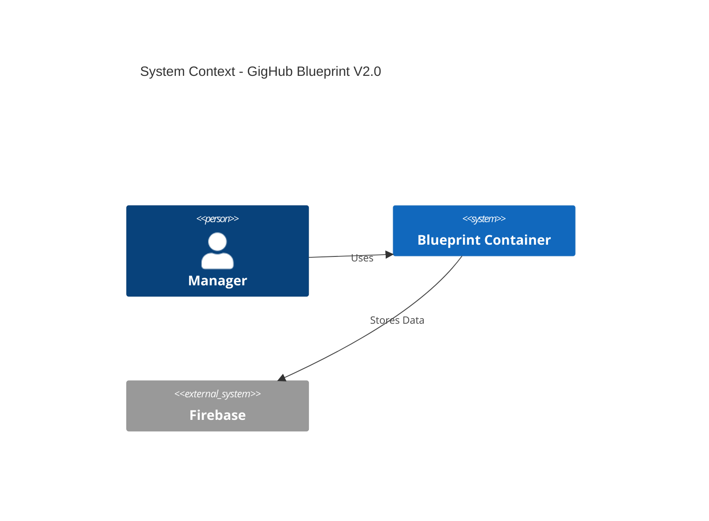
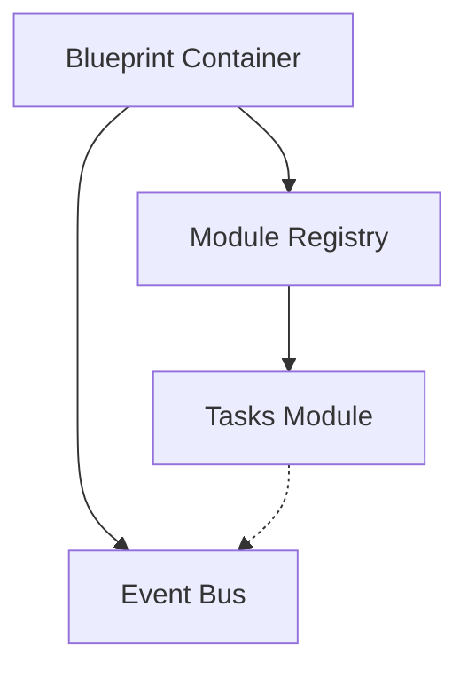
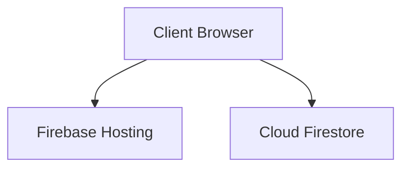
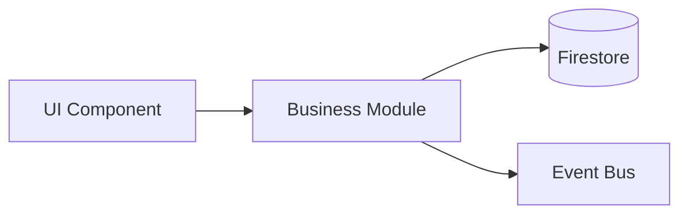
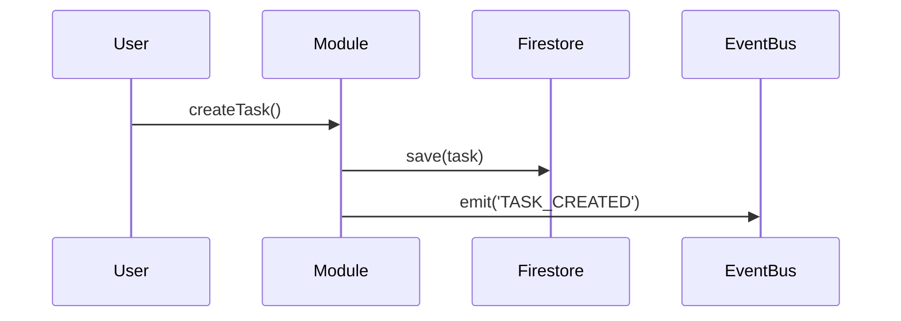

# next.md vs Standard Architecture Document - Visual Comparison

**Date**: 2025-12-12

---

## 📊 Side-by-Side Comparison

### Current next.md Structure

```
next.md (純文字文檔)
├── 🔷 Blueprint 架構說明
│   ├── (A) Platform Layer 概念
│   └── (B) Business Domains 概念
├── ✔ Blueprint Domain 列表 (6-8 個)
│   ├── 1️⃣ Task Domain
│   ├── 2️⃣ Log Domain
│   ├── 3️⃣ Workflow Domain
│   ├── 4️⃣ QA Domain
│   ├── 5️⃣ Acceptance Domain
│   ├── 6️⃣ Finance Domain
│   ├── 7️⃣ Material Domain (推薦)
│   └── 8️⃣ Safety/Communication (可選)
├── 📌 最佳推薦組合表格
└── 🎯 基本目錄結構建議

總頁數: ~1 頁
圖表數量: 0 張
NFR 分析: 無
實施計畫: 無
```

### Standard Architecture Document Structure

```
GigHub_Blueprint_Architecture.md (完整架構文檔)
├── 📋 Executive Summary
│   ├── Key Architectural Decisions
│   └── System Characteristics
├── 🌍 System Context
│   ├── [System Context Diagram - Mermaid] 🖼️
│   └── Detailed Explanation (4-5 段)
├── 🏗️ Architecture Overview
│   ├── Two-Layer Architecture 詳細說明
│   ├── Platform Layer Components (6 個組件)
│   ├── Business Domains (8 個域)
│   └── Architectural Patterns 說明
├── 🧩 Component Architecture
│   ├── [Container Components Diagram - Mermaid] 🖼️
│   └── Detailed Explanation (組件職責、關係、通訊)
├── 🚀 Deployment Architecture
│   ├── [Production Deployment Diagram - Mermaid] 🖼️
│   └── Infrastructure Components 詳細說明
├── 💾 Data Flow
│   ├── [Complete Data Flow Diagram - Mermaid] 🖼️
│   └── Data Flow Steps 詳細說明
├── 🔄 Key Workflows
│   ├── [Module Lifecycle Sequence - Mermaid] 🖼️
│   ├── [Task Creation Workflow - Mermaid] 🖼️
│   └── [Cross-Module Communication - Mermaid] 🖼️
├── 📅 Phased Development
│   ├── Phase 1: Initial Implementation (MVP)
│   │   ├── [Initial Phase Architecture Diagram] 🖼️
│   │   └── Phase 1 Features & Deliverables
│   ├── Phase 2: Full Architecture
│   │   ├── [Final Phase Architecture Diagram] 🖼️
│   │   └── Phase 2 Features & Deliverables
│   └── Migration Path (詳細步驟)
├── 📈 Non-Functional Requirements Analysis
│   ├── Scalability (如何擴展、目標、限制)
│   ├── Performance (效能特性、優化、監控)
│   ├── Security (安全架構、控制、風險)
│   ├── Reliability (高可用性、容錯、DR)
│   └── Maintainability (代碼組織、測試、版本管理)
├── ⚠️ Risks and Mitigations
│   ├── Technical Risks (6+ 項)
│   ├── Business Risks (4+ 項)
│   └── Operational Risks (3+ 項)
├── 🛠️ Technology Stack Recommendations
│   ├── Core Technologies (8+ 項)
│   ├── Development Tools (5+ 項)
│   └── Architecture Justifications
└── ✅ Next Steps
    ├── Immediate Actions (Week 1)
    ├── Sprint 1-6 計畫
    └── Post-MVP 計畫

總頁數: ~20-30 頁
圖表數量: 7-10 張 Mermaid 圖表
NFR 分析: 完整 5 大 NFR
實施計畫: 6 個月分階段計畫
```

---

## 📏 Content Coverage Matrix

| Content Type | next.md | Standard Doc | Gap |
|--------------|---------|--------------|-----|
| **Text Descriptions** | ✅ 有 (簡要) | ✅ 有 (詳細) | +400% |
| **Mermaid Diagrams** | ❌ 0 張 | ✅ 7-10 張 | +Infinite |
| **NFR Analysis** | ❌ 無 | ✅ 完整 | +100% |
| **Phased Plan** | ❌ 無 | ✅ 完整 | +100% |
| **Risk Management** | ❌ 無 | ✅ 完整 | +100% |
| **Tech Stack** | ❌ 無 | ✅ 完整 | +100% |
| **Implementation Guide** | ❌ 無 | ✅ 完整 | +100% |

---

## 🎯 Visual Completeness Comparison

### next.md Current State
```
█░░░░░░░░░ 7% Complete

█ Domain List (7%)
░ Everything else missing (93%)
```

### Standard Architecture Document
```
██████████ 100% Complete

██ Executive Summary (10%)
██ System Context (15%)
██ Component Architecture (15%)
██ Deployment Architecture (10%)
██ Data Flow (10%)
██ Key Workflows (10%)
██ Phased Development (10%)
██ NFR Analysis (15%)
░░ Risks & Tech Stack (5%)
```

---

## 📊 Diagram Comparison

### Current next.md (0 Diagrams)
```
[No diagrams - pure text only]
```

### Standard Document (7+ Diagrams Required)

#### 1. System Context Diagram 🖼️


#### 2. Component Diagram 🖼️


#### 3. Deployment Diagram 🖼️


#### 4. Data Flow Diagram 🖼️


#### 5. Sequence Diagram 🖼️


#### 6-7. Additional Diagrams
- Initial Phase Architecture
- Final Phase Architecture
- State Diagrams (if needed)
- ERD (if needed)

---

## 🔍 Detail Level Comparison

### Domain Description Example

#### next.md Style (Current)
```
1️⃣ Task Domain（任務域）
核心：所有行為的中心
包含：
- 任務（Task）
- 指派（Assignment）
- 狀態機（State Machine）
- 進度（Progress）
- 排程（Schedule）
```

#### Standard Document Style (Required)
```
### Task Domain (任務域)

**Purpose**: Central domain for all work-related activities

**Core Components**:
1. **Task Entity**: 
   - Properties: id, title, description, status, priority, assignee, dueDate
   - Lifecycle states: Draft → Assigned → In Progress → Review → Completed
   
2. **Assignment System**:
   - Auto-assignment based on workload
   - Manual assignment by managers
   - Reassignment workflow with notification
   
3. **State Machine**:
   - Configurable state transitions
   - State transition validation rules
   - State change event emissions
   
4. **Progress Tracking**:
   - Percentage completion
   - Milestone tracking
   - Time tracking (estimated vs actual)
   
5. **Scheduling**:
   - Gantt chart integration
   - Dependency management
   - Critical path calculation

**API Exports**:
- `createTask(data: TaskDto): Promise<Task>`
- `updateTask(id: string, data: Partial<Task>): Promise<Task>`
- `assignTask(taskId: string, userId: string): Promise<void>`
- `getTasksByStatus(status: TaskStatus): Observable<Task[]>`

**Events Emitted**:
- `TASK_CREATED`: When new task is created
- `TASK_ASSIGNED`: When task is assigned to user
- `TASK_STATUS_CHANGED`: When task status transitions
- `TASK_COMPLETED`: When task reaches completed state

**Dependencies**:
- Platform: Event Bus, Resource Provider, Shared Context
- Business: Workflow Domain (for state machine), Log Domain (for activity tracking)

**Database Schema**:
```typescript
interface Task {
  id: string;
  blueprintId: string;
  title: string;
  description: string;
  status: TaskStatus;
  priority: 'low' | 'medium' | 'high' | 'urgent';
  assigneeId: string;
  reporterId: string;
  startDate: Timestamp;
  dueDate: Timestamp;
  estimatedHours: number;
  actualHours: number;
  tags: string[];
  attachments: Attachment[];
  createdAt: Timestamp;
  updatedAt: Timestamp;
}
```

**NFR Considerations**:
- **Performance**: Task list pagination (50 items/page), indexed by status and assignee
- **Scalability**: Support 10,000+ tasks per blueprint
- **Security**: Task access controlled by blueprint membership and role
```

**Difference**: ~50 words → ~350 words (7x more detailed)

---

## 📈 NFR Analysis Comparison

### next.md (Current)
```
[No NFR analysis at all]
```

### Standard Document (Required)

#### Scalability Section
```markdown
### Scalability

**How the Architecture Supports Scaling**:

1. **Horizontal Scaling**
   - Client-Side: Each user runs own Angular instance
   - Database: Firestore auto-shards across regions
   - Static Assets: Global CDN (auto-scaling)

2. **Module Scalability**
   - Dynamic loading: Modules loaded on-demand
   - Zero coupling: Adding modules doesn't impact existing ones

3. **Data Scalability**
   - Hierarchical collections prevent bloat
   - Composite indexes for efficient queries
   - Cursor-based pagination (50 items/page)

**Scaling Targets**:
- Users: 10,000+ concurrent per organization
- Modules: 20+ business domains per Blueprint
- Data Volume: 10M+ documents per organization
- Events: 10,000+ events/minute through Event Bus

**Scaling Limitations**:
- Firestore: 1 write/second per document
- Event Bus: ~1000 events in-memory limit
- Modules: Practical limit ~20 due to init overhead
```

---

## 🚀 Implementation Guidance Comparison

### next.md (Current)
```
[No implementation plan]
```

### Standard Document (Required)

#### Phased Development
```markdown
### Phase 1: Initial Implementation (MVP - 3 Months)

**Goal**: Functional container with 3 core modules

**Phase 1 Features**:
- ✅ Blueprint Container with basic loading
- ✅ Module Registry (no circular detection)
- ✅ Simple Lifecycle Manager
- ✅ Basic Event Bus (emit, on, off)
- ✅ Tasks Module (CRUD)
- ✅ Logs Module (activity tracking)
- ✅ Workflow Module (predefined states)

**Phase 1 Deliverables**:
- Working container with 3 modules
- User authentication
- Task creation and tracking
- Deployment to Firebase Hosting

---

### Phase 2: Full Architecture (6 Months Total)

**Goal**: Complete all architectural components

**Phase 2 Additional Features**:
- ✅ Resource Provider with lazy loading
- ✅ Shared Context with Signals
- ✅ Circular dependency detection
- ✅ Event history and replay
- ✅ Multi-tenant RLS
- ✅ All 8 business modules
- ✅ Performance monitoring
- ✅ Comprehensive testing

---

### Migration Path: Phase 1 → Phase 2

**Month 1-3**: Phase 1 Implementation
**Month 4**: Enhance Core Services
**Month 5**: Add Business Modules
**Month 6**: Production Hardening
```

---

## 📋 Summary Table

| Aspect | next.md | Standard Doc | Improvement Needed |
|--------|---------|--------------|-------------------|
| **Page Count** | ~1 page | ~20-30 pages | +2000% |
| **Word Count** | ~500 words | ~8000 words | +1500% |
| **Diagrams** | 0 | 7-10 | +Infinite |
| **Detail Level** | High-level concepts | Implementation-ready | Critical |
| **NFR Analysis** | None | Complete (5 NFRs) | Critical |
| **Risk Management** | None | 13+ risks identified | Critical |
| **Implementation Plan** | None | 6-month phased plan | Critical |
| **Technology Stack** | None | Complete with versions | High |
| **Usability for Devs** | Planning reference only | Technical blueprint | Critical |

---

## 🎯 Recommended Action

**Transform next.md using Option 3 (Phased Enhancement)**:

### Week 1-2: Add Critical Content
- [ ] 5 core Mermaid diagrams
- [ ] 5 NFR analysis sections
- [ ] Executive summary

### Week 3: Add Implementation Guidance
- [ ] Phase 1 vs Phase 2 definition
- [ ] Migration path
- [ ] 2 additional sequence diagrams

### Week 4: Polish & Review
- [ ] Technology stack details
- [ ] Risk identification
- [ ] Team review and approval

**Result**: Transform 7% complete → 100% complete enterprise architecture document

---

**Visual Comparison Created**: 2025-12-12  
**Purpose**: Make gaps crystal clear for decision makers
