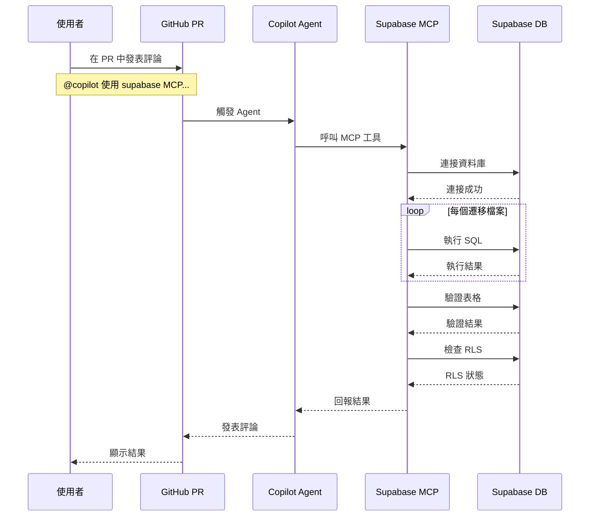
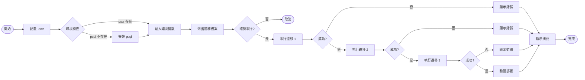
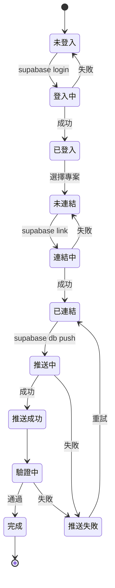
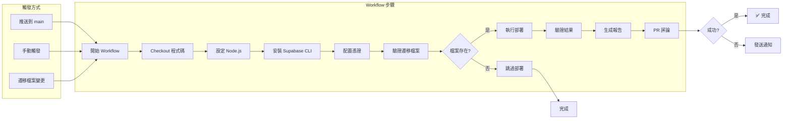
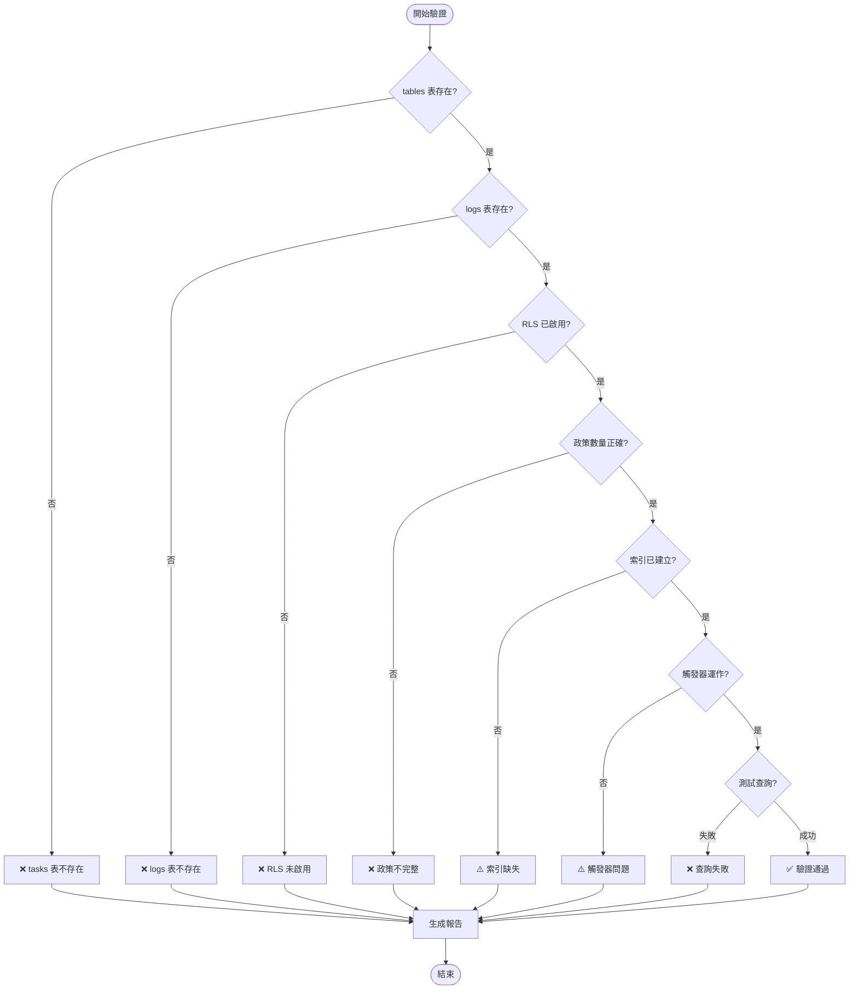
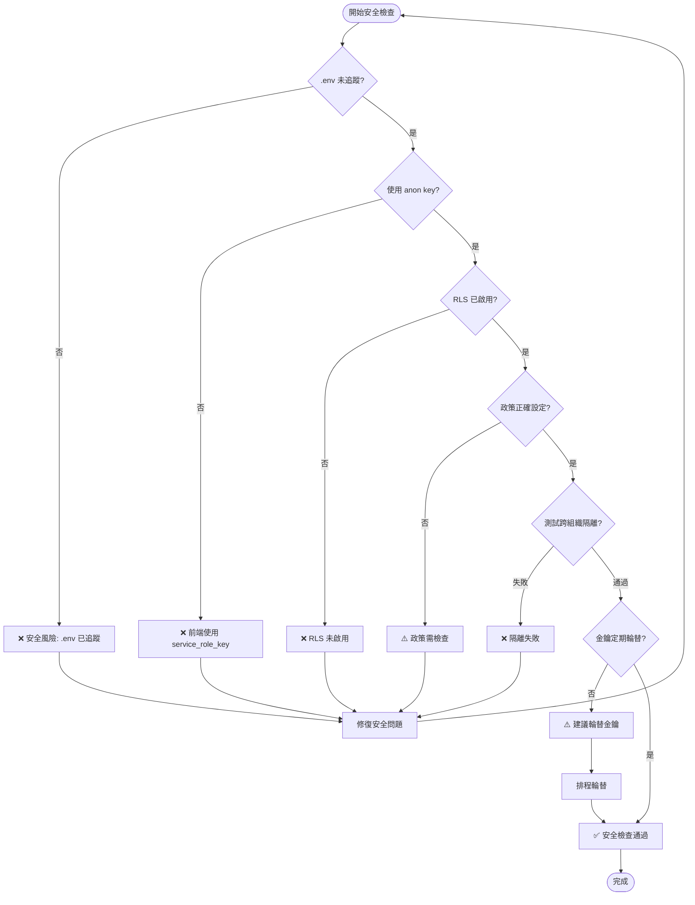
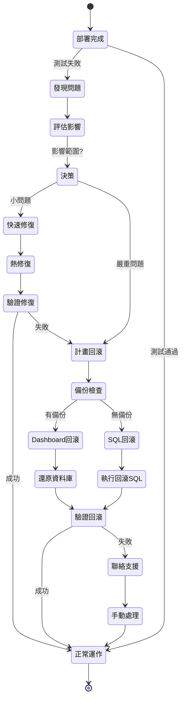
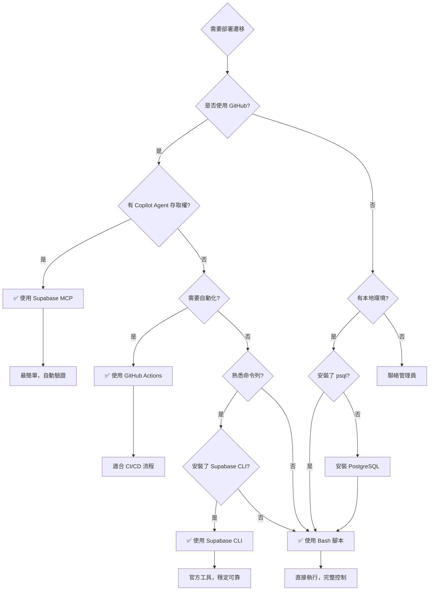
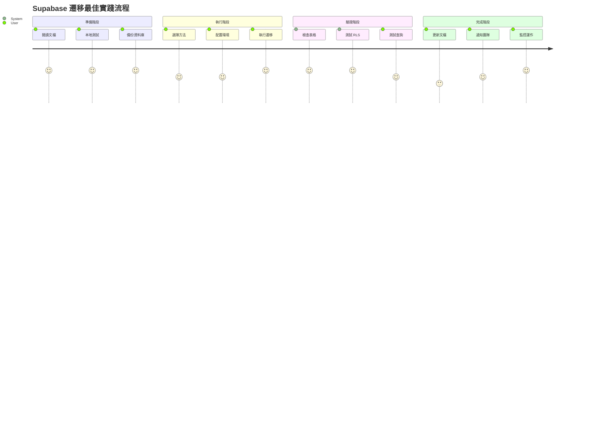

# Supabase 遷移部署工作流程

## 📊 視覺化工作流程

### 完整部署流程

```mermaid
graph TB
    Start([開始部署]) --> Choice{選擇部署方法}
    
    Choice -->|方法1| MCP[使用 Supabase MCP]
    Choice -->|方法2| Script[使用 Bash 腳本]
    Choice -->|方法3| CLI[使用 Supabase CLI]
    Choice -->|方法4| Actions[使用 GitHub Actions]
    
    subgraph "方法 1: Supabase MCP"
        MCP --> MCP1[在 PR 中評論]
        MCP1 --> MCP2[@copilot 使用 supabase MCP...]
        MCP2 --> MCP3[Copilot Agent 執行]
        MCP3 --> MCP4[自動驗證]
        MCP4 --> MCP5[回報結果]
    end
    
    subgraph "方法 2: Bash 腳本"
        Script --> S1[配置 .env]
        S1 --> S2[執行 yarn db:migrate]
        S2 --> S3[互動式確認]
        S3 --> S4[執行 SQL]
        S4 --> S5[自動驗證]
    end
    
    subgraph "方法 3: Supabase CLI"
        CLI --> C1[supabase login]
        C1 --> C2[supabase link]
        C2 --> C3[supabase db push]
        C3 --> C4[CLI 驗證]
    end
    
    subgraph "方法 4: GitHub Actions"
        Actions --> A1[觸發 Workflow]
        A1 --> A2[Checkout 程式碼]
        A2 --> A3[設定環境]
        A3 --> A4[執行遷移]
        A4 --> A5[驗證結果]
        A5 --> A6[PR 評論]
    end
    
    MCP5 --> Verify{驗證成功?}
    S5 --> Verify
    C4 --> Verify
    A6 --> Verify
    
    Verify -->|是| Success([✅ 部署成功])
    Verify -->|否| Debug[查看錯誤日誌]
    Debug --> Fix[修復問題]
    Fix --> Choice
    
    Success --> Test[測試整合]
    Test --> Done([🎉 完成])
```

---

## 🔄 各方法詳細流程

### 方法 1: Supabase MCP (推薦)



---

### 方法 2: Bash 腳本



---

### 方法 3: Supabase CLI



---

### 方法 4: GitHub Actions



---

## 🔍 驗證流程



---

## 🛡️ 安全檢查流程



---

## 🔄 回滾流程



---

## 📊 決策樹：選擇部署方法



---

## 🎯 最佳實踐路徑



---

## 📈 時間估算

| 階段 | Supabase MCP | Bash 腳本 | Supabase CLI | GitHub Actions |
|------|--------------|-----------|--------------|----------------|
| **準備** | 2 分鐘 | 5 分鐘 | 10 分鐘 | 15 分鐘 |
| **執行** | 自動 (2 分鐘) | 3 分鐘 | 2 分鐘 | 自動 (5 分鐘) |
| **驗證** | 自動 (1 分鐘) | 2 分鐘 | 2 分鐘 | 自動 (2 分鐘) |
| **總計** | ~5 分鐘 | ~10 分鐘 | ~14 分鐘 | ~22 分鐘 |

---

## 🔗 相關文檔連結

- [PR #63 部署指南](./PR63-DEPLOYMENT-GUIDE.md) - 完整步驟說明
- [Supabase MCP 指南](./supabase-mcp-guide.md) - MCP 工具使用
- [快速參考手冊](./QUICK-REFERENCE.md) - 指令速查表
- [Scripts README](../../scripts/README.md) - 腳本使用文檔

---

**建立日期**: 2025-12-12  
**版本**: 1.0.0  
**維護者**: GigHub Development Team
