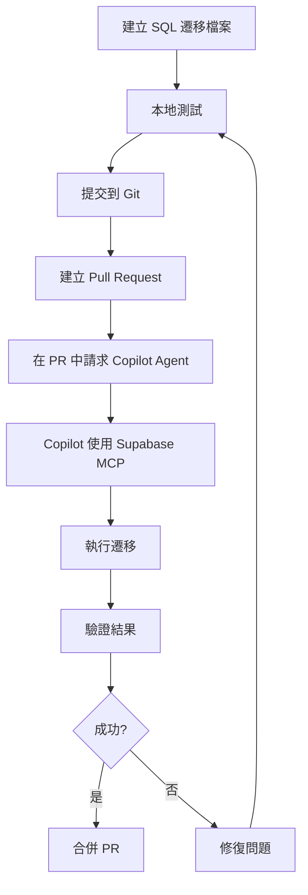

# Supabase MCP 工具使用指南

## 📋 概述

本指南說明如何使用 Supabase MCP (Model Context Protocol) 工具來管理 GigHub 專案的 Supabase 資料庫。Supabase MCP 是 GitHub Copilot Agent 的一個工具，可以直接與 Supabase 資料庫互動。

## 🎯 什麼是 Supabase MCP？

Supabase MCP 是一個整合在 GitHub Copilot 中的工具，提供以下功能：

- ✅ **資料庫查詢** - 執行 SQL 查詢
- ✅ **資料表管理** - 建立、修改、刪除資料表
- ✅ **RLS 政策管理** - 設定 Row Level Security 政策
- ✅ **Storage 管理** - 管理檔案儲存 Bucket
- ✅ **即時監控** - 檢視資料庫狀態與日誌

## 🔧 MCP 配置

### 配置檔案位置

`.github/copilot/mcp-servers.yml`:

```yaml
mcp-servers:
  supabase:
    type: http
    url: 'https://api.supabase.com/v1/mcp'
    headers: 
      'Authorization': 'Bearer ${{ secrets.SUPABASE_ACCESS_TOKEN }}'
    tools: 
      - 'query-database'
      - 'execute-sql'
      - 'manage-tables'
      - 'manage-policies'
      - 'manage-storage'
```

### 環境變數設定

需要在 GitHub Secrets 中設定以下變數：

1. **SUPABASE_ACCESS_TOKEN** - Supabase API 存取權杖
2. **SUPABASE_PROJECT_REF** - Supabase 專案參考 ID
3. **SUPABASE_DB_PASSWORD** - 資料庫密碼

## 🚀 使用方法

### 方法 1: 透過 GitHub Copilot Agent

在 GitHub Issues 或 Pull Requests 中，使用 Copilot Agent 與 Supabase MCP 互動：

```markdown
@copilot 使用 supabase MCP 執行以下 SQL：

CREATE TABLE test_table (
  id UUID PRIMARY KEY DEFAULT gen_random_uuid(),
  name TEXT NOT NULL
);
```

Copilot Agent 會自動：
1. 使用 Supabase MCP 工具
2. 連接到遠端資料庫
3. 執行 SQL 指令
4. 回報執行結果

### 方法 2: 使用提供的腳本

雖然 Supabase MCP 是理想的方法，但由於目前 GitHub Copilot 的限制，我們提供了替代腳本：

#### 2.1 Bash 腳本 (推薦)

```bash
# 應用所有遷移
./scripts/apply-migrations.sh

# 應用特定遷移
./scripts/apply-migrations.sh 20251212_01_create_tasks_table.sql
```

#### 2.2 Supabase CLI

```bash
# 推送所有遷移
supabase db push

# 推送特定檔案
supabase db push --file supabase/migrations/20251212_01_create_tasks_table.sql
```

## 📊 MCP 工具功能

### 1. 執行 SQL 查詢

**觸發詞**: `@copilot 使用 supabase MCP 查詢...`

**範例**:
```markdown
@copilot 使用 supabase MCP 查詢 tasks 表中所有狀態為 TODO 的任務
```

**MCP 會執行**:
```sql
SELECT * FROM tasks WHERE status = 'TODO' AND deleted_at IS NULL;
```

### 2. 建立資料表

**觸發詞**: `@copilot 使用 supabase MCP 建立資料表...`

**範例**:
```markdown
@copilot 使用 supabase MCP 建立一個名為 notifications 的資料表，包含以下欄位：
- id (UUID, Primary Key)
- user_id (UUID, Foreign Key to profiles)
- message (TEXT)
- read_at (TIMESTAMPTZ)
- created_at (TIMESTAMPTZ)
```

**MCP 會產生並執行**:
```sql
CREATE TABLE public.notifications (
  id UUID PRIMARY KEY DEFAULT gen_random_uuid(),
  user_id UUID REFERENCES public.profiles(id) ON DELETE CASCADE,
  message TEXT NOT NULL,
  read_at TIMESTAMPTZ,
  created_at TIMESTAMPTZ DEFAULT NOW() NOT NULL
);
```

### 3. 設定 RLS 政策

**觸發詞**: `@copilot 使用 supabase MCP 設定 RLS...`

**範例**:
```markdown
@copilot 使用 supabase MCP 為 notifications 表設定 RLS 政策：
- 使用者只能查看自己的通知
- 使用者可以更新自己的通知
```

**MCP 會產生並執行**:
```sql
ALTER TABLE public.notifications ENABLE ROW LEVEL SECURITY;

CREATE POLICY "users_view_own_notifications"
ON public.notifications FOR SELECT
TO authenticated
USING (user_id = auth.uid());

CREATE POLICY "users_update_own_notifications"
ON public.notifications FOR UPDATE
TO authenticated
USING (user_id = auth.uid());
```

### 4. 管理 Storage Bucket

**觸發詞**: `@copilot 使用 supabase MCP 建立 storage bucket...`

**範例**:
```markdown
@copilot 使用 supabase MCP 建立一個名為 avatars 的 storage bucket，設定為私有，大小限制 2MB
```

### 5. 驗證資料庫狀態

**觸發詞**: `@copilot 使用 supabase MCP 驗證...`

**範例**:
```markdown
@copilot 使用 supabase MCP 驗證以下內容：
1. tasks 表是否存在
2. logs 表是否存在
3. RLS 政策是否已啟用
4. 索引是否正確建立
```

## 🔐 安全考量

### MCP 存取控制

1. **使用 Service Role Key**
   - MCP 使用 Service Role Key 連接資料庫
   - 此金鑰跳過 RLS 政策，具有完整權限
   - ⚠️ **絕不要**在前端程式碼中使用

2. **GitHub Secrets 管理**
   - 所有敏感金鑰儲存在 GitHub Secrets
   - 不會出現在程式碼或日誌中
   - 定期輪替金鑰

3. **審計日誌**
   - 所有 MCP 操作都會記錄
   - 可在 Supabase Dashboard → Logs 檢視
   - 保留審計追蹤以符合合規要求

### 最佳實踐

✅ **應該做**:
- 使用 MCP 執行資料庫遷移
- 透過 Copilot Agent 請求 MCP 操作
- 在執行前驗證 SQL 語法
- 定期備份資料庫

❌ **不應該做**:
- 在前端程式碼中嵌入 Service Role Key
- 跳過 RLS 政策（除非必要）
- 直接在生產環境測試未驗證的 SQL
- 忽略 MCP 執行錯誤

## 📝 實際操作範例

### 範例 1: 應用 PR #63 的遷移

**在 GitHub PR #63 中評論**:
```markdown
@copilot 使用 supabase MCP 應用以下遷移檔案到遠端資料庫：

1. supabase/migrations/20251212_01_create_tasks_table.sql
2. supabase/migrations/20251212_02_create_logs_table.sql
3. supabase/migrations/20251212_03_create_rls_policies.sql

請執行並驗證結果。
```

**Copilot Agent 會**:
1. 讀取三個 SQL 檔案
2. 使用 Supabase MCP 執行每個檔案
3. 驗證表格是否建立成功
4. 檢查 RLS 政策是否正確設定
5. 回報執行狀態與任何錯誤

### 範例 2: 驗證資料庫結構

**在 GitHub Issue 中提問**:
```markdown
@copilot 使用 supabase MCP 驗證以下內容：

1. tasks 表是否有所有必要的欄位
2. logs 表的索引是否正確建立
3. RLS 政策是否對 authenticated 角色開放
4. Storage bucket log-photos 是否存在

請提供詳細報告。
```

### 範例 3: 緊急修復

**在 GitHub Issue 中請求**:
```markdown
@copilot 緊急！使用 supabase MCP 執行以下修復：

在 tasks 表中新增一個 priority_score INTEGER 欄位，預設值為 0。
請確保不影響現有資料。
```

## 🧪 測試 MCP 連接

### 方法 1: 透過 GitHub Copilot Chat

在 VS Code 或 GitHub.com 中：

```markdown
@copilot 測試 supabase MCP 連接，執行簡單查詢：
SELECT version();
```

### 方法 2: 透過腳本驗證

建立測試腳本 `scripts/test-mcp.sh`:

```bash
#!/bin/bash

echo "Testing Supabase MCP connection..."

# Test query through MCP
curl -X POST https://api.supabase.com/v1/mcp/query \
  -H "Authorization: Bearer $SUPABASE_ACCESS_TOKEN" \
  -H "Content-Type: application/json" \
  -d '{
    "project_ref": "'$SUPABASE_PROJECT_REF'",
    "sql": "SELECT version();"
  }'
```

## 🔄 遷移工作流程

### 完整工作流程



### 步驟說明

1. **建立遷移檔案**
   ```bash
   # 使用時間戳記命名
   touch supabase/migrations/$(date +%Y%m%d%H%M%S)_add_feature.sql
   ```

2. **本地測試**
   ```bash
   # 使用本地 Supabase
   supabase start
   supabase db reset
   ```

3. **提交並建立 PR**
   ```bash
   git add supabase/migrations/
   git commit -m "feat: Add new migration for feature X"
   git push origin feature/add-feature-x
   ```

4. **在 PR 中請求部署**
   ```markdown
   @copilot 請使用 supabase MCP 將這個遷移應用到遠端資料庫
   ```

5. **驗證與合併**
   - Copilot Agent 執行遷移
   - 檢視執行結果
   - 驗證無誤後合併 PR

## 📚 相關資源

- [Supabase 官方文檔](https://supabase.com/docs)
- [GitHub Copilot MCP 文檔](https://docs.github.com/copilot)
- [Supabase Setup Guide](./supabase-setup-guide.md)
- [Migration Scripts README](../../scripts/README.md)

## 🆘 故障排除

### MCP 無法連接

**症狀**: Copilot 回應「無法連接到 Supabase MCP」

**解決方案**:
1. 檢查 GitHub Secrets 中的 `SUPABASE_ACCESS_TOKEN` 是否正確
2. 驗證 `.github/copilot/mcp-servers.yml` 配置
3. 確認 Supabase 專案狀態正常

### SQL 執行失敗

**症狀**: MCP 回報 SQL 執行錯誤

**解決方案**:
1. 檢查 SQL 語法是否正確
2. 驗證所需的相依表格是否存在
3. 檢查使用者權限是否足夠
4. 查看 Supabase Dashboard → Logs 獲取詳細錯誤

### 權限不足

**症狀**: 「permission denied」錯誤

**解決方案**:
1. 確認使用 Service Role Key (非 Anon Key)
2. 檢查 RLS 政策是否正確
3. 驗證 GitHub Secrets 中的金鑰

## 💡 進階技巧

### 批次執行多個遷移

```markdown
@copilot 使用 supabase MCP 批次執行 supabase/migrations/ 目錄下所有以 20251212 開頭的遷移檔案
```

### 條件式遷移

```markdown
@copilot 使用 supabase MCP 檢查 tasks 表是否存在 priority_score 欄位。
如果不存在，則執行遷移新增該欄位。
```

### 回滾遷移

```markdown
@copilot 使用 supabase MCP 回滾最後一次遷移：
DROP TABLE IF EXISTS new_feature_table CASCADE;
```

---

**最後更新**: 2025-12-12  
**維護者**: GigHub Development Team  
**版本**: 1.0.0
